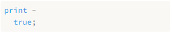

# 17.编译表达式 Compiling Expressions

> In the middle of the journey of our life I found myself within a dark woods where the straight way was lost.
>
> ​																	—— Dante Alighieri, *Inferno*

方吾生之半路，恍余处乎幽林，失正轨而迷误。（但丁，《地狱》）

【译者注：这里引用的是大名鼎鼎的《神曲》，所以我也直接引用了钱稻孙先生的译文】

> This chapter is exciting for not one, not two, but *three* reasons. First, it provides the final segment of our VM’s execution pipeline. Once in place, we can plumb the user’s source code from scanning all the way through to executing it.

这一章令人激动，原因不止一个，也不止两个，而是三个。首先，它补齐了虚拟机执行管道的最后一段。一旦到位，我们就可以处理用户的源代码，从扫描一直到执行。


> Second, we get to write an actual, honest-to-God *compiler*. It parses source code and outputs a low-level series of binary instructions. Sure, it’s bytecode and not some chip’s native instruction set, but it’s way closer to the metal than jlox was. We’re about to be real language hackers.

第二，我们要编写一个真正的*编译器*。它会解析源代码并输出低级的二进制指令序列。当然，它是字节码，而不是某个芯片的原生指令集，但它比jlox更接近于硬件。我们即将成为真正的语言黑客了。

> Third and finally, I get to show you one of my absolute favorite algorithms: Vaughan Pratt’s “top-down operator precedence parsing”. It’s the most elegant way I know to parse expressions. It gracefully handles prefix operators, postfix, infix, *mixfix*, any kind of *-fix* you got. It deals with precedence and associativity without breaking a sweat. I love it.

第三，也是最后一个，我可以向你们展示我们最喜欢的算法之一：Vaughan Pratt的“自顶向下算符优先解析”。这是我所知道的解析表达的最优雅的方法。它可以优雅地处理前缀、后缀、中缀、多元运算符，以及任何类型的运算符。它能处理优先级和结合性，而且毫不费力。我喜欢它。

> As usual, before we get to the fun stuff, we’ve got some preliminaries to work through. You have to eat your vegetables before you get dessert. First, let’s ditch that temporary scaffolding we wrote for testing the scanner and replace it with something more useful.

与往常一样，在我们开始真正有趣的工作之前，还有一些准备工作需要做。在得到甜点之前，你得先吃点蔬菜。首先，让我们抛弃我们为测试扫描器而编写的临时脚手架，用更有效的东西来替换它。

*<u>vm.c，在interpret() 方法中替换2行：</u>*

```c
InterpretResult interpret(const char* source) {
  // 替换部分开始
  Chunk chunk;
  initChunk(&chunk);

  if (!compile(source, &chunk)) {
    freeChunk(&chunk);
    return INTERPRET_COMPILE_ERROR;
  }

  vm.chunk = &chunk;
  vm.ip = vm.chunk->code;

  InterpretResult result = run();

  freeChunk(&chunk);
  return result;
  // 替换部分结束
}
```

> We create a new empty chunk and pass it over to the compiler. The compiler will take the user’s program and fill up the chunk with bytecode. At least, that’s what it will do if the program doesn’t have any compile errors. If it does encounter an error, `compile()` returns `false` and we discard the unusable chunk.

我们创建一个新的空字节码块，并将其传递给编译器。编译器会获取用户的程序，并将字节码填充到该块中。至少在程序没有任何编译错误的情况下，它就会这么做。如果遇到错误，`compile()`方法会返回`false`，我们就会丢弃不可用的字节码块。

> Otherwise, we send the completed chunk over to the VM to be executed. When the VM finishes, we free the chunk and we’re done. As you can see, the signature to `compile()` is different now.

否则，我们将完整的字节码块发送到虚拟机中去执行。当虚拟机完成后，我们会释放该字节码块，这样就完成了。如你所见，现在`compile()`的签名已经不同了。

<u>*compiler.h，替换一行代码：*</u>

```c
#define clox_compiler_h
// 替换部分开始
#include "vm.h"

bool compile(const char* source, Chunk* chunk);
// 替换部分结束
#endif
```

> We pass in the chunk where the compiler will write the code, and then `compile()` returns whether or not compilation succeeded. We make the same change to the signature in the implementation.

我们将字节码块传入，而编译器会向其中写入代码，如何`compile()`返回编译是否成功。我们在实现方法中对签名进行相同的修改。

*<u>compiler.c，在compile()方法中替换1行：</u>*

```c
#include "scanner.h"
// 替换部分开始
bool compile(const char* source, Chunk* chunk) {
// 替换部分结束
  initScanner(source);
```

> That call to `initScanner()` is the only line that survives this chapter. Rip out the temporary code we wrote to test the scanner and replace it with these three lines:

对`initScanner()`的调用是本章中唯一保留下来的代码行。删除我们为测试扫描器而编写的临时代码，将其替换为以下三行：

*<u>compiler.c，在compile()方法中替换13行：</u>*

```c
  initScanner(source);
  // 替换部分开始
  advance();
  expression();
  consume(TOKEN_EOF, "Expect end of expression.");
  // 替换部分结束
}
```

> The call to `advance()` “primes the pump” on the scanner. We’ll see what it does soon. Then we parse a single expression. We aren’t going to do statements yet, so that’s the only subset of the grammar we support. We’ll revisit this when we [add statements in a few chapters](http://www.craftinginterpreters.com/global-variables.html). After we compile the expression, we should be at the end of the source code, so we check for the sentinel EOF token.

对`advance()`的调用会在扫描器上“启动泵”。我们很快会看到它的作用。然后我们解析一个表达式。我们还不打算处理语句，所以表达式是我们支持的唯一的语法子集。等到我们在后面的章节中添加语句时，会重新审视这个问题。在编译表达式之后，我们应该处于源代码的末尾，所以我们要检查EOF标识。

> We’re going to spend the rest of the chapter making this function work, especially that little `expression()` call. Normally, we’d dive right into that function definition and work our way through the implementation from top to bottom.

我们将用本章的剩余时间让这个函数工作起来。尤其是那个小小的`expression()`调用。通常情况下，我们会直接进入函数定义，并从上到下地进行实现。

> This chapter is different. Pratt’s parsing technique is remarkably simple once you have it all loaded in your head, but it’s a little tricky to break into bite-sized pieces. It’s recursive, of course, which is part of the problem. But it also relies on a big table of data. As we build up the algorithm, that table grows additional columns.

这一章则不同。Pratt的解析技术，你一旦理解了就非常简单，但是要把它分解成小块就比较麻烦了[^1]。当然，它是递归的，这也是问题的一部分。但它也依赖于一个很大的数据表。等我们构建算法时，这个表格会增加更多的列。

> I don’t want to revisit 40-something lines of code each time we extend the table. So we’re going to work our way into the core of the parser from the outside and cover all of the surrounding bits before we get to the juicy center. This will require a little more patience and mental scratch space than most chapters, but it’s the best I could do.

我不想在每次扩展表时都要重新查看40多行代码。因此，我们要从外部进入解析器的核心，并在进入有趣的中心之前覆盖其外围的所有部分。与大多数章节相比，这将需要更多的耐心和思考空间，但这是我能做到的最好的了。

> ## 17 . 1 Single-Pass Compilation

## 17.1 单遍编译

> A compiler has roughly two jobs. It parses the user’s source code to understand what it means. Then it takes that knowledge and outputs low-level instructions that produce the same semantics. Many languages split those two roles into two separate passes in the implementation. A parser produces an AST—just like jlox does—and then a code generator traverses the AST and outputs target code.

一个编译器大约有两项工作[^2]。它会解析用户的源代码以理解其含义。然后，它利用这些知识并输出产生相同语义的低级指令。许多语言在实现中将这两个角色分成两遍独立的执行部分。一个解析器生成AST——就像jlox那样——还有一个代码生成器遍历AST并输出目标代码。

> In clox, we’re taking an old-school approach and merging these two passes into one. Back in the day, language hackers did this because computers literally didn’t have enough memory to store an entire source file’s AST. We’re doing it because it keeps our compiler simpler, which is a real asset when programming in C.

在clox中，我们采用了一种老派的方法，将这两遍处理合而为一。在过去，语言黑客们这样做是因为计算机没有足够的内存来存储整个源文件的AST。我们这样做是因为它使我们的编译器更简单，这是用C语言编程时的真正优势。

> Single-pass compilers like we’re going to build don’t work well for all languages. Since the compiler has only a peephole view into the user’s program while generating code, the language must be designed such that you don’t need much surrounding context to understand a piece of syntax. Fortunately, tiny, dynamically typed Lox is well-suited to that.

像我们要构建的单遍编译器并不是对所有语言都有效。因为编译器在生产代码时只能“管窥”用户的程序，所以语言必须设计成不需要太多外围的上下文环境就能理解一段语法。幸运的是，微小的、动态类型的Lox非常适合这种情况。

> What this means in practical terms is that our “compiler” C module has functionality you’ll recognize from jlox for parsing—consuming tokens, matching expected token types, etc. And it also has functions for code gen—emitting bytecode and adding constants to the destination chunk. (And it means I’ll use “parsing” and “compiling” interchangeably throughout this and later chapters.)

在实践中，这意味着我们的“编译器”C模块具有你在jlox中认识到的解析功能——消费标识，匹配期望的标识类型，等等。而且它还具有代码生成的功能——生成字节码和向目标块中添加常量。（这也意味着我会在本章和后面的章节中交替使用“解析”和“编译”。）

> We’ll build the parsing and code generation halves first. Then we’ll stitch them together with the code in the middle that uses Pratt’s technique to parse Lox’s particular grammar and output the right bytecode.

我们首先分别构建解析和代码生成两个部分。然后，我们会用中间代码将它们缝合在一起，该代码使用Pratt的技术来解析Lox 的语法并输出正确的字节码。

> ## 17 . 2 Parsing Tokens

## 17.2 解析标识

> First up, the front half of the compiler. This function’s name should sound familiar.

首先是编译器的前半部分。这个函数的名字听起来应该很熟悉。
*<u>compiler.c，添加代码：</u>*

```c
#include "scanner.h"
// 新增部分开始
static void advance() {
  parser.previous = parser.current;

  for (;;) {
    parser.current = scanToken();
    if (parser.current.type != TOKEN_ERROR) break;

    errorAtCurrent(parser.current.start);
  }
}
// 新增部分结束
```

> Just like in jlox, it steps forward through the token stream. It asks the scanner for the next token and stores it for later use. Before doing that, it takes the old `current` token and stashes that in a `previous` field. That will come in handy later so that we can get at the lexeme after we match a token.

就像在jlox中一样，该函数向前通过标识流。它会向扫描器请求下一个词法标识，并将其存储起来以供后面使用。在此之前，它会获取旧的`current`标识，并将其存储在`previous`字段中。这在以后会派上用场，让我们可以在匹配到标识之后获得词素。

> The code to read the next token is wrapped in a loop. Remember, clox’s scanner doesn’t report lexical errors. Instead, it creates special *error tokens* and leaves it up to the parser to report them. We do that here.

读取下一个标识的代码被包在一个循环中。记住，clox的扫描器不会报告词法错误。相反地，它创建了一个特殊的*错误标识*，让解析器来报告这些错误。我们这里就是这样做的。

> We keep looping, reading tokens and reporting the errors, until we hit a non-error one or reach the end. That way, the rest of the parser sees only valid tokens. The current and previous token are stored in this struct:

我们不断地循环，读取标识并报告错误，直到遇到一个没有错误的标识或者到达标识流终点。这样一来，解析器的其它部分只能看到有效的标记。当前和之前的标记被存储在下面的结构体中：

*<u>compiler.c，新增代码：</u>*

```c
#include "scanner.h"
// 新增部分开始
typedef struct {
  Token current;
  Token previous;
} Parser;

Parser parser;
// 新增部分结束
static void advance() {
```

> Like we did in other modules, we have a single global variable of this struct type so we don’t need to pass the state around from function to function in the compiler.

就像我们在其它模块中所做的那样，我们维护一个这种结构体类型的单一全局变量，所以我们不需要在编译器中将状态从一个函数传递到另一个函数。

> ### 17 . 2 . 1 Handling syntax errors

### 17.2.1 处理语法错误

> If the scanner hands us an error token, we need to actually tell the user. That happens using this:

如果扫描器交给我们一个错误标识，我们必须明确地告诉用户。这就需要使用下面的语句：

*<u>compiler.c，在变量parser后添加代码：</u>*

```c
static void errorAtCurrent(const char* message) {
  errorAt(&parser.current, message);
}
```

> We pull the location out of the current token in order to tell the user where the error occurred and forward it to `errorAt()`. More often, we’ll report an error at the location of the token we just consumed, so we give the shorter name to this other function:

我们从当前标识中提取位置信息，以便告诉用户错误发生在哪里，并将其转发给`errorAt()`。更常见的情况是，我们会在刚刚消费的令牌的位置报告一个错误，所以我们给另一个函数取了一个更短的名字：

*<u>compiler.c，在变量parser后添加代码：</u>*

```c
static void error(const char* message) {
  errorAt(&parser.previous, message);
}
```

> The actual work happens here:

实际的工作发生在这里：

*<u>compiler.c，在变量parser后添加代码：</u>*

```c
static void errorAt(Token* token, const char* message) {
  fprintf(stderr, "[line %d] Error", token->line);

  if (token->type == TOKEN_EOF) {
    fprintf(stderr, " at end");
  } else if (token->type == TOKEN_ERROR) {
    // Nothing.
  } else {
    fprintf(stderr, " at '%.*s'", token->length, token->start);
  }

  fprintf(stderr, ": %s\n", message);
  parser.hadError = true;
}
```

> First, we print where the error occurred. We try to show the lexeme if it’s human-readable. Then we print the error message itself. After that, we set this `hadError` flag. That records whether any errors occurred during compilation. This field also lives in the parser struct.

首先，我们打印出错误发生的位置。如果词素是人类可读的，我们就尽量显示词素。然后我们打印错误信息。之后，我们设置这个`hadError`标志。该标志记录了编译过程中是否有任何错误发生。这个字段也存在于解析器结构体中。

*<u>compiler.c，在结构体Parser中添加代码：</u>*

```c
  Token previous;
  // 新增部分开始
  bool hadError;
  // 新增部分结束
} Parser;
```

> Earlier I said that `compile()` should return `false` if an error occurred. Now we can make it do that.

前面我说过，如果发生错误，`compile()`应该返回`false`。现在我们可以这样做：

*<u>compiler.c，在compile()函数中添加代码：</u>*

```c
  consume(TOKEN_EOF, "Expect end of expression.");
  // 新增部分开始
  return !parser.hadError;
  // 新增部分结束
}
```

> I’ve got another flag to introduce for error handling. We want to avoid error cascades. If the user has a mistake in their code and the parser gets confused about where it is in the grammar, we don’t want it to spew out a whole pile of meaningless knock-on errors after the first one.

我还要引入另一个用于错误处理的标志。我们想要避免错误的级联效应。如果用户在他们的代码中犯了一个错误，而解析器又不理解它在语法中的含义，我们不希望解析器在第一个错误之后，又抛出一大堆无意义的连带错误。

> We fixed that in jlox using panic mode error recovery. In the Java interpreter, we threw an exception to unwind out of all of the parser code to a point where we could skip tokens and resynchronize. We don’t have exceptions in C. Instead, we’ll do a little smoke and mirrors. We add a flag to track whether we’re currently in panic mode.

我们在jlox中使用紧急模式错误恢复来解决这个问题。在Java解释器中，我们抛出一个异常，跳出解析器代码直到可以跳过标识并重新同步。我们在C语言中没有异常[^3]。相反，我们会做一些欺骗性行为。我们添加一个标志来跟踪当前是否在紧急模式中。

*<u>compiler.c，在结构体Parser中添加代码：</u>*

```c
  bool hadError;
  // 新增部分开始
  bool panicMode;
  // 新增部分结束
} Parser;
```

> When an error occurs, we set it.

当出现错误时，我们为其赋值。

*<u>compiler.c，在errorAt()方法中添加代码：</u>*

```c
static void errorAt(Token* token, const char* message) {
  // 新增部分开始
  parser.panicMode = true;
  // 新增部分结束
  fprintf(stderr, "[line %d] Error", token->line);
```

> After that, we go ahead and keep compiling as normal as if the error never occurred. The bytecode will never get executed, so it’s harmless to keep on trucking. The trick is that while the panic mode flag is set, we simply suppress any other errors that get detected.

之后，我们继续进行编译，就像错误从未发生过一样。字节码永远不会被执行，所以继续运行也是无害的。诀窍在于，虽然设置了紧急模式标志，但我们只是简单地屏蔽了检测到的其它错误。

*<u>compiler.c，在errorAt()方法中添加代码：</u>*

```c
static void errorAt(Token* token, const char* message) {
  // 新增部分开始
  if (parser.panicMode) return;
  // 新增部分结束
  parser.panicMode = true;
```

There’s a good chance the parser will go off in the weeds, but the user won’t know because the errors all get swallowed. Panic mode ends when the parser reaches a synchronization point. For Lox, we chose statement boundaries, so when we later add those to our compiler, we’ll clear the flag there.

解析器很有可能会崩溃，但是用户不会知道，因为错误都会被吞掉。当解析器到达一个同步点时，紧急模式就结束了。对于Lox，我们选择了语句作为边界，所以当我们稍后将语句添加到编译器时，将会清除该标志。

> These new fields need to be initialized.

这些新字段需要被初始化。

*<u>compiler.c，在compile()方法中添加代码：</u>*

```c
  initScanner(source);
  // 新增部分开始
  parser.hadError = false;
  parser.panicMode = false;
  // 新增部分结束
  advance();
```

> And to display the errors, we need a standard header.

为了展示这些错误，我们需要一个标准的头文件。

*<u>compiler.c，添加代码：</u>*

```c
#include <stdio.h>
// 新增部分开始
#include <stdlib.h>
// 新增部分结束
#include "common.h"
```

> There’s one last parsing function, another old friend from jlox.

还有最后一个解析函数，是jlox中的另一个老朋友。

*<u>compiler.c，在advance()方法后添加代码：</u>*

```c
static void consume(TokenType type, const char* message) {
  if (parser.current.type == type) {
    advance();
    return;
  }

  errorAtCurrent(message);
}
```

> It’s similar to `advance()` in that it reads the next token. But it also validates that the token has an expected type. If not, it reports an error. This function is the foundation of most syntax errors in the compiler.

它类似于`advance()`，都是读取下一个标识。但它也会验证标识是否具有预期的类型。如果不是，则报告错误。这个函数是编译器中大多数语法错误的基础。

> OK, that’s enough on the front end for now.

好了，关于前端的介绍就到此为止。

> ## 17 . 3 Emitting Bytecode

## 17.3 发出字节码

> After we parse and understand a piece of the user’s program, the next step is to translate that to a series of bytecode instructions. It starts with the easiest possible step: appending a single byte to the chunk.

在我们解析并理解了用户的一段程序之后，下一步是将其转换为一系列字节码指令。它从最简单的步骤开始：向块中追加一个字节。

*<u>compiler.c，在consume()方法后添加代码：</u>*

```c
static void emitByte(uint8_t byte) {
  writeChunk(currentChunk(), byte, parser.previous.line);
}
```

> It’s hard to believe great things will flow through such a simple function. It writes the given byte, which may be an opcode or an operand to an instruction. It sends in the previous token’s line information so that runtime errors are associated with that line.

很难相信伟大的东西会流经这样一个简单的函数。它将给定的字节写入一个指令，该字节可以是操作码或操作数。它会发送前一个标记的行信息，以便将运行时错误与该行关联起来。

> The chunk that we’re writing gets passed into `compile()`, but it needs to make its way to `emitByte()`. To do that, we rely on this intermediary function:

我们正在写入的字节码块被传递给`compile()`，但是它也需要进入`emitByte()`中。要做到这一点，我们依靠这个中间函数：

*<u>compiler.c，在变量parser后添加代码：</u>*

```c
Parser parser;
// 新增部分开始
Chunk* compilingChunk;

static Chunk* currentChunk() {
  return compilingChunk;
}
// 新增部分结束
static void errorAt(Token* token, const char* message) {
```

> Right now, the chunk pointer is stored in a module-level variable like we store other global state. Later, when we start compiling user-defined functions, the notion of “current chunk” gets more complicated. To avoid having to go back and change a lot of code, I encapsulate that logic in the `currentChunk()` function.

现在，chunk指针存储在一个模块级变量中，就像我们存储其它全局状态一样。以后，当我们开始编译用户定义的函数时，“当前块”的概念会变得更加复杂。为了避免到时候需要回头修改大量代码，我把这个逻辑封装在`currentChunk()`函数中。

> We initialize this new module variable before we write any bytecode:

在写入任何字节码之前，我们先初始化这个新的模块变量：

*<u>compiler.c，在compile()方法中添加代码：</u>*

```c
bool compile(const char* source, Chunk* chunk) {
  initScanner(source);
  // 新增部分开始
  compilingChunk = chunk;
  // 新增部分结束
  parser.hadError = false;
```

> Then, at the very end, when we’re done compiling the chunk, we wrap things up.

然后，在最后，当我们编译完字节码块后，对全部内容做个了结。

*<u>compiler.c，在compile()方法中添加代码：</u>*

```c
  consume(TOKEN_EOF, "Expect end of expression.");
  // 新增部分开始
  endCompiler();
  // 新增部分结束
  return !parser.hadError;
```

> That calls this:

会调用下面的函数：

*<u>compiler.c，在emitByte()方法后添加代码：</u>*

```c
static void endCompiler() {
  emitReturn();
}
```

> In this chapter, our VM deals only with expressions. When you run clox, it will parse, compile, and execute a single expression, then print the result. To print that value, we are temporarily using the `OP_RETURN` instruction. So we have the compiler add one of those to the end of the chunk.

在本章中，我们的虚拟机只处理表达式。当你运行clox时，它会解析、编译并执行一个表达式，然后打印结果。为了打印这个值，我们暂时使用`OP_RETURN`指令。我们让编译器在块的模块添加一条这样的指令。

*<u>compiler.c，在emitByte()方法后添加代码：</u>*

```c
static void emitReturn() {
  emitByte(OP_RETURN);
}
```

> While we’re here in the back end we may as well make our lives easier.

既然已经在编写后端，不妨让我们的工作更轻松一点。

*<u>compiler.c，在emitByte()方法后添加代码：</u>*

```c
static void emitBytes(uint8_t byte1, uint8_t byte2) {
  emitByte(byte1);
  emitByte(byte2);
}
```

> Over time, we’ll have enough cases where we need to write an opcode followed by a one-byte operand that it’s worth defining this convenience function.

随着时间的推移，我们将遇到很多的情况中需要写一个操作码，后面跟一个单字节的操作数，因此值得定义这个便利的函数。

> ## 17 . 4 Parsing Prefix Expressions

## 17.4 解析前缀表达式

> We’ve assembled our parsing and code generation utility functions. The missing piece is the code in the middle that connects those together.

我们已经组装了解析和生成代码的工具函数。缺失的部分就是将它们连接在一起的的中间代码。


> The only step in `compile()` that we have left to implement is this function:

`compile()`中唯一还未实现的步骤就是这个函数：

*<u>compiler.c，在endCompiler()方法后添加代码：</u>*

```c
static void expression() {
  // What goes here?
}
```

> We aren’t ready to implement every kind of expression in Lox yet. Heck, we don’t even have Booleans. For this chapter, we’re only going to worry about four:

我们还没有准备好在Lox中实现每一种表达式。见鬼，我们甚至还没有布尔值。在本章中，我们只考虑四个问题：

> - Number literals: `123`
> - Parentheses for grouping: `(123)`
> - Unary negation: `-123`
> - The Four Horsemen of the Arithmetic: `+`, `-`, `*`, `/`

* 数值字面量：`123`
* 用于分组的括号：`(123)`
* 一元取负：`-123`
* 算术运算四骑士：`+`、`-`、`*`、`/`

> As we work through the functions to compile each of those kinds of expressions, we’ll also assemble the requirements for the table-driven parser that calls them.

当我们通过函数编译每种类型的表达式时，我们也会对调用这些表达式的表格驱动的解析器的要求进行汇总。

> ### 17 . 4 . 1 Parsers for tokens

### 17.4.1 标识解析器

> For now, let’s focus on the Lox expressions that are each only a single token. In this chapter, that’s just number literals, but there will be more later. Here’s how we can compile them:

现在，让我们把注意力集中在那些只由单个 token 组成的Lox表达式上。在本章中，这只包括数值字面量，但后面会有更多。下面是我们如何编译它们：

> We map each token type to a different kind of expression. We define a function for each expression that outputs the appropriate bytecode. Then we build an array of function pointers. The indexes in the array correspond to the `TokenType` enum values, and the function at each index is the code to compile an expression of that token type.

我们将每种标识类型映射到不同类型的表达式。我们为每个表达式定义一个函数，该函数会输出对应的字节码。然后我们构建一个函数指针的数组。数组中的索引对应于`TokenType`枚举值，每个索引处的函数是编译该标识类型的表达式的代码。

> To compile number literals, we store a pointer to the following function at the `TOKEN_NUMBER` index in the array.

为了编译数值字面量，我们在数组的`TOKEN_NUMBER`索引处存储一个指向下面函数的指针，

*<u>compiler.c，在endCompiler()方法后添加代码：</u>*

```c
static void number() {
  double value = strtod(parser.previous.start, NULL);
  emitConstant(value);
}
```

> We assume the token for the number literal has already been consumed and is stored in `previous`. We take that lexeme and use the C standard library to convert it to a double value. Then we generate the code to load that value using this function:

我们假定数值字面量标识已经被消耗了，并被存储在`previous`中。我们获取该词素，并使用C标准库将其转换为一个double值。然后我们用下面的函数生成加载该double值的字节码：

*<u>compiler.c，在emitReturn()方法后添加代码：</u>*

```c
static void emitConstant(Value value) {
  emitBytes(OP_CONSTANT, makeConstant(value));
}
```

> First, we add the value to the constant table, then we emit an `OP_CONSTANT` instruction that pushes it onto the stack at runtime. To insert an entry in the constant table, we rely on:

首先，我们将值添加到常量表中，然后我们发出一条`OP_CONSTANT`指令，在运行时将其压入栈中。要在常量表中插入一条数据，我们需要依赖：

*<u>compiler.c，在emitReturn()方法后添加代码：</u>*

```c
static uint8_t makeConstant(Value value) {
  int constant = addConstant(currentChunk(), value);
  if (constant > UINT8_MAX) {
    error("Too many constants in one chunk.");
    return 0;
  }

  return (uint8_t)constant;
}
```

> Most of the work happens in `addConstant()`, which we defined back in an [earlier chapter](http://www.craftinginterpreters.com/chunks-of-bytecode.html). That adds the given value to the end of the chunk’s constant table and returns its index. The new function’s job is mostly to make sure we don’t have too many constants. Since the `OP_CONSTANT` instruction uses a single byte for the index operand, we can store and load only up to 256 constants in a chunk.

大部分的工作发生在`addConstant()`中，我们在前面的章节中定义了这个函数。它将给定的值添加到字节码块的常量表的末尾，并返回其索引。这个新函数的工作主要是确保我们没有太多常量。由于`OP_CONSTANT`指令使用单个字节来索引操作数，所以我们在一个块中最多只能存储和加载256个常量[^4]。

> That’s basically all it takes. Provided there is some suitable code that consumes a `TOKEN_NUMBER` token, looks up `number()` in the function pointer array, and then calls it, we can now compile number literals to bytecode.

这基本就是所有的事情了。只要有了这些合适的代码，能够消耗一个`TOKEN_NUMBER`标识，在函数指针数组中查找`number()`方法，然后调用它，我们现在就可以将数值字面量编译为字节码。

> ### 17 . 4 . 2 Parentheses for grouping

### 17.4.2 括号分组

> Our as-yet-imaginary array of parsing function pointers would be great if every expression was only a single token long. Alas, most are longer. However, many expressions *start* with a particular token. We call these *prefix* expressions. For example, when we’re parsing an expression and the current token is `(`, we know we must be looking at a parenthesized grouping expression.

如果每个表达式只有一个标识，那我们这个尚未成型的解析函数指针数组就很好处理了。不幸的是，大多数表达式都比较长。然而，许多表达式以一个特定的标识*开始*。我们称之为*前缀*表达式。举例来说，当我们解析一个表达式，而当前标识是`(`，我们就知道当前处理的一定是一个带括号的分组表达式。

> It turns out our function pointer array handles those too. The parsing function for an expression type can consume any additional tokens that it wants to, just like in a regular recursive descent parser. Here’s how parentheses work:

事实证明，我们的函数指针数组也能处理这些。一个表达式类型的解析函数可以消耗任何它需要的标识，就像在常规的递归下降解析器中一样。下面是小括号的工作原理：

*<u>compiler.c，在endCompiler()方法后添加代码：</u>*

```c
static void grouping() {
  expression();
  consume(TOKEN_RIGHT_PAREN, "Expect ')' after expression.");
}
```

> Again, we assume the initial `(` has already been consumed. We recursively call back into `expression()` to compile the expression between the parentheses, then parse the closing `)` at the end.

同样，我们假定初始的`(`已经被消耗了。我们递归地[^5]调用`expression()`来编译括号之间的表达式，然后解析结尾的`)`。

> As far as the back end is concerned, there’s literally nothing to a grouping expression. Its sole function is syntactic—it lets you insert a lower-precedence expression where a higher precedence is expected. Thus, it has no runtime semantics on its own and therefore doesn’t emit any bytecode. The inner call to `expression()` takes care of generating bytecode for the expression inside the parentheses.

就后端而言，分组表达式实际上没有任何意义。它的唯一功能是语法上的——它允许你在需要高优先级的地方插入一个低优先级的表达式。因此，它本身没有运行时语法，也就不会发出任何字节码。对`expression()`的内部调用负责为括号内的表达式生成字节码。

> ### 17 . 4 . 3 Unary negation

### 17.4.3 一元取负

> Unary minus is also a prefix expression, so it works with our model too.

一元减号也是一个前缀表达式，因此也适用于我们的模型。

*<u>compiler.c，在number()方法后添加代码：</u>*

```c
static void unary() {
  TokenType operatorType = parser.previous.type;

  // Compile the operand.
  expression();

  // Emit the operator instruction.
  switch (operatorType) {
    case TOKEN_MINUS: emitByte(OP_NEGATE); break;
    default: return; // Unreachable.
  }
}
```

> The leading `-` token has been consumed and is sitting in `parser.previous`. We grab the token type from that to note which unary operator we’re dealing with. It’s unnecessary right now, but this will make more sense when we use this same function to compile the `!` operator in [the next chapter](http://www.craftinginterpreters.com/types-of-values.html).

前导的`-`标识已经被消耗掉了，并被放在`parser.previous`中。我们从中获取标识类型，以了解当前正在处理的是哪个一元运算符。现在还没必要这样做，但当下一章中我们使用这个函数来编译`!`时，这将会更有意义。

> As in `grouping()`, we recursively call `expression()` to compile the operand. After that, we emit the bytecode to perform the negation. It might seem a little weird to write the negate instruction *after* its operand’s bytecode since the `-` appears on the left, but think about it in terms of order of execution:

就像在`grouping()`中一样，我们会递归地调用`expression()`来编译操作数。之后，我们发出字节码执行取负运算。因为`-`出现在左边，将取负指令放在其操作数的*后面*似乎有点奇怪，但是从执行顺序的角度来考虑：

> 1. We evaluate the operand first which leaves its value on the stack.
> 2. Then we pop that value, negate it, and push the result.

1. 首先计算操作数，并将其值留在堆栈中。
2. 然后弹出该值，对其取负，并将结果压入栈中。

> So the `OP_NEGATE` instruction should be emitted last. This is part of the compiler’s job—parsing the program in the order it appears in the source code and rearranging it into the order that execution happens.

所以`OP_NEGATE`指令应该是最后发出的[^6]。这也是编译器工作的一部分——按照源代码中的顺序对程序进行解析，并按照执行的顺序对其重新排序。

> There is one problem with this code, though. The `expression()` function it calls will parse any expression for the operand, regardless of precedence. Once we add binary operators and other syntax, that will do the wrong thing. Consider:

不过，这段代码有一个问题。它所调用的`expression()`函数会解析操作数中的任何表达式，而不考虑优先级。一旦我们加入二元运算符和其它语法，就会出错。考虑一下：

```c
-a.b + c;
```

> Here, the operand to `-` should be just the `a.b` expression, not the entire `a.b + c`. But if `unary()` calls `expression()`, the latter will happily chew through all of the remaining code including the `+`. It will erroneously treat the `-` as lower precedence than the `+`.

在这里`-`的操作数应该只是`a.b`表达式，而不是整个`a.b+c`。但如果`unary()`调用`expression()`，后者会愉快地处理包括`+`在内的所有剩余代码。它会错误地把`-`视为比`+`的优先级低。

> When parsing the operand to unary `-`, we need to compile only expressions at a certain precedence level or higher. In jlox’s recursive descent parser we accomplished that by calling into the parsing method for the lowest-precedence expression we wanted to allow (in this case, `call()`). Each method for parsing a specific expression also parsed any expressions of higher precedence too, so that included the rest of the precedence table.

当解析一元`-`的操作数时，只需要编译具有某一优先级或更高优先级的表达式。在jlox的递归下降解析器中，我们通过调用我们想要允许的最低优先级的表达式的解析方法（在本例中是`call()`）来实现这一点。每个解析特定表达式的方法也会解析任何优先级更高的表达式，也就是包括优先级表的其余部分。

> The parsing functions like `number()` and `unary()` here in clox are different. Each only parses exactly one type of expression. They don’t cascade to include higher-precedence expression types too. We need a different solution, and it looks like this:

clox中的`number()`和`unary()`这样的解析函数是不同的。每个函数只解析一种类型的表达式。它们不会级联处理更高优先级的表达式类型。我们需要一个不同的解决方案，看起来是这样的：

*<u>compiler.c，在unary()方法后添加代码：</u>*

```c
static void parsePrecedence(Precedence precedence) {
  // What goes here?
}
```

> This function—once we implement it—starts at the current token and parses any expression at the given precedence level or higher. We have some other setup to get through before we can write the body of this function, but you can probably guess that it will use that table of parsing function pointers I’ve been talking about. For now, don’t worry too much about how it works. In order to take the “precedence” as a parameter, we define it numerically.

这个函数（一旦实现）从当前的标识开始，解析给定优先级或更高优先级的任何表达式。在编写这个函数的主体之前，我们还有一些其它的设置要完成，但你可能也猜得到，它会使用我一直在谈论的解析函数指针列表。现在，还不用太担心它的如何工作的。为了把“优先级”作为一个参数，我们用数值来定义它。

*<u>compiler.c，在结构体Parser后添加代码：</u>*

```c
} Parser;
// 新增部分开始
typedef enum {
  PREC_NONE,
  PREC_ASSIGNMENT,  // =
  PREC_OR,          // or
  PREC_AND,         // and
  PREC_EQUALITY,    // == !=
  PREC_COMPARISON,  // < > <= >=
  PREC_TERM,        // + -
  PREC_FACTOR,      // * /
  PREC_UNARY,       // ! -
  PREC_CALL,        // . ()
  PREC_PRIMARY
} Precedence;
// 新增部分结束
Parser parser;
```

> These are all of Lox’s precedence levels in order from lowest to highest. Since C implicitly gives successively larger numbers for enums, this means that `PREC_CALL` is numerically larger than `PREC_UNARY`. For example, say the compiler is sitting on a chunk of code like:

这些是Lox中的所有优先级，按照从低到高的顺序排列。由于C语言会隐式地为枚举赋值连续递增的数字，这就意味着`PREC_CALL`在数值上比`PREC_UNARY`要大。举例来说，假设编译器正在处理这样的代码：

```c
-a.b + c
```

> If we call `parsePrecedence(PREC_ASSIGNMENT)`, then it will parse the entire expression because `+` has higher precedence than assignment. If instead we call `parsePrecedence(PREC_UNARY)`, it will compile the `-a.b` and stop there. It doesn’t keep going through the `+` because the addition has lower precedence than unary operators.

如果我们调用`parsePrecedence(PREC_ASSIGNMENT)`，那么它就会解析整个表达式，因为`+`的优先级高于赋值。如果我们调用`parsePrecedence(PREC_UNARY)`，它就会编译`-a.b`并停止。它不会径直解析`+`，因为加法的优先级比一元取负运算符要低。

> With this function in hand, it’s a snap to fill in the missing body for `expression()`.

有了这个函数，我们就可以轻松地填充`expression()`的缺失部分。

*<u>compiler.c，在expression()方法中替换1行：</u>*

```c
static void expression() {
  // 替换部分开始
  parsePrecedence(PREC_ASSIGNMENT);
  // 替换部分结束
}
```

> We simply parse the lowest precedence level, which subsumes all of the higher-precedence expressions too. Now, to compile the operand for a unary expression, we call this new function and limit it to the appropriate level:

我们只需要解析最低优先级，它也包含了所有更高优先级的表达式。现在，为了编译一元表达式的操作数，我们调用这个新函数并将其限制在适当的优先级：

*<u>compiler.c，在unary()方法中替换1行：</u>*

```c
  // Compile the operand.
  // 替换部分开始
  parsePrecedence(PREC_UNARY);
  // 替换部分结束
  // Emit the operator instruction.
```

> We use the unary operator’s own `PREC_UNARY` precedence to permit nested unary expressions like `!!doubleNegative`. Since unary operators have pretty high precedence, that correctly excludes things like binary operators. Speaking of which . . . 

我们使用一元运算符本身的`PREC_UNARY`优先级来允许嵌套的一元表达式，如`!!doubleNegative`。因为一元运算符的优先级很高，所以正确地排除了二元运算符之类的东西。说到这一点……

> ## 17 . 5 Parsing Infix Expressions

## 17.5 解析中缀表达式

> Binary operators are different from the previous expressions because they are *infix*. With the other expressions, we know what we are parsing from the very first token. With infix expressions, we don’t know we’re in the middle of a binary operator until *after* we’ve parsed its left operand and then stumbled onto the operator token in the middle.

二元运算符与之前的表达式不同，因为它们是中缀的。对于其它表达式，我们从第一个标识就知道我们在解析什么，对于中缀表达式，只有在解析了左操作数并发现了中间的运算符时，才知道自己正在处理二元运算符。

> Here’s an example:

下面是一个例子：

```c
1 + 2
```

> Let’s walk through trying to compile it with what we know so far:

让我们用目前已知的逻辑走一遍，试着编译一下它：

> 1. We call `expression()`. That in turn calls `parsePrecedence(PREC_ASSIGNMENT)`.
> 2. That function (once we implement it) sees the leading number token and recognizes it is parsing a number literal. It hands off control to `number()`.
> 3. `number()` creates a constant, emits an `OP_CONSTANT`, and returns back to `parsePrecedence()`.

1. 我们调用`expression()`，它会进一步调用`parsePrecedence(PREC_ASSIGNMENT)`
2. 该函数（一旦实现后）会看到前面的数字标识，并意识到正在解析一个数值字面量。它将控制权交给`number()`。
3. `number()`创建一个常数，发出一个`OP_CONSTANT`指令，然后返回到`parsePrecedence()`

> Now what? The call to `parsePrecedence()` should consume the entire addition expression, so it needs to keep going somehow. Fortunately, the parser is right where we need it to be. Now that we’ve compiled the leading number expression, the next token is `+`. That’s the exact token that `parsePrecedence()` needs to detect that we’re in the middle of an infix expression and to realize that the expression we already compiled is actually an operand to that.

现在怎么办？对 `parsePrecedence()`的调用应该要消费整个加法表达式，所以它需要以某种方式继续进行解析。幸运的是，解析器就在我们需要它的地方。现在我们已经编译了前面的数字表达式，下一个标识就是`+`。这正是`parsePrecedence()`用于判断我们是否在处理中缀表达式所需的标识，并意识到我们已经编译的表达式实际上是中缀表达式的操作数。

> So this hypothetical array of function pointers doesn’t just list functions to parse expressions that start with a given token. Instead, it’s a *table* of function pointers. One column associates prefix parser functions with token types. The second column associates infix parser functions with token types.

所以，这个假定的函数指针数组，不只是列出用于解析以指定标识开头的表达式的函数。相反，这个一个函数指针的*表格*。一列将前缀解析函数与标识类型关联起来，第二列将中缀解析函数与标识类型相关联。

> The function we will use as the infix parser for `TOKEN_PLUS`, `TOKEN_MINUS`, `TOKEN_STAR`, and `TOKEN_SLASH` is this:

我们将使用下面的函数作为`TOKEN_PLUS`， `TOKEN_MINUS`，`TOKEN_STAR`和`TOKEN_SLASH` 的中缀解析函数：

*<u>compiler.c，在endCompiler()方法后添加代码：</u>*

```c
static void binary() {
  TokenType operatorType = parser.previous.type;
  ParseRule* rule = getRule(operatorType);
  parsePrecedence((Precedence)(rule->precedence + 1));

  switch (operatorType) {
    case TOKEN_PLUS:          emitByte(OP_ADD); break;
    case TOKEN_MINUS:         emitByte(OP_SUBTRACT); break;
    case TOKEN_STAR:          emitByte(OP_MULTIPLY); break;
    case TOKEN_SLASH:         emitByte(OP_DIVIDE); break;
    default: return; // Unreachable.
  }
}
```

> When a prefix parser function is called, the leading token has already been consumed. An infix parser function is even more *in medias res*—the entire left-hand operand expression has already been compiled and the subsequent infix operator consumed.

当前缀解析函数被调用时，前缀标识已经被消耗了。中缀解析函数被调用时，情况更进一步——整个左操作数已经被编译，而随后的中缀操作符也已经被消耗掉。

> The fact that the left operand gets compiled first works out fine. It means at runtime, that code gets executed first. When it runs, the value it produces will end up on the stack. That’s right where the infix operator is going to need it.

首先左操作数已经被编译的事实是很好的。这意味着在运行时，其代码已经被执行了。当它运行时，它产生的值最终进入栈中。而这正是中缀操作符需要它的地方。

> Then we come here to `binary()` to handle the rest of the arithmetic operators. This function compiles the right operand, much like how `unary()` compiles its own trailing operand. Finally, it emits the bytecode instruction that performs the binary operation.

然后我们使用`binary()`来处理算术操作符的其余部分。这个函数会编译右边的操作数，就像`unary()`编译自己的尾操作数那样。最后，它会发出执行对应二元运算的字节码指令。

> When run, the VM will execute the left and right operand code, in that order, leaving their values on the stack. Then it executes the instruction for the operator. That pops the two values, computes the operation, and pushes the result.

当运行时，虚拟机会按顺序执行左、右操作数的代码，将它们的值留在栈上。然后它会执行操作符的指令。这时，会从栈中弹出这两个值，计算结果，并将结果推入栈中。

> The code that probably caught your eye here is that `getRule()` line. When we parse the right-hand operand, we again need to worry about precedence. Take an expression like:

这里可能会引起你注意的代码是`getRule()`这一行。当我们解析右操作数时，我们又一次需要考虑优先级的问题。以下面这个表达式为例：

```c
2 * 3 + 4
```

> When we parse the right operand of the `*` expression, we need to just capture `3`, and not `3 + 4`, because `+` is lower precedence than `*`. We could define a separate function for each binary operator. Each would call `parsePrecedence()` and pass in the correct precedence level for its operand.

当我们解析`*`表达式的右操作数时，我们只需要获取`3`，而不是`3+4`，因为`+`的优先级比`*`低。我们可以为每个二元运算符定义一个单独的函数。每个函数都会调用 `parsePrecedence()` 并传入正确的优先级来解析其操作数。

> But that’s kind of tedious. Each binary operator’s right-hand operand precedence is one level higher than its own. We can look that up dynamically with this `getRule()` thing we’ll get to soon. Using that, we call `parsePrecedence()` with one level higher than this operator’s level.

但这有点乏味。每个二元运算符的右操作数的优先级都比自己高一级[^7]。我们可以通过`getRule()`动态地查找，我们很快就会讲到。有了它，我们就可以使用比当前运算符高一级的优先级来调用`parsePrecedence()`。

> This way, we can use a single `binary()` function for all binary operators even though they have different precedences.

这样，我们就可以对所有的二元运算符使用同一个`binary()`函数，即使它们的优先级各不相同。

> ## 17 . 6 A Pratt Parser

## 17.6 Pratt解析器

> We now have all of the pieces and parts of the compiler laid out. We have a function for each grammar production: `number()`, `grouping()`, `unary()`, and `binary()`. We still need to implement `parsePrecedence()`, and `getRule()`. We also know we need a table that, given a token type, lets us find

现在我们已经排列好了编译器的所有部分。对于每个语法生成式都有对应的函数：`number()`，`grouping()`，`unary()` 和 `binary()`。我们仍然需要实现 `parsePrecedence()`和`getRule()`。我们还知道，我们需要一个表格，给定一个标识类型，可以从中找到：

> - the function to compile a prefix expression starting with a token of that type,
> - the function to compile an infix expression whose left operand is followed by a token of that type, and
> - the precedence of an infix expression that uses that token as an operator.
>

* 编译以该类型标识为起点的前缀表达式的函数
* 编译一个左操作数后跟该类型标识的中缀表达式的函数，以及
* 使用该标识作为操作符的中缀表达式的优先级[^8]

> We wrap these three properties in a little struct which represents a single row in the parser table.

我们将这三个属性封装在一个小结构体中[^9]，该结构体表示解析器表格中的一行。

*<u>compiler.c，在枚举Precedence后添加代码：</u>*

```c
} Precedence;
// 新增部分开始
typedef struct {
  ParseFn prefix;
  ParseFn infix;
  Precedence precedence;
} ParseRule;
// 新增部分结束
Parser parser;
```

> That ParseFn type is a simple typedef for a function type that takes no arguments and returns nothing.

这个ParseFn类型是一个简单的函数类型定义，这类函数不需要任何参数且不返回任何内容。

*<u>compiler.c，在枚举 Precedence后添加代码：</u>*

```c
} Precedence;
// 新增部分开始
typedef void (*ParseFn)();
// 新增部分结束
typedef struct {
```

> The table that drives our whole parser is an array of ParseRules. We’ve been talking about it forever, and finally you get to see it.

驱动整个解析器的表格是一个ParserRule的数组。我们讨论了这么久，现在你终于可以看到它了[^10]。

*<u>compiler.c，在unary()方法后添加代码：</u>*

```c
ParseRule rules[] = {
  [TOKEN_LEFT_PAREN]    = {grouping, NULL,   PREC_NONE},
  [TOKEN_RIGHT_PAREN]   = {NULL,     NULL,   PREC_NONE},
  [TOKEN_LEFT_BRACE]    = {NULL,     NULL,   PREC_NONE}, 
  [TOKEN_RIGHT_BRACE]   = {NULL,     NULL,   PREC_NONE},
  [TOKEN_COMMA]         = {NULL,     NULL,   PREC_NONE},
  [TOKEN_DOT]           = {NULL,     NULL,   PREC_NONE},
  [TOKEN_MINUS]         = {unary,    binary, PREC_TERM},
  [TOKEN_PLUS]          = {NULL,     binary, PREC_TERM},
  [TOKEN_SEMICOLON]     = {NULL,     NULL,   PREC_NONE},
  [TOKEN_SLASH]         = {NULL,     binary, PREC_FACTOR},
  [TOKEN_STAR]          = {NULL,     binary, PREC_FACTOR},
  [TOKEN_BANG]          = {NULL,     NULL,   PREC_NONE},
  [TOKEN_BANG_EQUAL]    = {NULL,     NULL,   PREC_NONE},
  [TOKEN_EQUAL]         = {NULL,     NULL,   PREC_NONE},
  [TOKEN_EQUAL_EQUAL]   = {NULL,     NULL,   PREC_NONE},
  [TOKEN_GREATER]       = {NULL,     NULL,   PREC_NONE},
  [TOKEN_GREATER_EQUAL] = {NULL,     NULL,   PREC_NONE},
  [TOKEN_LESS]          = {NULL,     NULL,   PREC_NONE},
  [TOKEN_LESS_EQUAL]    = {NULL,     NULL,   PREC_NONE},
  [TOKEN_IDENTIFIER]    = {NULL,     NULL,   PREC_NONE},
  [TOKEN_STRING]        = {NULL,     NULL,   PREC_NONE},
  [TOKEN_NUMBER]        = {number,   NULL,   PREC_NONE},
  [TOKEN_AND]           = {NULL,     NULL,   PREC_NONE},
  [TOKEN_CLASS]         = {NULL,     NULL,   PREC_NONE},
  [TOKEN_ELSE]          = {NULL,     NULL,   PREC_NONE},
  [TOKEN_FALSE]         = {NULL,     NULL,   PREC_NONE},
  [TOKEN_FOR]           = {NULL,     NULL,   PREC_NONE},
  [TOKEN_FUN]           = {NULL,     NULL,   PREC_NONE},
  [TOKEN_IF]            = {NULL,     NULL,   PREC_NONE},
  [TOKEN_NIL]           = {NULL,     NULL,   PREC_NONE},
  [TOKEN_OR]            = {NULL,     NULL,   PREC_NONE},
  [TOKEN_PRINT]         = {NULL,     NULL,   PREC_NONE},
  [TOKEN_RETURN]        = {NULL,     NULL,   PREC_NONE},
  [TOKEN_SUPER]         = {NULL,     NULL,   PREC_NONE},
  [TOKEN_THIS]          = {NULL,     NULL,   PREC_NONE},
  [TOKEN_TRUE]          = {NULL,     NULL,   PREC_NONE},
  [TOKEN_VAR]           = {NULL,     NULL,   PREC_NONE},
  [TOKEN_WHILE]         = {NULL,     NULL,   PREC_NONE},
  [TOKEN_ERROR]         = {NULL,     NULL,   PREC_NONE},
  [TOKEN_EOF]           = {NULL,     NULL,   PREC_NONE},
};
```

> You can see how `grouping` and `unary` are slotted into the prefix parser column for their respective token types. In the next column, `binary` is wired up to the four arithmetic infix operators. Those infix operators also have their precedences set in the last column.

你可以看到`grouping`和`unary`是如何被插入到它们各自标识类型对应的前缀解析器列中的。在下一列中，`binary`被连接到四个算术中缀操作符上。这些中缀操作符的优先级也设置在最后一列。

> Aside from those, the rest of the table is full of `NULL` and `PREC_NONE`. Most of those empty cells are because there is no expression associated with those tokens. You can’t start an expression with, say, `else`, and `}` would make for a pretty confusing infix operator.

除此之外，表格的其余部分都是`NULL`和`PREC_NONE`。这些空的单元格中大部分是因为没有与这些标识相关联的表达式。比如说，你不能用`else`作为表达式开头，而`}`如果作为中缀操作符也会变得很混乱。

> But, also, we haven’t filled in the entire grammar yet. In later chapters, as we add new expression types, some of these slots will get functions in them. One of the things I like about this approach to parsing is that it makes it very easy to see which tokens are in use by the grammar and which are available.

但是，我们还没有填入整个语法。在后面的章节中，当我们添加新的表达式类型时，其中一些槽会插入函数。我喜欢这种解析方法的一点是，它使我们很容易看到哪些标识被语法使用，以及哪些标识是可用的。

Now that we have the table, we are finally ready to write the code that uses it. This is where our Pratt parser comes to life. The easiest function to define is `getRule()`.

我们现在有了这个表格，终于准备好编写使用它的代码了。这就是我们的Pratt解析器发挥作用的地方。最容易定义的函数是`getRule()`。

*<u>compiler.c，在parsePrecedence()方法后添加代码：</u>*

```c
static ParseRule* getRule(TokenType type) {
  return &rules[type];
}
```

> It simply returns the rule at the given index. It’s called by `binary()` to look up the precedence of the current operator. This function exists solely to handle a declaration cycle in the C code. `binary()` is defined *before* the rules table so that the table can store a pointer to it. That means the body of `binary()` cannot access the table directly.

它只是简单地返回指定索引处的规则。`binary()`调用该函数来查询当前操作符的优先级。这个函数的存在只是为了处理C代码中的声明循环。`binary()`在规则表之前定义，以便规则表中可以存储指向它的指针。这也就意味着`binary()`的函数体不能直接访问表格。

> Instead, we wrap the lookup in a function. That lets us forward declare `getRule()` before the definition of `binary()`, and then *define* `getRule()` after the table. We’ll need a couple of other forward declarations to handle the fact that our grammar is recursive, so let’s get them all out of the way.

相反地，我们将查询封装在一个函数中。这样我们可以在`binary()`函数定义之前声明`getRule()`，然后在表格之后*定义*`getRule()`。我们还需要一些其它的前置声明来处理语法的递归，所以让我们一次性全部理出来。

*<u>compiler.c，在endCompiler()方法后添加代码：</u>*

```c
  emitReturn();
}
// 新增部分开始
static void expression();
static ParseRule* getRule(TokenType type);
static void parsePrecedence(Precedence precedence);
// 新增部分结束
static void binary() {
```

> If you’re following along and implementing clox yourself, pay close attention to the little annotations that tell you where to put these code snippets. Don’t worry, though, if you get it wrong, the C compiler will be happy to tell you.

如果你正在跟随本文实现自己的clox，请密切注意那些告诉你代码片段应该加在哪里的小注释。不过不用担心，如果你弄错了，C编译器会很乐意告诉你。

> ### 17 . 6 . 1 Parsing with precedence

### 17.6.1 带优先级解析

> Now we’re getting to the fun stuff. The maestro that orchestrates all of the parsing functions we’ve defined is `parsePrecedence()`. Let’s start with parsing prefix expressions.

现在，我们要开始做有趣的事情了。我们定义的所有解析函数的协调者是 `parsePrecedence()`。让我们从解析前缀表达式开始。

*<u>compiler.c，在parsePrecedence()方法中替换一行：</u>*

```c
static void parsePrecedence(Precedence precedence) {
  // 替换部分开始
  advance();
  ParseFn prefixRule = getRule(parser.previous.type)->prefix;
  if (prefixRule == NULL) {
    error("Expect expression.");
    return;
  }

  prefixRule();
  // 替换部分结束
}
```

> We read the next token and look up the corresponding ParseRule. If there is no prefix parser, then the token must be a syntax error. We report that and return to the caller.

我们读取下一个标识并查找对应的ParseRule。如果没有前缀解析器，那么这个标识一定是语法错误。我们会报告这个错误并返回给调用方。

> Otherwise, we call that prefix parse function and let it do its thing. That prefix parser compiles the rest of the prefix expression, consuming any other tokens it needs, and returns back here. Infix expressions are where it gets interesting since precedence comes into play. The implementation is remarkably simple.

否则，我们就调用前缀解析函数，让它做自己的事情。该前缀解析器会编译表达式的其余部分，消耗它需要的任何其它标识，然后返回这里。中缀表达式是比较有趣的地方，因为优先级开始发挥作用了。这个实现非常简单。
*<u>compiler.c，在parsePrecedence()方法中添加代码：</u>*

```c
  prefixRule();
  // 新增部分开始
  while (precedence <= getRule(parser.current.type)->precedence) {
    advance();
    ParseFn infixRule = getRule(parser.previous.type)->infix;
    infixRule();
  }
  // 新增部分结束
}
```

> That’s the whole thing. Really. Here’s how the entire function works: At the beginning of `parsePrecedence()`, we look up a prefix parser for the current token. The first token is *always* going to belong to some kind of prefix expression, by definition. It may turn out to be nested as an operand inside one or more infix expressions, but as you read the code from left to right, the first token you hit always belongs to a prefix expression.

这就是全部内容了，真的。下面是整个函数的工作原理：在`parsePrecedence()`的开头，我们会为当前标识查找对应的前缀解析器。根据定义，第一个标识*总是*属于某种前缀表达式。它可能作为一个操作数嵌套在一个或多个中缀表达式中，但是当你从左到右阅读代码时，你碰到的第一个标识总是属于一个前缀表达式。

> After parsing that, which may consume more tokens, the prefix expression is done. Now we look for an infix parser for the next token. If we find one, it means the prefix expression we already compiled might be an operand for it. But only if the call to `parsePrecedence()` has a `precedence` that is low enough to permit that infix operator.

解析之后（可能会消耗更多的标识），前缀表达式就完成了。现在我们要为下一个标识寻找一个中缀解析器。如果我们找到了，就意味着我们刚刚编译的前缀表达式可能是它的一个操作数。但前提是调用 `parsePrecedence()` 时传入的`precedence`允许该中缀操作符。

> If the next token is too low precedence, or isn’t an infix operator at all, we’re done. We’ve parsed as much expression as we can. Otherwise, we consume the operator and hand off control to the infix parser we found. It consumes whatever other tokens it needs (usually the right operand) and returns back to `parsePrecedence()`. Then we loop back around and see if the *next* token is also a valid infix operator that can take the entire preceding expression as its operand. We keep looping like that, crunching through infix operators and their operands until we hit a token that isn’t an infix operator or is too low precedence and stop.

如果下一个标识的优先级太低，或者根本不是一个中缀操作符，我们就结束了。我们已经尽可能多地解析了表达式。否则，我们就消耗操作符，并将控制权移交给我们发现的中缀解析器。它会消耗所需要的其它标识（通常是右操作数）并返回到`parsePrecedence()`。然后我们再次循环，并查看*下一个*标识符是否也是一个有效的中缀操作符，且该操作符可以把前面的整个表达式作为其操作数。我们就这样一直循环下去，直到遇见一个不是中缀操作符或优先级太低的标识，然后停止。

> That’s a lot of prose, but if you really want to mind meld with Vaughan Pratt and fully understand the algorithm, step through the parser in your debugger as it works through some expressions. Maybe a picture will help. There’s only a handful of functions, but they are marvelously intertwined:
>

这是一篇冗长的文章，但是如果你真的想与Vaughan Pratt心意相通，完全理解这个算法，你可以让解析器处理一些表达式，然后在调试器中逐步查看解析器。也许图片会有帮助，只有少数几个函数，但它们奇妙地交织在一起[^11]。


> Later, we’ll need to tweak the code in this chapter to handle assignment. But, otherwise, what we wrote covers all of our expression compiling needs for the rest of the book. We’ll plug additional parsing functions into the table when we add new kinds of expressions, but `parsePrecedence()` is complete.

稍后，我们在处理赋值的时候需要调整本章中的代码。但是，除此之外，我们所写的内容涵盖了本书中其余部分所有表达式编译的需求。在添加新的表达式类型时，我们会在表格中插入额外的解析函数，但是 `parsePrecedence()` 是完整的。

> ## 17 . 7 Dumping Chunks

## 17.7 转储字节码块

> While we’re here in the core of our compiler, we should put in some instrumentation. To help debug the generated bytecode, we’ll add support for dumping the chunk once the compiler finishes. We had some temporary logging earlier when we hand-authored the chunk. Now we’ll put in some real code so that we can enable it whenever we want.

既然我们已经进入了编译器的核心，我们就应该加入一些工具。为了有助于调试生成的字节码，我们会增加对编译器完成后转储字节码块的支持。在之前我们手工编写字节码块时，进行了一些临时的日志记录。现在，我们要填入一些实际的代码，以便我们可以随时启用它。

> Since this isn’t for end users, we hide it behind a flag.

因为这不是为终端用户准备的，所以我们把它隐藏在一个标志后面。

*<u>common.h，添加代码：</u>*

```c
#include <stdint.h>
// 新增部分开始
#define DEBUG_PRINT_CODE
// 新增部分结束
#define DEBUG_TRACE_EXECUTION
```

> When that flag is defined, we use our existing “debug” module to print out the chunk’s bytecode.

当这个标志被定义后，我们使用现有的“debug”模块打印出块中的字节码。

*<u>compiler.c，在endCompiler()方法中添加代码：</u>*

```c
  emitReturn();
// 新增部分开始  
#ifdef DEBUG_PRINT_CODE
  if (!parser.hadError) {
    disassembleChunk(currentChunk(), "code");
  }
#endif
// 新增部分结束
}
```

> We do this only if the code was free of errors. After a syntax error, the compiler keeps on going but it’s in kind of a weird state and might produce broken code. That’s harmless because it won’t get executed, but we’ll just confuse ourselves if we try to read it.

只有在代码没有错误的情况下，我们才会这样做。在出现语法错误后，编译器会继续运行，但它会处于一种奇怪的状态，可能会产生错误的代码。不过这是无害的，因为它不会被执行，但如果我们试图阅读它，只会把我们弄糊涂。

> Finally, to access `disassembleChunk()`, we need to include its header.

最后，为了访问`disassembleChunk()`，我们需要包含它的头文件。

*<u>compiler.c，添加代码：</u>*

```c
#include "scanner.h"
// 新增部分开始
#ifdef DEBUG_PRINT_CODE
#include "debug.h"
#endif
// 新增部分结束
typedef struct {
```

> We made it! This was the last major section to install in our VM’s compilation and execution pipeline. Our interpreter doesn’t *look* like much, but inside it is scanning, parsing, compiling to bytecode, and executing.

我们成功了！这是我们的虚拟机的编译和执行管道中需要安装的最后一个主要部分。我们的解释器*看起来*不大，但它内部有扫描、解析、编译字节码并执行。

> Fire up the VM and type in an expression. If we did everything right, it should calculate and print the result. We now have a very over-engineered arithmetic calculator. We have a lot of language features to add in the coming chapters, but the foundation is in place.
>

启动虚拟机，输入一个表达式。如果我们所有操作都正确，它应该会计算并打印结果。我们现在有了一个过度设计的算术计算器。在接下来的章节中，我们还好添加很多语言特性，但是基础已经准备好了。


[^1]: 如果你对这一章不感兴趣，而你又希望从另一个角度了解这些概念，我写过一篇文章讲授了同样的算法，但使用了Java和面向对象的风格：[“Pratt Parsing: Expression Parsing Made Easy”](http://journal.stuffwithstuff.com/2011/03/19/pratt-parsers-expression-parsing-made-easy/)
[^2]: 事实上，大多数复杂的优化编译器都不止两遍执行过程。不仅要确定需要进行哪些优化，还要确定如何安排它们的顺序——因为优化往往以复杂的方式相互作用——这是介于“开放的研究领域”和“黑暗的艺术”之间的问题。
[^3]: 有`setjmp()`和`longjmp()`，但我不想使用它们。这些使我们很容易泄漏内存、忘记维护不变量，或者说寝食难安。
[^4]: 确实，这个限制是很低的。如果这是一个完整的语言实现，我们应该添加另一个指令，比如`OP_CONSTANT_16`，将索引存储为两字节的操作数，这样就可以在需要时处理更多的常量。支持这个指令的代码不是特别有启发性，所以我在clox中省略了它，但你会希望你的虚拟机能够扩展成更大的程序。
[^5]: Pratt解析器不是递归下降解析器，但它仍然是递归的。这是意料之中的，因为语法本身是递归的。
[^6]: 在操作数之后发出`OP_NEGATE`确实意味着写入字节码时的当前标识不是`-`标识。但这并不重要，除了我们使用标识中的行号与指令相关联。这意味着，如果你有一个多行的取负表达式，比如<BR> <BR>那么运行时错误会报告在错误的代码行上。这里，它将在第2行显示错误，而`-`是在第一行。一个更稳健的方法是在编译器操作数之前存储标识中的行号，然后将其传递给`emitByte()`，当我想在本书中尽量保持简单。
[^7]: 我们对右操作数使用高一级的优先级，因为二元操作符是左结合的。给出一系列相同的运算符，如：<br>`1+2+3+4`<br>我们想这样解析它：<br>`((1+2)+3)+4`<br>因此，当解析第一个`+`的右侧操作数时，我们希望消耗`2`，但不消耗其余部分，所以我们使用比`+`高一个优先级的操作数。但如果我们的操作符是右结合的，这就错了。考虑一下：<br>`a=b=c=d`<br>因为赋值是右结合的，我们希望将其解析为：<br>`a=(b=(c=d))`<br>为了实现这一点，我们会使用与当前操作符*相同*的优先级来调用`parsePrecedence()`。
[^8]: 我们不需要跟踪以指定标识开头的前缀表达式的优先级，因为Lox中的所有前缀操作符都有相同的优先级。
[^9]: C语言中函数指针类型的语法非常糟糕，所以我总是把它隐藏在类型定义之后。我理解这种语法背后的意图——整个“声明反映使用”之类的——但我认为这是一个失败的语法实验。
[^10]: 现在明白我所说的“不想每次需要新列时都重新审视这个表格”是什么意思了吧？这就是个野兽。也许你没有见过C语言数组字面量中的`[TOKEN_DOT]=`语法，这是C99指定的初始化器语法。这比手动计算数组索引要清楚得多。
[^11]: 箭头连接一个函数与其直接调用的另一个函数，箭头连接表格中的指针与解析函数。

---

> ## CHALLENGES

## 习题

1. > To really understand the parser, you need to see how execution threads through the interesting parsing functions—`parsePrecedence()` and the parser functions stored in the table. Take this (strange) expression:

   要真正理解解析器，你需要查看执行线程如何通过有趣的解析函数——`parsePrecedence()`和表格中的解析器函数。以这个（奇怪的）表达式为例：

   ```c
   (-1 + 2) * 3 - -4
   ```

   > Write a trace of how those functions are called. Show the order they are called, which calls which, and the arguments passed to them.

   写一下关于这些函数如何被调用的追踪信息。显示它们被调用的顺序，哪个调用哪个，以及传递给它们的参数。

2. > The ParseRule row for `TOKEN_MINUS` has both prefix and infix function pointers. That’s because `-` is both a prefix operator (unary negation) and an infix one (subtraction).
   >
   > In the full Lox language, what other tokens can be used in both prefix and infix positions? What about in C or in another language of your choice?

   `TOKEN_MINUS`的ParseRule行同时具有前缀和中缀函数指针。这是因为`-`既是前缀操作符（一元取负），也是一个中缀操作符（减法）。

   在完整的Lox语言中，还有哪些标识可以同时用于前缀和中缀位置？在C语言或你选择的其它语言中呢？

3. > You might be wondering about complex “mixfix” expressions that have more than two operands separated by tokens. C’s conditional or “ternary” operator, `?:`, is a widely known one.
   >
   > Add support for that operator to the compiler. You don’t have to generate any bytecode, just show how you would hook it up to the parser and handle the operands.

   你可能会好奇负责的“多元”表达式，他有两个以上的操作数，操作数之间由标识分开。C语言中的条件运算符或“三元”运算符`?:`就是一个广为人知的多元操作符。

   向编译器中添加对该运算符的支持。你不需要生成任何字节码，只需要展示如何将其连接到解析器中并处理操作数。

---

> ## DESIGN NOTE: IT’S JUST PARSING

## 设计笔记：只是解析

> I’m going to make a claim here that will be unpopular with some compiler and language people. It’s OK if you don’t agree. Personally, I learn more from strongly stated opinions that I disagree with than I do from several pages of qualifiers and equivocation. My claim is that *parsing doesn’t matter*.
>
> Over the years, many programming language people, especially in academia, have gotten *really* into parsers and taken them very seriously. Initially, it was the compiler folks who got into compiler-compilers, LALR, and other stuff like that. The first half of the dragon book is a long love letter to the wonders of parser generators.
>
> All of us suffer from the vice of “when all you have is a hammer, everything looks like a nail”, but perhaps none so visibly as compiler people. You wouldn’t believe the breadth of software problems that miraculously seem to require a new little language in their solution as soon as you ask a compiler hacker for help.
>
> Yacc and other compiler-compilers are the most delightfully recursive example. “Wow, writing compilers is a chore. I know, let’s write a compiler to write our compiler for us.”
>
> For the record, I don’t claim immunity to this affliction.
>
> Later, the functional programming folks got into parser combinators, packrat parsers, and other sorts of things. Because, obviously, if you give a functional programmer a problem, the first thing they’ll do is whip out a pocketful of higher-order functions.
>
> Over in math and algorithm analysis land, there is a long legacy of research into proving time and memory usage for various parsing techniques, transforming parsing problems into other problems and back, and assigning complexity classes to different grammars.
>
> At one level, this stuff is important. If you’re implementing a language, you want some assurance that your parser won’t go exponential and take 7,000 years to parse a weird edge case in the grammar. Parser theory gives you that bound. As an intellectual exercise, learning about parsing techniques is also fun and rewarding.
>
> But if your goal is just to implement a language and get it in front of users, almost all of that stuff doesn’t matter. It’s really easy to get worked up by the enthusiasm of the people who *are* into it and think that your front end *needs* some whiz-bang generated combinator-parser-factory thing. I’ve seen people burn tons of time writing and rewriting their parser using whatever today’s hot library or technique is.
>
> That’s time that doesn’t add any value to your user’s life. If you’re just trying to get your parser done, pick one of the bog-standard techniques, use it, and move on. Recursive descent, Pratt parsing, and the popular parser generators like ANTLR or Bison are all fine.
>
> Take the extra time you saved not rewriting your parsing code and spend it improving the compile error messages your compiler shows users. Good error handling and reporting is more valuable to users than almost anything else you can put time into in the front end.

我在这里要提出一个主张，这个主张可能不被一些编译器和语言人士所欢迎。如果你不同意也没关系。就我个人而言，比起几页的限定词和含糊其辞，从那些我不同意的强烈的观点中学习到的东西更多。我的主张是，解析并不重要。

多年来，许多从事编程语言的人，尤其是在学术界，确实是真正地深入了解析器，并且非常认真地对待它们[^12]。最初，是编译器研究者，他们深入研究编译器的编译器、LALR，以及其它类似的东西。龙书的前半部分就是写给对解析器生成器好奇的人的一封长信。

后来，函数式编程人员开始研究解析器组合子、packrat解析器和其它类型的东西。原因很明显，如果你给函数式程序员提出一个问题，他们要做的第一件事就是拿出一堆高阶函数。

在数学和算法分析领域，长期以来一直在研究证明各种解析技术的时间和内存使用情况，将解析问题转换为其它问题，并为不同的语法进行复杂性分类。

在某种程度上，这些东西很重要。如果你正在实现一门语言，你希望能够确保你的解析器复杂度不会是指数级，不会花费7000年时间来解析语法中的一个奇怪的边界情况。解析器理论给了你这种约束。作为一项智力练习，学习解析技术也是很有趣和有意义的。

但是，如果你的目标只是实现一门语言并将其送到用户面前，那么几乎所有这些都不重要了。你很容易被那些对语言感兴趣的人们的热情所感染，认为你的前端*需要*一些快速生成的解析器组合子工厂之类的东西。我见过人们花费大量的时间，使用当下最热门的库或技术，编写或重写他们的解析器。

这些时间并不会给用户的生活带来任何价值。如果你只是想完成解析器，那么可以选择一个普通的标准技术，使用它，然后继续前进。递归下降法，Pratt解析和流行的解析器生成器（如ANTLR或Bison）都很不错。

把你不用重写解析代码而节省下来的额外时间，花在改进编译器向用户显示的编译错误信息上。对用户来说，良好的错误处理和报告比你在语言前端投入时间所做的几乎任何事情都更有价值。


[^12]: 我们所有人都有这样的毛病：“当你只有一把锤子时，一切看起来都像是钉子”，但也许没有人向编译器人员那样明显。你不会相信，只要你向编译器黑客寻求帮助，在他们的解决方案中有那么多的软件问题需要一种新的小语言来解决。<br>Yacc和其它编译器的编译器是最令人愉快的递归示例。“哇，写编译器是一件苦差事。我知道，让我们写一个编译器来为我们编写编译器吧”。<br>郑重声明一下，我对这种疾病并没有免疫力。
