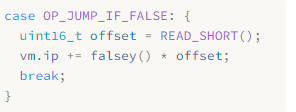

# 23.来回跳转 Jumping Back and Forth

> The order that our mind imagines is like a net, or like a ladder, built to attain something. But afterward you must throw the ladder away, because you discover that, even if it was useful, it was meaningless.
>
> ​																——Umberto Eco, *The Name of the Rose*

我们头脑中想象的秩序就像一张网，或者像一架梯子，用来达到某种目的。但事后你必须把梯子扔掉，因为你会发现，即使它有用，也毫无意义。（翁贝托·艾柯，《玫瑰之名》）

> It’s taken a while to get here, but we’re finally ready to add control flow to our virtual machine. In the tree-walk interpreter we built for jlox, we implemented Lox’s control flow in terms of Java’s. To execute a Lox `if` statement, we used a Java `if` statement to run the chosen branch. That works, but isn’t entirely satisfying. By what magic does the *JVM itself* or a native CPU implement `if` statements? Now that we have our own bytecode VM to hack on, we can answer that.

虽然花了一些时间，但我们终于准备好向虚拟机中添加控制流了。在我们为jlox构建的树遍历解释器中，我们以Java的方式实现了控制流。为了执行Lox的`if`语句，我们使用Java的`if`语句来执行所选的分支。这是可行的，但并不是完全令人满意。JVM本身或原生CPU如何实现`if`语句呢？现在我们有了自己的字节码虚拟机，我们可以回答这个问题。

> When we talk about “control flow”, what are we referring to? By “flow” we mean the way execution moves through the text of the program. Almost like there is a little robot inside the computer wandering through our code, executing bits and pieces here and there. Flow is the path that robot takes, and by *controlling* the robot, we drive which pieces of code it executes.

当我们谈论“控制流”时，我们指的是什么？我们所说的“流”是指执行过程在程序文本中的移动方式。就好像电脑里有一个小机器人在我们的代码里游荡，在这里或那里执行一些零零碎碎的片段。流就是机器人所走的路径，通过*控制*机器人，我们驱动它执行某些代码片段。

> In jlox, the robot’s locus of attention—the *current* bit of code—was implicit based on which AST nodes were stored in various Java variables and what Java code we were in the middle of running. In clox, it is much more explicit. The VM’s `ip` field stores the address of the current bytecode instruction. The value of that field is exactly “where we are” in the program.

在jlox中，机器人的关注点（*当前*代码位）是隐式的，它取决于哪些AST节点被存储在各种Java变量中，以及我们正在运行的Java代码是什么。在clox中，它要明确得多。VM的`ip`字段存储了当前字节码指令的地址。该字段的值正是我们在程序中的“位置”。

> Execution proceeds normally by incrementing the `ip`. But we can mutate that variable however we want to. In order to implement control flow, all that’s necessary is to change the `ip` in more interesting ways. The simplest control flow construct is an `if` statement with no `else` clause:

执行操作通常是通过增加`ip`进行的。但是我们可以随意地改变这个变量。为了实现控制流，所需要做的就是以更有趣的方式改变`ip`。最简单的控制流结构是没有`else`子句的`if`语句：

```c
if (condition) print("condition was truthy");
```

> The VM evaluates the bytecode for the condition expression. If the result is truthy, then it continues along and executes the `print` statement in the body. The interesting case is when the condition is falsey. When that happens, execution skips over the then branch and proceeds to the next statement.

虚拟机会计算条件表达式对应的字节码。如果结构是真，则继续执行主体中的`print`语句。有趣的是当条件为假的时候，这种情况下，执行会跳过then分支并执行下一条语句。

> To skip over a chunk of code, we simply set the `ip` field to the address of the bytecode instruction following that code. To *conditionally* skip over some code, we need an instruction that looks at the value on top of the stack. If it’s falsey, it adds a given offset to the `ip` to jump over a range of instructions. Otherwise, it does nothing and lets execution proceed to the next instruction as usual.

要想跳过一大块代码，我们只需将`ip`字段设置为其后代码的字节码指令的地址。为了*有条件地*跳过一些代码，我们需要一条指令来查看栈顶的值。如果它是假，就在`ip`上增加一个给定的偏移量，跳过一系列指令。否则，它什么也不做，并照常执行下一条指令。

> When we compile to bytecode, the explicit nested block structure of the code evaporates, leaving only a flat series of instructions behind. Lox is a [structured programming](https://en.wikipedia.org/wiki/Structured_programming) language, but clox bytecode isn’t. The right—or wrong, depending on how you look at it—set of bytecode instructions could jump into the middle of a block, or from one scope into another.
>

当我们编译成字节码时，代码中显式的嵌套块结构就消失了，只留下一系列扁平的指令。Lox是一种[结构化的编程语言](https://en.wikipedia.org/wiki/Structured_programming)，但clox字节码却不是。正确的（或者说错误的，取决于你怎么看待它）字节码指令集可以跳转到代码块的中间位置，或从一个作用域跳到另一个作用域。

> The VM will happily execute that, even if the result leaves the stack in an unknown, inconsistent state. So even though the bytecode is unstructured, we’ll take care to ensure that our compiler only generates clean code that maintains the same structure and nesting that Lox itself does.
>

虚拟机会很高兴地执行这些指令，即使其结果会导致堆栈处于未知的、不一致的状态。因此，尽管字节码是非结构化的，我们也要确保编译成只生成与Lox本身保持相同结构和嵌套的干净代码。

> This is exactly how real CPUs behave. Even though we might program them using higher-level languages that mandate structured control flow, the compiler lowers that down to raw jumps. At the bottom, it turns out goto is the only real control flow.

这就是真正的CPU的行为方式。即使我们可能会使用高级语言对它们进行编程，这些语言能够规定格式化控制流，但编译器也会将其降级为原生跳转。在底层，事实证明goto是唯一真正的控制流。

> Anyway, I didn’t mean to get all philosophical. The important bit is that if we have that one conditional jump instruction, that’s enough to implement Lox’s `if` statement, as long as it doesn’t have an `else` clause. So let’s go ahead and get started with that.

不管这么说，我并不是故意要搞得这么哲学化。重要的是，如果我们有一个条件跳转指令，就足以实现Lox的`if`语句了，只要它没有`else`子句。让我们开始吧。

> ## 23 . 1 If Statements

## 23.1 If语句

> This many chapters in, you know the drill. Any new feature starts in the front end and works its way through the pipeline. An `if` statement is, well, a statement, so that’s where we hook it into the parser.

这么多章了，你知道该怎么做。任何新特性都是从前端开始的，如果沿着管道进行工作。`if`语句是一个，嗯，语句，所以我们通过语句将它连接到解析器。

*<u>compiler.c，在statement()语句中添加代码：</u>*

```c
  if (match(TOKEN_PRINT)) {
    printStatement();
  // 新增部分开始  
  } else if (match(TOKEN_IF)) {
    ifStatement();
  // 新增部分结束  
  } else if (match(TOKEN_LEFT_BRACE)) {
```

> When we see an `if` keyword, we hand off compilation to this function:

如果我们看到`if`关键字，就把编译工作交给这个函数[^1]：

*<u>compiler.c，在expressionStatement()方法后添加代码：</u>*

```c
static void ifStatement() {
  consume(TOKEN_LEFT_PAREN, "Expect '(' after 'if'.");
  expression();
  consume(TOKEN_RIGHT_PAREN, "Expect ')' after condition."); 

  int thenJump = emitJump(OP_JUMP_IF_FALSE);
  statement();

  patchJump(thenJump);
}
```

> First we compile the condition expression, bracketed by parentheses. At runtime, that will leave the condition value on top of the stack. We’ll use that to determine whether to execute the then branch or skip it.

首先我们编译条件表达式（用小括号括起来）。在运行时，这会将条件值留在栈顶。我们将通过它来决定是执行then分支还是跳过它。

> Then we emit a new `OP_JUMP_IF_FALSE` instruction. It has an operand for how much to offset the `ip`—how many bytes of code to skip. If the condition is falsey, it adjusts the `ip` by that amount. Something like this:

然后我们生成一个新的`OP_JUMP_IF_ELSE`指令。这条指令有一个操作数，用来表示`ip`的偏移量——要跳过多少字节的代码。如果条件是假，它就按这个值调整`ip`，就像这样：


> But we have a problem. When we’re writing the `OP_JUMP_IF_FALSE` instruction’s operand, how do we know how far to jump? We haven’t compiled the then branch yet, so we don’t know how much bytecode it contains.

但我们有个问题。当我们写`OP_JUMP_IF_FALSE`指令的操作数时，我们怎么知道要跳多远？我们还没有编译then分支，所以我们不知道它包含多少字节码。

> To fix that, we use a classic trick called **backpatching**. We emit the jump instruction first with a placeholder offset operand. We keep track of where that half-finished instruction is. Next, we compile the then body. Once that’s done, we know how far to jump. So we go back and replace that placeholder offset with the real one now that we can calculate it. Sort of like sewing a patch onto the existing fabric of the compiled code.

为了解决这个问题，我们使用了一个经典的技巧，叫作**回填（backpatching）**。我们首先生成跳转指令，并附上一个占位的偏移量操作数，我们跟踪这个半成品指令的位置。接下来，我们编译then主体。一旦完成，我们就知道要跳多远。所以我们回去将占位符替换为真正的偏移量，现在我们可以计算它了。这有点像在已编译代码的现有结构上打补丁。


> We encode this trick into two helper functions.

我们将这个技巧编码为两个辅助函数。

*<u>compiler.c，在emitBytes()方法后添加代码：</u>*

```c
static int emitJump(uint8_t instruction) {
  emitByte(instruction);
  emitByte(0xff);
  emitByte(0xff);
  return currentChunk()->count - 2;
}
```

> The first emits a bytecode instruction and writes a placeholder operand for the jump offset. We pass in the opcode as an argument because later we’ll have two different instructions that use this helper. We use two bytes for the jump offset operand. A 16-bit offset lets us jump over up to 65,535 bytes of code, which should be plenty for our needs.

第一个程序会生成一个字节码指令，并为跳转偏移量写入一个占位符操作数。我们把操作码作为参数传入，因为稍后我们会有两个不同的指令都使用这个辅助函数。我们使用两个字节作为跳转偏移量的操作数。一个16位的偏移量可以让我们跳转65535个字节的代码，这对于我们的需求来说应该足够了[^2]。

> The function returns the offset of the emitted instruction in the chunk. After compiling the then branch, we take that offset and pass it to this:

该函数会返回生成的指令在字节码块中的偏移量。编译完then分支后，我们将这个偏移量传递给这个函数：

*<u>compiler.c，在emitConstant()方法后添加代码：</u>*

```c
static void patchJump(int offset) {
  // -2 to adjust for the bytecode for the jump offset itself.
  int jump = currentChunk()->count - offset - 2;

  if (jump > UINT16_MAX) {
    error("Too much code to jump over.");
  }

  currentChunk()->code[offset] = (jump >> 8) & 0xff;
  currentChunk()->code[offset + 1] = jump & 0xff;
}
```

> This goes back into the bytecode and replaces the operand at the given location with the calculated jump offset. We call `patchJump()` right before we emit the next instruction that we want the jump to land on, so it uses the current bytecode count to determine how far to jump. In the case of an `if` statement, that means right after we compile the then branch and before we compile the next statement.

这个函数会返回到字节码中，并将给定位置的操作数替换为计算出的跳转偏移量。我们在生成下一条希望跳转的指令之前调用`patchJump()`，因此会使用当前字节码计数来确定要跳转的距离。在`if`语句的情况下，就是在编译完then分支之后，并在编译下一个语句之前。

> That’s all we need at compile time. Let’s define the new instruction.

这就是在编译时需要做的。让我们来定义新指令。

*<u>chunk.h，在枚举OpCode中添加代码：</u>*

```c
  OP_PRINT,
  // 新增部分开始
  OP_JUMP_IF_FALSE,
  // 新增部分结束
  OP_RETURN,
```

> Over in the VM, we get it working like so:

在虚拟机中，我们让它这样工作：

*<u>vm.c，在run()方法中添加代码：</u>*

```c
        break;
      }
      // 新增部分开始
      case OP_JUMP_IF_FALSE: {
        uint16_t offset = READ_SHORT();
        if (isFalsey(peek(0))) vm.ip += offset;
        break;
      }
      // 新增部分结束
      case OP_RETURN: {
```

> This is the first instruction we’ve added that takes a 16-bit operand. To read that from the chunk, we use a new macro.

这是我们添加的第一个需要16位操作数的指令。为了从字节码块中读出这个指令，需要使用一个新的宏。

*<u>vm.c，在run()方法中添加代码：</u>*

```c
#define READ_CONSTANT() (vm.chunk->constants.values[READ_BYTE()])
// 新增部分开始
#define READ_SHORT() \
    (vm.ip += 2, (uint16_t)((vm.ip[-2] << 8) | vm.ip[-1]))
// 新增部分结束    
#define READ_STRING() AS_STRING(READ_CONSTANT())
```

> It yanks the next two bytes from the chunk and builds a 16-bit unsigned integer out of them. As usual, we clean up our macro when we’re done with it.

它从字节码块中抽取接下来的两个字节，并从中构建出一个16位无符号整数。和往常一样，当我们结束之后要清理宏。

*<u>vm.c，在run()方法中添加代码：</u>*

```c
#undef READ_BYTE
// 新增部分开始
#undef READ_SHORT
// 新增部分结束
#undef READ_CONSTANT
```

> After reading the offset, we check the condition value on top of the stack. If it’s falsey, we apply this jump offset to the `ip`. Otherwise, we leave the `ip` alone and execution will automatically proceed to the next instruction following the jump instruction.

读取偏移量之后，我们检查栈顶的条件值。如果是假，我们就将这个跳转偏移量应用到`ip`上。否则，我们就保持`ip`不变，执行会自动进入跳转指令的下一条指令。

> In the case where the condition is falsey, we don’t need to do any other work. We’ve offset the `ip`, so when the outer instruction dispatch loop turns again, it will pick up execution at that new instruction, past all of the code in the then branch.

在条件为假的情况下，我们不需要做任何其它工作。我们已经移动了`ip`，所以当外部指令调度循环再次启动时，将会在新指令处执行，跳过了then分支的所有代码[^3]。

> Note that the jump instruction doesn’t pop the condition value off the stack. So we aren’t totally done here, since this leaves an extra value floating around on the stack. We’ll clean that up soon. Ignoring that for the moment, we do have a working `if` statement in Lox now, with only one little instruction required to support it at runtime in the VM.
>

请注意，跳转指令并没有将条件值弹出栈。因此，我们在这里还没有全部完成，因为还在堆栈上留下了一个额外的值。我们很快就会把它清理掉。暂时先忽略这个问题，我们现在在Lox中已经有了可用的`if`语句，只需要一条小指令在虚拟机运行时支持它。

> ### 23 . 1 . 1 Else clauses

### 23.1.1 Else子句

> An `if` statement without support for `else` clauses is like Morticia Addams without Gomez. So, after we compile the then branch, we look for an `else` keyword. If we find one, we compile the else branch.

一个不支持`else`子句的`if`语句就像没有Gomez的Morticia Addams（《亚当斯一家》）。因此，在我们编译完then分支之后，我们要寻找`else`关键字。如果找到了，则编译else分支。

*<u>compiler.c，在ifStatement()方法中添加代码：</u>*

```c
  patchJump(thenJump);
  // 新增部分开始
  if (match(TOKEN_ELSE)) statement();
  // 新增部分结束
}
```

> When the condition is falsey, we’ll jump over the then branch. If there’s an else branch, the `ip` will land right at the beginning of its code. But that’s not enough, though. Here’s the flow that leads to:

当条件为假时，我们会跳过then分支。如果存在else分支，`ip`就会出现在其字节码的开头处。但这还不够。下面是对应的流：


> If the condition is truthy, we execute the then branch like we want. But after that, execution rolls right on through into the else branch. Oops! When the condition is true, after we run the then branch, we need to jump over the else branch. That way, in either case, we only execute a single branch, like this:

如果条件是真，则按照要求执行then分支。但在那之后，执行会直接转入到else分支。糟糕！当条件为真时，执行完then分支后，我们需要跳过else分支。这样，无论哪种情况，我们都只执行一个分支，像这样：


> To implement that, we need another jump from the end of the then branch.

为了实现这一点，我们需要从then分支的末端再进行一次跳转。

*<u>compiler.c，在ifStatement()方法中添加代码：</u>*

```c
  statement();
  // 新增部分开始
  int elseJump = emitJump(OP_JUMP);
  // 新增部分结束
  patchJump(thenJump);
```

> We patch that offset after the end of the else body.

我们在else主体结束后修补这个偏移量。

*<u>compiler.c，在ifStatement()方法中添加代码：</u>*

```c
  if (match(TOKEN_ELSE)) statement();
  // 新增部分开始
  patchJump(elseJump);
  // 新增部分结束
}
```

> After executing the then branch, this jumps to the next statement after the else branch. Unlike the other jump, this jump is unconditional. We always take it, so we need another instruction that expresses that.

在执行完then分支后，会跳转到else分支之后的下一条语句。与其它跳转不同，这个跳转是无条件的。我们一定会接受该跳转，所以我们需要另一条指令来表达它。

*<u>chunk.h，在枚举OpCode中添加代码：</u>*

```c
  OP_PRINT,
  // 新增部分开始
  OP_JUMP,
  // 新增部分结束
  OP_JUMP_IF_FALSE,
```

> We interpret it like so:

我们这样来解释它：

*<u>vm.c，在run()方法中添加代码：</u>*

```c
        break;
      }
      // 新增部分开始
      case OP_JUMP: {
        uint16_t offset = READ_SHORT();
        vm.ip += offset;
        break;
      }
      // 新增部分结束
      case OP_JUMP_IF_FALSE: {
```

> Nothing too surprising here—the only difference is that it doesn’t check a condition and always applies the offset.

这里没有什么特别出人意料的——唯一的区别就是它不检查条件，并且一定会应用偏移量。

> We have then and else branches working now, so we’re close. The last bit is to clean up that condition value we left on the stack. Remember, each statement is required to have zero stack effect—after the statement is finished executing, the stack should be as tall as it was before.

我们现在有了then和else分支，所以已经接近完成了。最后一点是清理我们遗留在栈上的条件值。请记住，每个语句都要求是0堆栈效应——在语句执行完毕后，堆栈应该与之前一样高。

> We could have the `OP_JUMP_IF_FALSE` instruction pop the condition itself, but soon we’ll use that same instruction for the logical operators where we don’t want the condition popped. Instead, we’ll have the compiler emit a couple of explicit `OP_POP` instructions when compiling an `if` statement. We need to take care that every execution path through the generated code pops the condition.

我们可以让`OP_JUMP_IF_FALSE`指令自身弹出条件值，但很快我们会对不希望弹出条件值的逻辑运算符使用相同的指令。相对地，我们在编译`if`语句时，会让编译器生成几条显式的`OP_POP`指令，我们需要注意生成的代码中的每一条执行路径都要弹出条件值。

> When the condition is truthy, we pop it right before the code inside the then branch.

当条件为真时，我们会在进入then分支的代码前弹出该值。

*<u>compiler.c，在ifStatement()方法中添加代码：</u>*

```c
  int thenJump = emitJump(OP_JUMP_IF_FALSE);
  // 新增部分开始
  emitByte(OP_POP);
  // 新增部分结束
  statement();
```

> Otherwise, we pop it at the beginning of the else branch.

否则，我们就在else分支的开头弹出它。

*<u>compiler.c，在ifStatement()方法中添加代码：</u>*

```c
  patchJump(thenJump);
  // 新增部分开始
  emitByte(OP_POP);
  // 新增部分结束
  if (match(TOKEN_ELSE)) statement();
```

> This little instruction here also means that every `if` statement has an implicit else branch even if the user didn’t write an `else` clause. In the case where they left it off, all the branch does is discard the condition value.

这里的这个小指令也意味着每个`if`语句都有一个隐含的else分支，即使用户没有写`else`子句。在用户没有写else子句的情况下，这个分支所做的就是丢弃条件值。

> The full correct flow looks like this:

完整正确的流看起来是这样的：


> If you trace through, you can see that it always executes a single branch and ensures the condition is popped first. All that remains is a little disassembler support.

如果你跟踪整个过程，可以看到它总是只执行一个分支，并确保条件值首先被弹出。剩下的就是一点反汇编程序的支持了。

*<u>debug.c，在disassembleInstruction()方法中添加代码：</u>*

```c
      return simpleInstruction("OP_PRINT", offset);
    // 新增部分开始  
    case OP_JUMP:
      return jumpInstruction("OP_JUMP", 1, chunk, offset);
    case OP_JUMP_IF_FALSE:
      return jumpInstruction("OP_JUMP_IF_FALSE", 1, chunk, offset);
    // 新增部分结束  
    case OP_RETURN:
```

> These two instructions have a new format with a 16-bit operand, so we add a new utility function to disassemble them.

这两条指令具有新格式，有着16位的操作数，因此我们添加了一个新的工具函数来反汇编它们。

*<u>debug.c，在byteInstruction()方法后添加代码：</u>*

```c
static int jumpInstruction(const char* name, int sign,
                           Chunk* chunk, int offset) {
  uint16_t jump = (uint16_t)(chunk->code[offset + 1] << 8);
  jump |= chunk->code[offset + 2];
  printf("%-16s %4d -> %d\n", name, offset,
         offset + 3 + sign * jump);
  return offset + 3;
}
```

> There we go, that’s one complete control flow construct. If this were an ’80s movie, the montage music would kick in and the rest of the control flow syntax would take care of itself. Alas, the ’80s are long over, so we’ll have to grind it out ourselves.

就这样，这就是一个完整的控制流结构。如果这是一部80年代的电影，蒙太奇音乐就该响起了，剩下的控制流语法就会自行完成。唉，80年代已经过去很久了，所以我们得自己打磨了。

> ## 23 . 2 Logical Operators

## 23.2 逻辑运算符

> You probably remember this from jlox, but the logical operators `and` and `or` aren’t just another pair of binary operators like `+` and `-`. Because they short-circuit and may not evaluate their right operand depending on the value of the left one, they work more like control flow expressions.

你可能还记得jlox中的实现，但是逻辑运算符`and`和`or`并不仅仅是另一对像`+`和`-`一样的二元运算符。因为它们是短路的，根据左操作数的值，有可能不会对右操作数求值，它们的工作方式 更像是控制流表达式。

> They’re basically a little variation on an `if` statement with an `else` clause. The easiest way to explain them is to just show you the compiler code and the control flow it produces in the resulting bytecode. Starting with `and`, we hook it into the expression parsing table here:
>

它们基本上是带有`else`子句的`if`语句的小变体。解释它们的最简单的方法是向你展示编译器代码以及它在字节码中生成的控制流。从`and`开始，我们把它挂接到表达式解析表中：

*<u>compiler.c，替换1行：</u>*

```c
  [TOKEN_NUMBER]        = {number,   NULL,   PREC_NONE},
  // 替换部分开始
  [TOKEN_AND]           = {NULL,     and_,   PREC_AND},
  // 替换部分结束
  [TOKEN_CLASS]         = {NULL,     NULL,   PREC_NONE},
```

> That hands off to a new parser function.

这就交给了一个新的解析器函数。

*<u>compiler.c，在defineVariable()方法后添加代码：</u>*

```c
static void and_(bool canAssign) {
  int endJump = emitJump(OP_JUMP_IF_FALSE);

  emitByte(OP_POP);
  parsePrecedence(PREC_AND);

  patchJump(endJump);
}
```

> At the point this is called, the left-hand side expression has already been compiled. That means at runtime, its value will be on top of the stack. If that value is falsey, then we know the entire `and` must be false, so we skip the right operand and leave the left-hand side value as the result of the entire expression. Otherwise, we discard the left-hand value and evaluate the right operand which becomes the result of the whole `and` expression.

在这个方法被调用时，左侧的表达式已经被编译了。这意味着，在运行时，它的值将会在栈顶。如果这个值为假，我们就知道整个`and`表达式的结果一定是假，所以我们跳过右边的操作数，将左边的值作为整个表达式的结果。否则，我们就丢弃左值，计算右操作数，并将它作为整个`and`表达式的结果。

> Those four lines of code right there produce exactly that. The flow looks like this:

这四行代码正是产生这样的结果。流程看起来像这样：


> Now you can see why `OP_JUMP_IF_FALSE` leaves the value on top of the stack. When the left-hand side of the `and` is falsey, that value sticks around to become the result of the entire expression.

现在你可以看到为什么`OP_JUMP_IF_FALSE`要将值留在栈顶。当`and`左侧的值为假时，这个值会保留下来，成为整个表达式的结果[^4]。

> ### 23 . 2 . 1 Logical or operator

### 23.2.1 逻辑or运算符

> The `or` operator is a little more complex. First we add it to the parse table.

`or`运算符有点复杂。首先，我们将它添加到解析表中。

*<u>compiler.c，替换1行：</u>*

```c
  [TOKEN_NIL]           = {literal,  NULL,   PREC_NONE},
  // 替换部分开始
  [TOKEN_OR]            = {NULL,     or_,    PREC_OR},
  // 替换部分结束
  [TOKEN_PRINT]         = {NULL,     NULL,   PREC_NONE},
```

> When that parser consumes an infix `or` token, it calls this:

当解析器处理中缀`or`标识时，会调用这个：

*<u>compiler.c，在number()方法后添加代码：</u>*

```c
static void or_(bool canAssign) {
  int elseJump = emitJump(OP_JUMP_IF_FALSE);
  int endJump = emitJump(OP_JUMP);

  patchJump(elseJump);
  emitByte(OP_POP);

  parsePrecedence(PREC_OR);
  patchJump(endJump);
}
```

> In an `or` expression, if the left-hand side is *truthy*, then we skip over the right operand. Thus we need to jump when a value is truthy. We could add a separate instruction, but just to show how our compiler is free to map the language’s semantics to whatever instruction sequence it wants, I implemented it in terms of the jump instructions we already have.

在`or`表达式中，如果左侧值为*真*，那么我们就跳过右侧的操作数。因此，当值为真时，我们需要跳过。我们可以添加一条单独的指令，但为了说明编译器如何自由地将语言的语义映射为它想要的任何指令序列，我会使用已有的跳转指令来实现它。

> When the left-hand side is falsey, it does a tiny jump over the next statement. That statement is an unconditional jump over the code for the right operand. This little dance effectively does a jump when the value is truthy. The flow looks like this:

当左侧值为假时，它会做一个小跳跃，跳过下一条语句。该语句会无条件跳过右侧操作数的代码。当值为真时，就会进行该跳转。流程看起来是这样的：


> If I’m honest with you, this isn’t the best way to do this. There are more instructions to dispatch and more overhead. There’s no good reason why `or` should be slower than `and`. But it is kind of fun to see that it’s possible to implement both operators without adding any new instructions. Forgive me my indulgences.

说实话，这并不是最好的方法。（这种方式中）需要调度的指令更多，开销也更大。没有充足的理由说明为什么`or`要比`and`慢。但是，可以在不增加任何新指令的前提下实现两个运算符，这是有趣的。请原谅我的放纵。

> OK, those are the three *branching* constructs in Lox. By that, I mean, these are the control flow features that only jump *forward* over code. Other languages often have some kind of multi-way branching statement like `switch` and maybe a conditional expression like `?:`, but Lox keeps it simple.

好了，这就是Lox中的三个分支结构。我的意思是，这些控制流特性只能在代码上*向前*跳转。其它语言中通常有某种多路分支语句，如`switch`，也许还有条件表达式`?:`，但Lox保持简单。

> ## 23 . 3 While Statements

## 23.3 While语句

> That takes us to the *looping* statements, which jump *backward* so that code can be executed more than once. Lox only has two loop constructs, `while` and `for`. A `while` loop is (much) simpler, so we start the party there.

这就将我们带到了*循环*语句，循环语句会向后跳转，使代码可以多次执行。Lox只有两种循环结构`while`和`for`。`while`循环要简单（得多），所以我们从这里开始。

*<u>compiler.c，在statement()方法中添加代码：</u>*

```c
    ifStatement();
  // 新增部分开始  
  } else if (match(TOKEN_WHILE)) {
    whileStatement();
  // 新增部分结束  
  } else if (match(TOKEN_LEFT_BRACE)) {
```

> When we reach a `while` token, we call:

当我们遇到`while`标识时，调用：

*<u>compiler.c，在printStatement()方法后添加代码：</u>*

```c
static void whileStatement() {
  consume(TOKEN_LEFT_PAREN, "Expect '(' after 'while'.");
  expression();
  consume(TOKEN_RIGHT_PAREN, "Expect ')' after condition.");

  int exitJump = emitJump(OP_JUMP_IF_FALSE);
  emitByte(OP_POP);
  statement();

  patchJump(exitJump);
  emitByte(OP_POP);
}
```

> Most of this mirrors `if` statements—we compile the condition expression, surrounded by mandatory parentheses. That’s followed by a jump instruction that skips over the subsequent body statement if the condition is falsey.

大部分跟`if`语句相似——我们编译条件表达式（强制用括号括起来）。之后是一个跳转指令，如果条件为假，会跳过后续的主体语句。

> We patch the jump after compiling the body and take care to pop the condition value from the stack on either path. The only difference from an `if` statement is the loop. That looks like this:

我们在编译完主体之后对跳转指令进行修补，并注意在每个执行路径上都要弹出栈顶的条件值。与`if`语句的唯一区别就是循环[^5]。看起来像这样：

*<u>compiler.c，在whileStatement()方法中添加代码：</u>*

```c
  statement();
  // 新增部分开始
  emitLoop(loopStart);
  // 新增部分结束
  patchJump(exitJump);
```

> After the body, we call this function to emit a “loop” instruction. That instruction needs to know how far back to jump. When jumping forward, we had to emit the instruction in two stages since we didn’t know how far we were going to jump until after we emitted the jump instruction. We don’t have that problem now. We’ve already compiled the point in code that we want to jump back to—it’s right before the condition expression.

在主体之后，我们调用这个函数来生成一个“循环”指令。该指令需要知道往回跳多远。当向前跳时，我们必须分两个阶段发出指令，因为在发出跳跃指令前，我们不知道要跳多远。现在我们没有这个问题了。我们已经编译了要跳回去的代码位置——就在条件表达式之前。

> All we need to do is capture that location as we compile it.

我们所需要做的就是在编译时捕获这个位置。

*<u>compiler.c，在whileStatement()方法中添加代码：</u>*

```c
static void whileStatement() {
  // 新增部分开始
  int loopStart = currentChunk()->count;
  // 新增部分结束
  consume(TOKEN_LEFT_PAREN, "Expect '(' after 'while'.");
```

> After executing the body of a `while` loop, we jump all the way back to before the condition. That way, we re-evaluate the condition expression on each iteration. We store the chunk’s current instruction count in `loopStart` to record the offset in the bytecode right before the condition expression we’re about to compile. Then we pass that into this helper function:

在执行完`while`循环后，我们会一直跳到条件表达式之前。这样，我们就可以在每次迭代时都重新对条件表达式求值。我们在`loopStar`中存储字节码块中当前的指令数，作为我们即将编译的条件表达式在字节码中的偏移量。然后我们将该值传给这个辅助函数：

*<u>compiler.c，在emitBytes()方法后添加代码：</u>*

```c
static void emitLoop(int loopStart) {
  emitByte(OP_LOOP);

  int offset = currentChunk()->count - loopStart + 2;
  if (offset > UINT16_MAX) error("Loop body too large.");

  emitByte((offset >> 8) & 0xff);
  emitByte(offset & 0xff);
}
```

> It’s a bit like `emitJump()` and `patchJump()` combined. It emits a new loop instruction, which unconditionally jumps *backwards* by a given offset. Like the jump instructions, after that we have a 16-bit operand. We calculate the offset from the instruction we’re currently at to the `loopStart` point that we want to jump back to. The `+ 2` is to take into account the size of the `OP_LOOP` instruction’s own operands which we also need to jump over.

这有点像`emitJump()`和`patchJump()` 的结合。它生成一条新的循环指令，该指令会无条件地*向回*跳转给定的偏移量。和跳转指令一样，其后还有一个16位的操作数。我们计算当前指令到我们想要跳回的`loopStart`之间的偏移量。`+2`是考虑到了`OP_LOOP`指令自身操作数的大小，这个操作数我们也需要跳过。

> From the VM’s perspective, there really is no semantic difference between `OP_LOOP` and `OP_JUMP`. Both just add an offset to the `ip`. We could have used a single instruction for both and given it a signed offset operand. But I figured it was a little easier to sidestep the annoying bit twiddling required to manually pack a signed 16-bit integer into two bytes, and we’ve got the opcode space available, so why not use it?

从虚拟机的角度看，`OP_LOOP` 和`OP_JUMP`之间实际上没有语义上的区别。两者都只是在`ip`上加了一个偏移量。我们本可以用一条指令来处理这两者，并给该指令传入一个有符号的偏移量操作数。但我认为，这样做更容易避免手动将一个有符号的16位整数打包到两个字节所需要的烦人的位操作，况且我们有可用的操作码空间，为什么不使用呢？

> The new instruction is here:

新指令如下：

*<u>chunk.h，在枚举OpCode中添加代码：</u>*

```c
  OP_JUMP_IF_FALSE,
  // 新增部分开始
  OP_LOOP,
  // 新增部分结束
  OP_RETURN,
```

> And in the VM, we implement it thusly:

在虚拟机中，我们这样实现它：

*<u>vm.c，在run()方法中添加代码：</u>*

```c
      }
      // 新增部分开始
      case OP_LOOP: {
        uint16_t offset = READ_SHORT();
        vm.ip -= offset;
        break;
      }
      // 新增部分结束
      case OP_RETURN: {
```

> The only difference from `OP_JUMP` is a subtraction instead of an addition. Disassembly is similar too.

与`OP_JUMP`唯一的区别就是这里使用了减法而不是加法。反汇编也是相似的。

*<u>debug.c，在disassembleInstruction()方法中添加代码：</u>*

```c
      return jumpInstruction("OP_JUMP_IF_FALSE", 1, chunk, offset);
    // 新增部分开始  
    case OP_LOOP:
      return jumpInstruction("OP_LOOP", -1, chunk, offset);
    // 新增部分结束
    case OP_RETURN:
```

> That’s our `while` statement. It contains two jumps—a conditional forward one to escape the loop when the condition is not met, and an unconditional loop backward after we have executed the body. The flow looks like this:

这就是我们的`while`语句。它包含两个跳转——一个是有条件的前向跳转，用于在不满足条件的时候退出循环；另一个是在执行完主体代码后的无条件跳转。流程看起来如下：


> ## 23 . 4 For Statements

## 23.4 For语句

> The other looping statement in Lox is the venerable `for` loop, inherited from C. It’s got a lot more going on with it compared to a `while` loop. It has three clauses, all of which are optional:

Lox中的另一个循环语句是古老的`for`循环，继承自C语言。与`while`循环相比，它有着更多的功能。它有三个子句，都是可选的：

> - The initializer can be a variable declaration or an expression. It runs once at the beginning of the statement.
> - The condition clause is an expression. Like in a `while` loop, we exit the loop when it evaluates to something falsey.
> - The increment expression runs once at the end of each loop iteration.

- 初始化器可以是一个变量声明或一个表达式。它会在整个语句的开头运行一次。
- 条件子句是一个表达式。就像`while`循环一样，如果其计算结果为假，就退出循环。
- 增量表达式在每次循环迭代结束时运行一次。

> In jlox, the parser desugared a `for` loop to a synthesized AST for a `while` loop with some extra stuff before it and at the end of the body. We’ll do something similar, though we won’t go through anything like an AST. Instead, our bytecode compiler will use the jump and loop instructions we already have.

在jlox中，解析器将`for`循环解构为一个`while`循环与其主体前后的一些额外内容的合成AST。我们会做一些类似的事情，不过我们不会使用AST之类的东西。相反，我们的字节码编译器将使用我们已有的跳转和循环指令。

> We’ll work our way through the implementation a piece at a time, starting with the `for` keyword.

我们将从`for`关键字开始，逐步完成整个实现。

*<u>compiler.c，在statement()方法中添加代码：</u>*

```c
    printStatement();
  // 新增部分开始  
  } else if (match(TOKEN_FOR)) {
    forStatement();
  // 新增部分结束  
  } else if (match(TOKEN_IF)) {
```

> It calls a helper function. If we only supported `for` loops with empty clauses like `for (;;)`, then we could implement it like this:

它会调用一个辅助函数。如果我们只支持`for(;;)`这样带有空子句的`for`循环，那么我们可以这样实现它：

*<u>compiler.c，在expressionStatement()方法后添加代码：</u>*

```c
static void forStatement() {
  consume(TOKEN_LEFT_PAREN, "Expect '(' after 'for'.");
  consume(TOKEN_SEMICOLON, "Expect ';'.");

  int loopStart = currentChunk()->count;
  consume(TOKEN_SEMICOLON, "Expect ';'.");
  consume(TOKEN_RIGHT_PAREN, "Expect ')' after for clauses.");

  statement();
  emitLoop(loopStart);
}
```

> There’s a bunch of mandatory punctuation at the top. Then we compile the body. Like we did for `while` loops, we record the bytecode offset at the top of the body and emit a loop to jump back to that point after it. We’ve got a working implementation of infinite loops now.

首先是一堆强制性的标点符号。然后我们编译主体。与`while`循环一样，我们在主体的顶部记录字节码的偏移量，并在之后生成一个循环指令跳回该位置。现在我们已经有了一个无限循环的有效实现。

> ### 23 . 4 . 1 Initializer clause

### 23.4.1 初始化子句

> Now we’ll add the first clause, the initializer. It executes only once, before the body, so compiling is straightforward.

现在我们要添加第一个子句，初始化器。它只在主体之前执行一次，因此编译很简单。

*<u>compiler.c，在forStatement()方法中替换1行：</u>*

```c
  consume(TOKEN_LEFT_PAREN, "Expect '(' after 'for'.");
  // 替换部分开始
  if (match(TOKEN_SEMICOLON)) {
    // No initializer.
  } else if (match(TOKEN_VAR)) {
    varDeclaration();
  } else {
    expressionStatement();
  }
  // 替换部分结束
  int loopStart = currentChunk()->count;
```

> The syntax is a little complex since we allow either a variable declaration or an expression. We use the presence of the `var` keyword to tell which we have. For the expression case, we call `expressionStatement()` instead of `expression()`. That looks for a semicolon, which we need here too, and also emits an `OP_POP` instruction to discard the value. We don’t want the initializer to leave anything on the stack.

语法有点复杂，因为我们允许出现变量声明或表达式。我们通过是否存在`var`关键字来判断是哪种类型。对于表达式，我们调用`expressionStatement()`而不是`expression()`。它会查找分号（我们这里也需要一个分号），并生成一个`OP_POP`指令来丢弃表达式的值。我们不希望初始化器在堆栈中留下任何东西。

> If a `for` statement declares a variable, that variable should be scoped to the loop body. We ensure that by wrapping the whole statement in a scope.

如果`for`语句声明了一个变量，那么该变量的作用域应该限制在循环体中。我们通过将整个语句包装在一个作用域中来确保这一点。

*<u>compiler.c，在forStatement()方法中添加代码：</u>*

```c
static void forStatement() {
  // 新增部分开始
  beginScope();
  // 新增部分结束
  consume(TOKEN_LEFT_PAREN, "Expect '(' after 'for'.");
```

> Then we close it at the end.

然后我们在结尾关闭这个作用域。

*<u>compiler.c，在forStatement()方法中添加代码：</u>*

```c
  emitLoop(loopStart);
  // 新增部分开始
  endScope();
  // 新增部分结束
}
```

> ### 23 . 4 . 2 Condition clause

### 23.4.2 条件子句

> Next, is the condition expression that can be used to exit the loop.

接下来，是可以用来退出循环的条件表达式。

*<u>compiler.c，在forStatement()方法中替换1行：</u>*

```c
  int loopStart = currentChunk()->count;
  // 替换部分开始
  int exitJump = -1;
  if (!match(TOKEN_SEMICOLON)) {
    expression();
    consume(TOKEN_SEMICOLON, "Expect ';' after loop condition.");

    // Jump out of the loop if the condition is false.
    exitJump = emitJump(OP_JUMP_IF_FALSE);
    emitByte(OP_POP); // Condition.
  }
  // 替换部分结束
  consume(TOKEN_RIGHT_PAREN, "Expect ')' after for clauses.");
```

> Since the clause is optional, we need to see if it’s actually present. If the clause is omitted, the next token must be a semicolon, so we look for that to tell. If there isn’t a semicolon, there must be a condition expression.

因为子句是可选的，我们需要查看它是否存在。如果子句被省略，下一个标识一定是分号，所以我们通过查找分号来进行判断。如果没有分号，就一定有一个条件表达式。

> In that case, we compile it. Then, just like with while, we emit a conditional jump that exits the loop if the condition is falsey. Since the jump leaves the value on the stack, we pop it before executing the body. That ensures we discard the value when the condition is true.

在这种情况下，我们对它进行编译。然后，就像`while`一样，我们生成一个条件跳转指令，如果条件为假则退出循环。因为跳转指令将值留在了栈上，我们在执行主体之前将值弹出。这样可以确保当条件值为真时，我们会丢弃这个值。

> After the loop body, we need to patch that jump.

在循环主体之后，我们需要修补跳转指令。

*<u>compiler.c，在forStatement()方法中添加代码：</u>*

```c
  emitLoop(loopStart);
  // 新增部分开始
  if (exitJump != -1) {
    patchJump(exitJump);
    emitByte(OP_POP); // Condition.
  }
  // 新增部分结束
  endScope();
}
```

> We do this only when there is a condition clause. If there isn’t, there’s no jump to patch and no condition value on the stack to pop.

我们只在有条件子句的时候才会这样做。如果没有条件子句，就没有需要修补的跳转指令，堆栈中也没有条件值需要弹出。

> ### 23 . 4 . 3 Increment clause

### 23.4.3 增量子句

> I’ve saved the best for last, the increment clause. It’s pretty convoluted. It appears textually before the body, but executes *after* it. If we parsed to an AST and generated code in a separate pass, we could simply traverse into and compile the `for` statement AST’s body field before its increment clause.

我把非常复杂的增量子句部分留到最后。从文本上看，它出现在循环主体之前，但却是在主体*之后*执行。如果我们将其解析为AST，并在单独的处理过程中生成代码，就可以简单地遍历并编译`for`语句AST的主体字段，然后再编译其增量子句。

> Unfortunately, we can’t compile the increment clause later, since our compiler only makes a single pass over the code. Instead, we’ll *jump over* the increment, run the body, jump *back* up to the increment, run it, and then go to the next iteration.

不幸的是，我们不能稍后再编译增量子句，因为我们的编译器只对代码做了一次遍历。相对地，我们会*跳过*增量子句，运行主体，*跳回*增量子句，运行它，然后进入下一个迭代。

> I know, a little weird, but hey, it beats manually managing ASTs in memory in C, right? Here’s the code:

我知道，这有点奇怪，但是，这总比在C语言中手动管理内存中的AST要好，对吗？代码如下：

*<u>compiler.c，在forStatement()方法中替换1行：</u>*

```c
  }
  // 替换部分开始
  if (!match(TOKEN_RIGHT_PAREN)) {
    int bodyJump = emitJump(OP_JUMP);
    int incrementStart = currentChunk()->count;
    expression();
    emitByte(OP_POP);
    consume(TOKEN_RIGHT_PAREN, "Expect ')' after for clauses.");

    emitLoop(loopStart);
    loopStart = incrementStart;
    patchJump(bodyJump);
  }
  // 替换部分结束
  statement();
```

> Again, it’s optional. Since this is the last clause, when omitted, the next token will be the closing parenthesis. When an increment is present, we need to compile it now, but it shouldn’t execute yet. So, first, we emit an unconditional jump that hops over the increment clause’s code to the body of the loop.

同样，它也是可选的。因为这是最后一个子句，下一个标识是右括号。当存在增加子句时，我们需要立即编译它，但是它还不应该执行。因此，首先我们生成一个无条件跳转指令，该指令会跳过增量子句的代码进入循环体中。

> Next, we compile the increment expression itself. This is usually an assignment. Whatever it is, we only execute it for its side effect, so we also emit a pop to discard its value.

接下来，我们编译增量表达式本身。这通常是一个赋值语句。不管它是什么，我们执行它只是为了它的副作用，所以我们也生成一个弹出指令丢弃该值。

> The last part is a little tricky. First, we emit a loop instruction. This is the main loop that takes us back to the top of the `for` loop—right before the condition expression if there is one. That loop happens right after the increment, since the increment executes at the end of each loop iteration.

最后一部分有点棘手。首先，我们生成一个循环指令。这是主循环，会将我们带到`for`循环的顶部——如果有条件表达式的话，就回在它前面。这个循环发生在增量语句之后，因此增量语句是在每次循环迭代结束时执行的。

> Then we change `loopStart` to point to the offset where the increment expression begins. Later, when we emit the loop instruction after the body statement, this will cause it to jump up to the *increment* expression instead of the top of the loop like it does when there is no increment. This is how we weave the increment in to run after the body.

然后我们更改`loopStart`，指向增量表达式开始处的偏移量。之后，当我们在主体语句结束之后生成循环指令时，就会跳转到增量表达式，而不是像没有增量表达式时那样跳转到循环顶部。这就是我们如何在主体之后运行增量子句的办法。

> It’s convoluted, but it all works out. A complete loop with all the clauses compiles to a flow like this:

这很复杂，但一切都解决了。一个包含所有子句的完整循环会被编译为类似这样的流程：


> As with implementing `for` loops in jlox, we didn’t need to touch the runtime. It all gets compiled down to primitive control flow operations the VM already supports. In this chapter, we’ve taken a big leap forward—clox is now Turing complete. We’ve also covered quite a bit of new syntax: three statements and two expression forms. Even so, it only took three new simple instructions. That’s a pretty good effort-to-reward ratio for the architecture of our VM.

与jlox中实现`for`循环一样，我们不需要接触运行时。所有这些都被编译到虚拟机已经支持的原始控制流中。在这一章中，我们向前迈出了一大步——clox现在图灵完整了。我们还讨论了相当多的新语法：三种语句和两种表达式形式。即便如此，我们也只用了三个简单的新指令。对于我们的虚拟机架构来说，这是一个相当不错的努力-回报比。


[^1]: 你有没有注意到，`if`关键字后面的`(`实际上没有什么用处？如果没有它，语言也会很明确，而且容易解析，比如：<BR>`if condition) print("looks weird");`<BR>结尾的`)`是有用的，因为它将条件表达式和主体分隔开。有些语言使用`then`关键字来代替。但是开头的`(`没有任何作用。它之所以存在，是因为不匹配的括号在我们人类看来很糟糕。
[^2]: 一些指令集中有单独的“长”跳转指令，这些指令会接受更大的操作数，当你需要跳转更远的距离时可以使用。
[^3]: 我说过我们不会使用C的`if`语句来实现Lox的控制流，但我们在这里确实使用了`if`语句来决定是否偏移指令指针。但我们并没有真正使用C语言来实现控制流。如果我们想的话，可以用纯粹的算术做到同样的事情。假设我们有一个函数`falsey()`，它接受一个Lox Value，如果是假则返回1，否则返回0。那我们可以这样实现跳转指令：<BR><BR>`falsey()`函数可能会使用一些控制流来处理不同的值类型，但这是该函数的实现细节，并不影响我们的虚拟机如何处理自己的控制流。
[^4]: 我们的操作码范围中还有足够的空间，所以我们可以为隐式弹出值的条件跳转和不弹出值的条件跳转制定单独的指令。但我想尽量在书中保持简约。在你的字节码虚拟机中，值得探索添加更多的专用指令，看看它们是如何影响性能的。
[^5]: 真的开始怀疑我对逻辑运算符使用相同的跳转指令的决定了。

---

## 习题

1. > In addition to `if` statements, most C-family languages have a multi-way `switch` statement. Add one to clox. The grammar is:

   除了`if`语句，大多数C家族语言都要一个多路`switch`语句。在clox中添加一个。语法如下：

   ```c
   switchStmt     → "switch" "(" expression ")"
                    "{" switchCase* defaultCase? "}" ;
   switchCase     → "case" expression ":" statement* ;
   defaultCase    → "default" ":" statement* ;
   ```

   > To execute a `switch` statement, first evaluate the parenthesized switch value expression. Then walk the cases. For each case, evaluate its value expression. If the case value is equal to the switch value, execute the statements under the case and then exit the `switch` statement. Otherwise, try the next case. If no case matches and there is a `default` clause, execute its statements.
   >
   > To keep things simpler, we’re omitting fallthrough and `break` statements. Each case automatically jumps to the end of the switch statement after its statements are done.

   为了执行`switch`语句，首先要计算括号内的switch值表达式。然后遍历分支。对于每个分支，计算其值表达式。如果case值等于switch值，就执行case下的语句，然后退出`switch`语句。否则，就尝试下一个case分支。如果没有匹配的分支，并且有`default`子句，就执行其中的语句。

   为了让事情更简单，我们省略了fall through和`break`语句。每个case子句在其语句完成后会自动跳转到switch语句的结尾。

2. > In jlox, we had a challenge to add support for `break` statements. This time, let’s do `continue`:

   在jlox中，我们有一个习题是添加对`break`语句的支持。这一次，我们来做`continue`：

   ```
   continueStmt   → "continue" ";" ;
   ```

   > A `continue` statement jumps directly to the top of the nearest enclosing loop, skipping the rest of the loop body. Inside a `for` loop, a `continue` jumps to the increment clause, if there is one. It’s a compile-time error to have a `continue` statement not enclosed in a loop.
   >
   > Make sure to think about scope. What should happen to local variables declared inside the body of the loop or in blocks nested inside the loop when a `continue` is executed?

   `continue`语句直接跳转到最内层的封闭循环的顶部，跳过循环体的其余部分。在`for`循环中，如果有增量子句，`continue`会跳到增量子句。如果`continue`子句没有被包含在循环中，则是一个编译时错误。

   一定要考虑作用域问题。当执行`continue`语句时，在循环体内或嵌套在循环体中的代码块内声明的局部变量应该如何处理？

3. > Control flow constructs have been mostly unchanged since Algol 68. Language evolution since then has focused on making code more declarative and high level, so imperative control flow hasn’t gotten much attention.
   >
   > For fun, try to invent a useful novel control flow feature for Lox. It can be a refinement of an existing form or something entirely new. In practice, it’s hard to come up with something useful enough at this low expressiveness level to outweigh the cost of forcing a user to learn an unfamiliar notation and behavior, but it’s a good chance to practice your design skills.

   自Algol 68以来，控制流结构基本没有变化。从那时起，语言的发展就专注于使代码更具有声明性和高层次，因此命令式控制流并没有得到太多的关注。

   为了好玩，可以试着为Lox发明一个有用的新的控制流功能。它可以是现有形式的改进，也可以是全新的东西。实践中，在这种较低的表达层次上，很难想出足够有用的东西来抵消迫使用户学习不熟悉的符号和行为的代价，但这是一个练习设计技能的好机会。


---

> ## DESIGN NOTE: CONSIDERING GOTO HARMFUL

## 设计笔记：认为GOTO有害

> Discovering that all of our beautiful structured control flow in Lox is actually compiled to raw unstructured jumps is like the moment in Scooby Doo when the monster rips the mask off their face. It was goto all along! Except in this case, the monster is *under* the mask. We all know goto is evil. But . . . why?
>
> It is true that you can write outrageously unmaintainable code using goto. But I don’t think most programmers around today have seen that first hand. It’s been a long time since that style was common. These days, it’s a boogie man we invoke in scary stories around the campfire.
>
> The reason we rarely confront that monster in person is because Edsger Dijkstra slayed it with his famous letter “Go To Statement Considered Harmful”, published in *Communications of the ACM* (March, 1968). Debate around structured programming had been fierce for some time with adherents on both sides, but I think Dijkstra deserves the most credit for effectively ending it. Most new languages today have no unstructured jump statements.
>
> A one-and-a-half page letter that almost single-handedly destroyed a language feature must be pretty impressive stuff. If you haven’t read it, I encourage you to do so. It’s a seminal piece of computer science lore, one of our tribe’s ancestral songs. Also, it’s a nice, short bit of practice for reading academic CS writing, which is a useful skill to develop.
>
> That is, if you can get past Dijkstra’s insufferable faux-modest self-aggrandizing writing style:
>
> > More recently I discovered why the use of the go to statement has such disastrous effects. . . . At that time I did not attach too much importance to this discovery; I now submit my considerations for publication because in very recent discussions in which the subject turned up, I have been urged to do so.
>
> Ah, yet another one of my many discoveries. I couldn’t even be bothered to write it up until the clamoring masses begged me to.
>
> I’ve read it through a number of times, along with a few critiques, responses, and commentaries. I ended up with mixed feelings, at best. At a very high level, I’m with him. His general argument is something like this:
>
> 1. As programmers, we write programs—static text—but what we care about is the actual running program—its dynamic behavior.
> 2. We’re better at reasoning about static things than dynamic things. (He doesn’t provide any evidence to support this claim, but I accept it.)
> 3. Thus, the more we can make the dynamic execution of the program reflect its textual structure, the better.
>
> This is a good start. Drawing our attention to the separation between the code we write and the code as it runs inside the machine is an interesting insight. Then he tries to define a “correspondence” between program text and execution. For someone who spent literally his entire career advocating greater rigor in programming, his definition is pretty hand-wavey. He says:
>
> > Let us now consider how we can characterize the progress of a process. (You may think about this question in a very concrete manner: suppose that a process, considered as a time succession of actions, is stopped after an arbitrary action, what data do we have to fix in order that we can redo the process until the very same point?)
>
> Imagine it like this. You have two computers with the same program running on the exact same inputs—so totally deterministic. You pause one of them at an arbitrary point in its execution. What data would you need to send to the other computer to be able to stop it exactly as far along as the first one was?
>
> If your program allows only simple statements like assignment, it’s easy. You just need to know the point after the last statement you executed. Basically a breakpoint, the `ip` in our VM, or the line number in an error message. Adding branching control flow like `if` and `switch` doesn’t add any more to this. Even if the marker points inside a branch, we can still tell where we are.
>
> Once you add function calls, you need something more. You could have paused the first computer in the middle of a function, but that function may be called from multiple places. To pause the second machine at exactly the same point in *the entire program’s* execution, you need to pause it on the *right* call to that function.
>
> So you need to know not just the current statement, but, for function calls that haven’t returned yet, you need to know the locations of the callsites. In other words, a call stack, though I don’t think that term existed when Dijkstra wrote this. Groovy.
>
> He notes that loops make things harder. If you pause in the middle of a loop body, you don’t know how many iterations have run. So he says you also need to keep an iteration count. And, since loops can nest, you need a stack of those (presumably interleaved with the call stack pointers since you can be in loops in outer calls too).
>
> This is where it gets weird. So we’re really building to something now, and you expect him to explain how goto breaks all of this. Instead, he just says:
>
> > The unbridled use of the go to statement has an immediate consequence that it becomes terribly hard to find a meaningful set of coordinates in which to describe the process progress.
>
> He doesn’t prove that this is hard, or say why. He just says it. He does say that one approach is unsatisfactory:
>
> > With the go to statement one can, of course, still describe the progress uniquely by a counter counting the number of actions performed since program start (viz. a kind of normalized clock). The difficulty is that such a coordinate, although unique, is utterly unhelpful.
>
> But . . . that’s effectively what loop counters do, and he was fine with those. It’s not like every loop is a simple “for every integer from 0 to 10” incrementing count. Many are `while` loops with complex conditionals.
>
> Taking an example close to home, consider the core bytecode execution loop at the heart of clox. Dijkstra argues that that loop is tractable because we can simply count how many times the loop has run to reason about its progress. But that loop runs once for each executed instruction in some user’s compiled Lox program. Does knowing that it executed 6,201 bytecode instructions really tell us VM maintainers *anything* edifying about the state of the interpreter?
>
> In fact, this particular example points to a deeper truth. Böhm and Jacopini [proved](https://en.wikipedia.org/wiki/Structured_program_theorem) that *any* control flow using goto can be transformed into one using just sequencing, loops, and branches. Our bytecode interpreter loop is a living example of that proof: it implements the unstructured control flow of the clox bytecode instruction set without using any gotos itself.
>
> That seems to offer a counter-argument to Dijkstra’s claim: you *can* define a correspondence for a program using gotos by transforming it to one that doesn’t and then use the correspondence from that program, which—according to him—is acceptable because it uses only branches and loops.
>
> But, honestly, my argument here is also weak. I think both of us are basically doing pretend math and using fake logic to make what should be an empirical, human-centered argument. Dijkstra is right that some code using goto is really bad. Much of that could and should be turned into clearer code by using structured control flow.
>
> By eliminating goto completely from languages, you’re definitely prevented from writing bad code using gotos. It may be that forcing users to use structured control flow and making it an uphill battle to write goto-like code using those constructs is a net win for all of our productivity.
>
> But I do wonder sometimes if we threw out the baby with the bathwater. In the absence of goto, we often resort to more complex structured patterns. The “switch inside a loop” is a classic one. Another is using a guard variable to exit out of a series of nested loops:
>
> 
>
> ```
> // See if the matrix contains a zero.
> bool found = false;
> for (int x = 0; x < xSize; x++) {
>   for (int y = 0; y < ySize; y++) {
>     for (int z = 0; z < zSize; z++) {
>       if (matrix[x][y][z] == 0) {
>         printf("found");
>         found = true;
>         break;
>       }
>     }
>     if (found) break;
>   }
>   if (found) break;
> }
> ```
>
> Is that really better than:
>
> ```
> for (int x = 0; x < xSize; x++) {
>   for (int y = 0; y < ySize; y++) {
>     for (int z = 0; z < zSize; z++) {
>       if (matrix[x][y][z] == 0) {
>         printf("found");
>         goto done;
>       }
>     }
>   }
> }
> done:
> ```
>
> You could do this without `break` statements—themselves a limited goto-ish construct—by inserting `!found &&` at the beginning of the condition clause of each loop.
>
> I guess what I really don’t like is that we’re making language design and engineering decisions today based on fear. Few people today have any subtle understanding of the problems and benefits of goto. Instead, we just think it’s “considered harmful”. Personally, I’ve never found dogma a good starting place for quality creative work.

发现我们在Lox中的所有漂亮的结构化控制流实际上都被编译成原始的非结构化跳转，就像《Scooby Doo》中怪兽撕下脸上的面具一样。一直以来都是goto！只不过这一次，怪物藏在面具下。我们都知道goto是魔鬼。但是……为什么呢？

的确，你可以用goto编写极度难以维护的代码。但我认为现在的大多数程序员都没有亲身经历过这种情况。这种风格已经很久没有出现了。如今，它只是我们在篝火旁的恐怖故事里会提到的一个恶棍。

我们之所以很少亲自面对这个怪物，是因为Edsger Dijkstra用他那封著名的信件“Go To Statement Considered Harmful”杀死了它，这封信发表在《ACM通讯》(1968年3月刊)上。彼时围绕结构化编程的争论已经激烈了一段时间，双方都有支持者，但我认为Dijkstra最突出的贡献就是有效地结束了争论。今天的大多数新语言都没有非结构化的跳转语句。

一封一页半的信，几乎以一己之力摧毁了一种语言特性，这一定是相当令人印象深刻的东西。如果你还没有读过，我鼓励你读一下。它是计算机科学知识的开山之作，是我们部落的祖传歌曲之一。同时，它也是阅读学术性CS文章的一个很好的、简短的练习，这是一个很有用的技能。

【也就是说，你是否能克服Dijkstra那令人难以忍受的虚伪谦虚、自我吹嘘的写作风格：

> 最近，我发现了为什么goto语句是使用会产生灾难性的影响。……当时我并没有太重视这个发现；现在我把我的想法提交出来进行发表，是因为在最近关于这个问题的讨论中，有人敦促我这样做。

嗯，这是我众多发现中的又一项。我甚至懒得把它写下来，都是吵吵嚷嚷的群众求我写。】

我把它读了好几遍，还有一些批评、回复和评论。我最后的感受充其量是喜忧参半。在很高的层次上来说，我是支持他的。他的总体论点是这样的：

1. 作为程序员，我们编写程序——静态文本——但我们关心的是实际运行的程序——它的动态行为。
2. 相比之下，我们更擅长对静态事物进行推理，而不是动态事物。（他没有提供任何证据来支持这一说法，但我接受这个说法）
3. 因此，我们越能使程序的动态执行反映其文本结构，就越好。

这是一个良好的开端。让我们注意到编写的代码和机器内部运行的代码之间的分离是一个有趣的见解。然后，他试图在程序文本和执行之间定义一种“对应关系”。对于一个几乎在整个职业生涯中都倡导更严格的编程的人来说，他的定义是相当简单的。他说：

> 现在让我们考虑一下，如何能够描述一个过程的进展。（你可以用一种非常具体的方式来思考这个问题：假设一个过程，被看做是一系列操作的时间序列，在一个任意的操作之后停止，我们必须要固定哪些数据，才能重做整个过程，并达到完全相同的点）

想象一下这样的情况，你有两台计算机，在完全相同的输入上运行相同的程序，所以这是完全确定性的。在执行过程中，你可以在任意点暂停其中一个函数。你需要向另一台计算机发送什么数据才能让它完全像第一台那样暂停。

如果你的程序只允许像赋值这样的简单语句，这很容易。你只需要知道你执行的最后一条语句之后的那一个点。基本上就是一个断点，即我们虚拟机中的`ip`或错误信息中的行号。添加`if`和`switch`这样的分支控制流并不会改变什么。即时标记点指向分支内部，我们仍然可以知道我们在哪里。

一旦增加了函数调用，就需要更多的数据才行。你可以在函数中间位置暂停第一台计算机，但是该函数可能会从多个地方调用。要想在*整个程序执行*的同一时刻暂停第二台机器，你就需要在*正确*调用该函数的时机暂停它。

因此，你不仅需要知道当前的语句，而且，对于尚未返回的函数调用，你也需要知道调用点的位置。换句话说，就是调用堆栈，尽管我认为Dijkstra写这个的时候，这个术语还不存在。有趣。

他指出，循环使事情变得更难。如果你在循环体中间暂停，你就不知道运行了多少次迭代。所以他说你还需要记录迭代数。而且，由于循环可以嵌套，所以你需要一个堆栈（估计是与调用栈指针交错在一起，因为你也可能在外部调用的循环中）。

这就是奇怪的地方。所以，我们现在真的有了一些进展，你希望他解释goto是如何破坏这一切的。相反，他说：

> 无节制地使用goto语句会产生一个直接的后果，那就是很难找到一组有意义的坐标来描述进程的进展。

他没有证明这很困难，也没有说明原因。他就是这么说了一下。他确实说过有一种方法是无法令人满意的：

> 当然，有了goto语句，我们仍然可以通过一个计数器来唯一性地描述进程，计数器计算自程序启动以来所执行的操作的数量（即一种规范化的时钟）。困难的是，这样的坐标虽然是唯一的，但完全没有帮助。

但是……这就是循环计数器的作用，而且他对这些计数器很满意。并不是每个循环都是简单地“对于0到10的每个整数”的递增计数。许多是带有复杂条件的`while`循环。

举一个比较接近的例子，考虑一下clox中的核心字节码执行循环。Dijkstra认为这个循环很容易处理，因为我们可以简单地计算循环运行了多少次来推断它的进度。但是，对于某些用户编译的Lox程序中执行的每条指令，该循环都会运行一次。知道它执行了6201条字节码指令真的能告诉我们这些虚拟机维护者关于解释器状态的任何信息吗？

事实上，这个特殊的例子指出了一个更深层次的事实。Böhm和Jacopini证明，*任何*使用goto的控制流都可以转换为只使用排序、循环和分支的控制流。我们的字节码解释器核心循环就是一个活生生的例子：它实现了clox字节码指令集的非结构化控制流，而本身没有使用任何goto。

这似乎提供了一种反驳Dijkstra主张的论点：你可以为使用goto的程序定义一个对应关系，将其转换为不使用goto的程序，然后使用该程序的对应关系，根据他的说法，这是可接受的，因为它只使用了分支和循环。

但是，老实说，我的论点也很弱。我认为我们两个人基本上都在做假数学，用假逻辑来做一个应该是经验性的、以人为本的论证。Dijkstra是对的，一些使用goto的代码真的很糟糕。通过使用结构化控制流，其中的大部分内容可以也应该变成更清晰的代码。

从语言中消除goto，你肯定可以避免使用goto写出糟糕的代码。对我们所有的生产力来说，迫使用户使用结构化控制流，并使用这些结构写出类似goto的代码，可能是一场净胜。

但我有时会怀疑我们是否把孩子和洗澡水一起倒掉了。在没有goto的情况下，我们常常求助于更复杂的结构化模式。“循环中的分支”就是一个典型的例子。另一个例子是使用保护变量退出一系列的嵌套循环：

```c
// See if the matrix contains a zero.
bool found = false;
for (int x = 0; x < xSize; x++) {
  for (int y = 0; y < ySize; y++) {
    for (int z = 0; z < zSize; z++) {
      if (matrix[x][y][z] == 0) {
        printf("found");
        found = true;
        break;
      }
    }
    if (found) break;
  }
  if (found) break;
}
```

【你可以在每个循环的条件子句的开头插入`!found &&`，而不需要使用`break`语句（它们本身就是一种有限的goto式结构）】

这真的比下面的形式好吗：

```c
for (int x = 0; x < xSize; x++) {
  for (int y = 0; y < ySize; y++) {
    for (int z = 0; z < zSize; z++) {
      if (matrix[x][y][z] == 0) {
        printf("found");
        goto done;
      }
    }
  }
}
done:
```

我想我真正不喜欢的是，我们现在基于恐惧来进行语言设计和工程决策。如今，很少有人对goto的问题和好处有任何微妙的了解。相反，我们只是认为它“被认为是有害的”。就我个人而言，我从不觉得教条是高质量创造性工作的良好开端。
