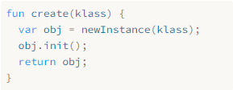

# 28.方法和初始化器 Methods and Initializers

> When you are on the dancefloor, there is nothing to do but dance.
>
> ​							—— Umberto Eco, *The Mysterious Flame of Queen Loana*

当你在舞池里时，除了跳舞，别无选择。（翁贝托·艾柯，《洛安娜女王的神秘火焰》）

> It is time for our virtual machine to bring its nascent objects to life with behavior. That means methods and method calls. And, since they are a special kind of method, initializers too.

对于我们的虚拟机来说，现在是时候通过赋予行为的方式为新生对象赋予生命了。也就是方法和方法调用。而且由于初始化器同样也属于这种特殊的方法，所以也要予以考虑。

> All of this is familiar territory from our previous jlox interpreter. What’s new in this second trip is an important optimization we’ll implement to make method calls over seven times faster than our baseline performance. But before we get to that fun, we gotta get the basic stuff working.

所有这些都是我们以前的jlox解释器中所熟悉的领域。第二次旅行中的新内容是我们将实现一个重要的优化，使方法调用的速度比基线性能快7倍以上。但在此之前，我们得先把基本的东西弄好。

> ## 28 . 1 Method Declarations

## 28.1 方法声明

> We can’t optimize method calls before we have method calls, and we can’t call methods without having methods to call, so we’ll start with declarations.

没有方法调用，我们就无法优化方法调用，而没有可供调用的方法，我们就无法调用方法，因此我们从声明开始。

> ### 28 . 1 . 1 Representing methods

### 28.1.1 表示方法

> We usually start in the compiler, but let’s knock the object model out first this time. The runtime representation for methods in clox is similar to that of jlox. Each class stores a hash table of methods. Keys are method names, and each value is an ObjClosure for the body of the method.

我们通常从编译器开始，但这次让我们先搞定对象模型。clox中方法的运行时表示形式与jlox相似。每个类都存储了一个方法的哈希表。键是方法名，每个值都是方法主体对应的ObjClosure。

*<u>object.h，在结构体ObjClass中添加代码：</u>*

```c
typedef struct {
  Obj obj;
  ObjString* name;
  // 新增部分开始
  Table methods;
  // 新增部分结束
} ObjClass;
```

> A brand new class begins with an empty method table.

一个全新的类初始时得到的是空方法表。

*<u>object.c，在newClass()方法中添加代码：</u>*

```c
  klass->name = name;
  // 新增部分开始
  initTable(&klass->methods);
  // 新增部分结束
  return klass;
```

> The ObjClass struct owns the memory for this table, so when the memory manager deallocates a class, the table should be freed too.

ObjClass 结构体拥有该表的内存，因此当内存管理器释放某个类时，该表也应该被释放。

*<u>memory.c，在freeObject()方法中添加代码：</u>*

```c
    case OBJ_CLASS: {
      // 新增部分开始
      ObjClass* klass = (ObjClass*)object;
      freeTable(&klass->methods);
      // 新增部分结束
      FREE(ObjClass, object);
```

> Speaking of memory managers, the GC needs to trace through classes into the method table. If a class is still reachable (likely through some instance), then all of its methods certainly need to stick around too.

说到内存管理器，GC需要通过类追踪到方法表。如果某个类仍然是可达的（可能是通过某个实例），那么它的所有方法当然也需要保留。

*<u>memory.c，在blackenObject()方法中添加代码：</u>*

```c
      markObject((Obj*)klass->name);
      // 新增部分开始
      markTable(&klass->methods);
      // 新增部分结束
      break;
```

> We use the existing `markTable()` function, which traces through the key string and value in each table entry.

我们使用现有的`markTable()`函数，该函数可以追踪每个表项中的键字符串和值。

> Storing a class’s methods is pretty familiar coming from jlox. The different part is how that table gets populated. Our previous interpreter had access to the entire AST node for the class declaration and all of the methods it contained. At runtime, the interpreter simply walked that list of declarations.

存储类方法的方式与jlox是非常类似的。不同之处在于如何填充该表。我们以前的解释器可以访问整个类声明及其包含的所有方法对应的AST节点。在运行时，解释器只是简单地遍历声明列表。

> Now every piece of information the compiler wants to shunt over to the runtime has to squeeze through the interface of a flat series of bytecode instructions. How do we take a class declaration, which can contain an arbitrarily large set of methods, and represent it as bytecode? Let’s hop over to the compiler and find out.

现在，编译器想要分发到运行时的每一条信息都必须通过一个扁平的字节码指令序列形式。我们如何接受一个可以包含任意大的方法集的类声明，并以字节码的形式将其表现出来？让我们跳到编译器上看看。

> ### 28 . 1 . 2 Compiling method declarations

### 28.1.2 编译方法声明

> The last chapter left us with a compiler that parses classes but allows only an empty body. Now we insert a little code to compile a series of method declarations between the braces.

上一章留给我们一个能解析类但只允许空主体的编译器。现在我们添加一些代码来解析大括号之间的一系列方法声明。

*<u>compiler.c，在classDeclaration()方法中添加代码：</u>*

```c
  consume(TOKEN_LEFT_BRACE, "Expect '{' before class body.");
  // 新增部分开始
  while (!check(TOKEN_RIGHT_BRACE) && !check(TOKEN_EOF)) {
    method();
  }
  // 新增部分结束
  consume(TOKEN_RIGHT_BRACE, "Expect '}' after class body.");
```

> Lox doesn’t have field declarations, so anything before the closing brace at the end of the class body must be a method. We stop compiling methods when we hit that final curly or if we reach the end of the file. The latter check ensures our compiler doesn’t get stuck in an infinite loop if the user accidentally forgets the closing brace.

Lox没有字段声明，因此，在主体块末尾的右括号之前的任何内容都必须是方法。当我们碰到最后的大括号或到达文件结尾时，就会停止编译方法。后一项检查可以确保我们的编译器不会在用户不小心忘记关闭大括号时陷入无限循环。

> The tricky part with compiling a class declaration is that a class may declare any number of methods. Somehow the runtime needs to look up and bind all of them. That would be a lot to pack into a single `OP_CLASS` instruction. Instead, the bytecode we generate for a class declaration will split the process into a *series* of instructions. The compiler already emits an `OP_CLASS` instruction that creates a new empty ObjClass object. Then it emits instructions to store the class in a variable with its name.

编译类声明的棘手之处在于，一个类可以声明任意数量的方法。运行时需要以某种方式查找并绑定所有这些方法。这会导致一个`OP_CLASS`指令中纳入了太多内容。相反，我们为类声明生成的字节码将这个过程分为一系列的指令。编译器已经发出了一条`OP_CLASS`指令，用来创建一个新的空ObjClass对象。然后它发出指令，将类存储在一个具有其名称的变量中[^1]。

> Now, for each method declaration, we emit a new `OP_METHOD` instruction that adds a single method to that class. When all of the `OP_METHOD` instructions have executed, we’re left with a fully formed class. While the user sees a class declaration as a single atomic operation, the VM implements it as a series of mutations.

现在，对于每个方法声明，我们发出一条新的`OP_METHOD`指令，将一个方法添加到该类中。当所有的`OP_METHOD`指令都执行完毕后，我们就得到了一个完整的类。尽管用户将类声明看作是单个原子操作，但虚拟机却将其实现为一系列的变化。

> To define a new method, the VM needs three things:

要定义一个新方法，VM需要三样东西：

> 1. The name of the method.
> 2. The closure for the method body.
> 3. The class to bind the method to.

1. 方法名称。
2. 方法主体的闭包。
3. 绑定该方法的类。

> We’ll incrementally write the compiler code to see how those all get through to the runtime, starting here:

我们会逐步编写编译器代码，看看它们是如何进入运行时的，从这里开始：

*<u>compiler.c，在function()方法后添加代码：</u>*

```c
static void method() {
  consume(TOKEN_IDENTIFIER, "Expect method name.");
  uint8_t constant = identifierConstant(&parser.previous);
  emitBytes(OP_METHOD, constant);
}
```

> Like `OP_GET_PROPERTY` and other instructions that need names at runtime, the compiler adds the method name token’s lexeme to the constant table, getting back a table index. Then we emit an `OP_METHOD` instruction with that index as the operand. That’s the name. Next is the method body:

像`OP_GET_PROPERTY`和其它在运行时需要名称的指令一样，编译器将方法名称标识的词素添加到常量表中，获得表索引。然后发出一个`OP_METHOD`指令，以该索引作为操作数。这就是名称。接下来是方法主体：

*<u>compiler.c，在method()方法中添加代码：</u>*

```c
  uint8_t constant = identifierConstant(&parser.previous);
  // 新增部分开始
  FunctionType type = TYPE_FUNCTION;
  function(type);
  // 新增部分结束
  emitBytes(OP_METHOD, constant);
```

> We use the same `function()` helper that we wrote for compiling function declarations. That utility function compiles the subsequent parameter list and function body. Then it emits the code to create an ObjClosure and leave it on top of the stack. At runtime, the VM will find the closure there.

我们使用为编译函数声明而编写的`function()`辅助函数。该工具函数会编译后续的参数列表和函数主体。然后它发出创建ObjClosure的代码，并将其留在栈顶。在运行时，VM会在那里找到这个闭包。

> Last is the class to bind the method to. Where can the VM find that? Unfortunately, by the time we reach the `OP_METHOD` instruction, we don’t know where it is. It could be on the stack, if the user declared the class in a local scope. But a top-level class declaration ends up with the ObjClass in the global variable table.

最后是要绑定方法的类。VM在哪里可以找到它呢？不幸的是，当我们到达`OP_METHOD`指令时，我们还不知道它在哪里。如果用户在局部作用域中声明该类，那它可能在栈上。但是顶层的类声明最终会成为全局变量表中的ObjClass[^2]。

> Fear not. The compiler does know the *name* of the class. We can capture it right after we consume its token.

不要担心。编译器确实知道类的*名称*。我们可以在消费完名称标识后捕获这个值。

*<u>compiler.c，在classDeclaration()方法中添加代码：</u>*

```c
  consume(TOKEN_IDENTIFIER, "Expect class name.");
  // 新增部分开始
  Token className = parser.previous;
  // 新增部分结束
  uint8_t nameConstant = identifierConstant(&parser.previous);
```

> And we know that no other declaration with that name could possibly shadow the class. So we do the easy fix. Before we start binding methods, we emit whatever code is necessary to load the class back on top of the stack.

我们知道，其它具有该名称的声明不可能会遮蔽这个类。所以我们选择了简单的处理方式。在我们开始绑定方法之前，通过一些必要的代码，将类加载回栈顶。

*<u>compiler.c，在classDeclaration()方法中添加代码：</u>*

```c
  defineVariable(nameConstant);
  // 新增部分开始
  namedVariable(className, false);
  // 新增部分结束
  consume(TOKEN_LEFT_BRACE, "Expect '{' before class body.");
```

> Right before compiling the class body, we call `namedVariable()`. That helper function generates code to load a variable with the given name onto the stack. Then we compile the methods.

在编译类主体之前，我们调用`namedVariable()`。这个辅助函数会生成代码，将一个具有给定名称的变量加载到栈中[^3]。然后，我们编译方法。

> This means that when we execute each `OP_METHOD` instruction, the stack has the method’s closure on top with the class right under it. Once we’ve reached the end of the methods, we no longer need the class and tell the VM to pop it off the stack.

这意味着，当我们执行每一条`OP_METHOD`指令时，栈顶是方法的闭包，它下面就是类。一旦我们到达了方法的末尾，我们就不再需要这个类，并告诉虚拟机将该它从栈中弹出。

*<u>compiler.c，在classDeclaration()方法中添加代码：</u>*

```c
  consume(TOKEN_RIGHT_BRACE, "Expect '}' after class body.");
  // 新增部分开始
  emitByte(OP_POP);
  // 新增部分结束
}
```

> Putting all of that together, here is an example class declaration to throw at the compiler:

把所有这些放在一起，下面是一个可以扔给编译器的类声明示例：

```typescript
class Brunch {
  bacon() {}
  eggs() {}
}
```

> Given that, here is what the compiler generates and how those instructions affect the stack at runtime:

鉴于此，下面是编译器生成的内容以及这些指令在运行时如何影响堆栈：


> All that remains for us is to implement the runtime for that new `OP_METHOD` instruction.

我们剩下要做的就是为这个新的`OP_METHOD`指令实现运行时。

> ### 28 . 1 . 3 Executing method declarations

### 28.1.3 执行方法声明

> First we define the opcode.

首先我们定义操作码。

*<u>chunk.h，在枚举OpCode中添加代码：</u>*

```c
  OP_CLASS,
  // 新增部分开始
  OP_METHOD
  // 新增部分结束
} OpCode;
```

> We disassemble it like other instructions that have string constant operands.

我们像其它具有字符串常量操作数的指令一样对它进行反汇编。

*<u>debug.c，在disassembleInstruction()方法中添加代码：</u>*

```c
    case OP_CLASS:
      return constantInstruction("OP_CLASS", chunk, offset);
    // 新增部分开始
    case OP_METHOD:
      return constantInstruction("OP_METHOD", chunk, offset);
    // 新增部分结束
    default:
```

> And over in the interpreter, we add a new case too.

在解释器中，我们也添加一个新的case分支。

*<u>vm.c，在run()方法中添加代码：</u>*

```c
        break;
      // 新增部分开始
      case OP_METHOD:
        defineMethod(READ_STRING());
        break;
      // 新增部分结束  
    }
```

> There, we read the method name from the constant table and pass it here:

其中，我们从常量表中读取方法名称，并将其传递到这里：

*<u>vm.c，在closeUpvalues()方法后添加代码：</u>*

```c
static void defineMethod(ObjString* name) {
  Value method = peek(0);
  ObjClass* klass = AS_CLASS(peek(1));
  tableSet(&klass->methods, name, method);
  pop();
}
```

> The method closure is on top of the stack, above the class it will be bound to. We read those two stack slots and store the closure in the class’s method table. Then we pop the closure since we’re done with it.

方法闭包位于栈顶，在它将绑定的类的上方。我们读取这两个栈槽并将闭包存储到类的方法表中。然后弹出闭包，因为我们已经用完了。

> Note that we don’t do any runtime type checking on the closure or class object. That `AS_CLASS()` call is safe because the compiler itself generated the code that causes the class to be in that stack slot. The VM trusts its own compiler.

注意，我们没有对闭包或类对象做任何的运行时类型检查。`AS_CLASS()`调用是安全的，因为编译器本身会生成使类位于栈槽的代码。虚拟机信任自己的编译器[^4]。

> After the series of `OP_METHOD` instructions is done and the `OP_POP` has popped the class, we will have a class with a nicely populated method table, ready to start doing things. The next step is pulling those methods back out and using them.

在完成一系列的`OP_METHOD`指令并且`OP_POP`弹出类后，我们将得到一个已填充好方法表的类，可以开始做事情了。下一步是将这些方法拉出来并使用它们。

> ## 28 . 2 Method References

## 28.2 方法引用

> Most of the time, methods are accessed and immediately called, leading to this familiar syntax:

大多数情况下，方法被访问并立即被调用，导致了这种熟悉的语法：

```c
instance.method(argument);
```

> But remember, in Lox and some other languages, those two steps are distinct and can be separated.

但是请记住，在Lox和其它一些语言中，这两个步骤是不同的，可以分开。

```javascript
var closure = instance.method;
closure(argument);
```

> Since users *can* separate the operations, we have to implement them separately. The first step is using our existing dotted property syntax to access a method defined on the instance’s class. That should return some kind of object that the user can then call like a function.

由于用户可以将这些操作分开，所以我们必须分别实现它们。第一步是使用现有的点属性语法来访问实例的类中定义的方法。这应该返回某种类型的对象，然后用户可以向函数一样调用它。

> The obvious approach is to look up the method in the class’s method table and return the ObjClosure associated with that name. But we also need to remember that when you access a method, `this` gets bound to the instance the method was accessed from. Here’s the example from [when we added methods to jlox](http://www.craftinginterpreters.com/classes.html#methods-on-classes):

明显的方式是，在类的方法表中查找该方法，并返回与该名称关联的ObjClosure。但是我们也需要记住，当你访问一个方法时，`this`绑定到访问该方法的实例上。下面是我们在向jlox添加方法时的例子：

```typescript
class Person {
  sayName() {
    print this.name;
  }
}

var jane = Person();
jane.name = "Jane";

var method = jane.sayName;
method(); // ?
```

> This should print “Jane”, so the object returned by `.sayName` somehow needs to remember the instance it was accessed from when it later gets called. In jlox, we implemented that “memory” using the interpreter’s existing heap-allocated Environment class, which handled all variable storage.

这里应该打印“Jane”，因此`.sayName`返回的对象在以后被调用时需要记住访问它的实例。在jlox中，我们通过解释器已有的堆分配的Environment类来实现这个“记忆”，该Environment类会处理所有的变量存储。。

> Our bytecode VM has a more complex architecture for storing state. [Local variables and temporaries](http://www.craftinginterpreters.com/local-variables.html#representing-local-variables) are on the stack, [globals](http://www.craftinginterpreters.com/global-variables.html#variable-declarations) are in a hash table, and variables in closures use [upvalues](http://www.craftinginterpreters.com/closures.html#upvalues). That necessitates a somewhat more complex solution for tracking a method’s receiver in clox, and a new runtime type.

我们的字节码虚拟机用一个更复杂的结构来存储状态。局部变量和临时变量在栈中，全局变量在哈希表中，而闭包中的变量使用上值。这就需要一个更复杂的跟踪clox中方法接收者的解决方案，以及一个新的运行时类型。

> ### 28 . 2 . 1 Bound methods

### 28.2.1 已绑定方法

> When the user executes a method access, we’ll find the closure for that method and wrap it in a new “bound method” object that tracks the instance that the method was accessed from. This bound object can be called later like a function. When invoked, the VM will do some shenanigans to wire up `this` to point to the receiver inside the method’s body.

当用户执行一个方法访问时，我们会找到该方法的闭包，并将其包装在一个新的“已绑定方法（bound method）”对象中[^5]，该对象会跟踪访问该方法的实例。这个已绑定对象可以像一个函数一样在稍后被调用。当被调用时，虚拟机会做一些小动作，将`this`连接到方法主体中的接收器。

> Here’s the new object type:

下面是新的对象类型：

*<u>object.h，在结构体ObjInstance后添加代码：</u>*

```c
} ObjInstance;
// 新增部分开始
typedef struct {
  Obj obj;
  Value receiver;
  ObjClosure* method;
} ObjBoundMethod;
// 新增部分结束
ObjClass* newClass(ObjString* name);
```

> It wraps the receiver and the method closure together. The receiver’s type is Value even though methods can be called only on ObjInstances. Since the VM doesn’t care what kind of receiver it has anyway, using Value means we don’t have to keep converting the pointer back to a Value when it gets passed to more general functions.
>

它将接收器和方法闭包包装在一起。尽管方法只能在ObjInstances上调用，但接收器类型是Value。因为虚拟机并不关心它拥有什么样的接收器，使用Value意味着当它需要传递给更多通用函数时，我们不必将指针转换回Value。

> The new struct implies the usual boilerplate you’re used to by now. A new case in the object type enum:
>

新的结构体暗含了你现在已经熟悉的常规模板。对象类型枚举中的新值：

*<u>object.h，在枚举ObjType中添加代码：</u>*

```c
typedef enum {  
  // 新增部分开始
  OBJ_BOUND_METHOD,
  // 新增部分结束
  OBJ_CLASS,
```

> A macro to check a value’s type:
>

一个检查值类型的宏：

*<u>object.h，添加代码：</u>*

```c
#define OBJ_TYPE(value)        (AS_OBJ(value)->type)
// 新增部分开始
#define IS_BOUND_METHOD(value) isObjType(value, OBJ_BOUND_METHOD)
// 新增部分结束
#define IS_CLASS(value)        isObjType(value, OBJ_CLASS)
```

> Another macro to cast the value to an ObjBoundMethod pointer:
>

另一个将值转换为ObjBoundMethod 指针的宏：

*<u>object.h，添加代码：</u>*

```c
#define IS_STRING(value)       isObjType(value, OBJ_STRING)
// 新增部分开始
#define AS_BOUND_METHOD(value) ((ObjBoundMethod*)AS_OBJ(value))
// 新增部分结束
#define AS_CLASS(value)        ((ObjClass*)AS_OBJ(value))
```

> A function to create a new ObjBoundMethod:
>

一个创建新ObjBoundMethod的函数：

*<u>object.h，在结构体ObjBoundMethod后添加代码：</u>*

```c
} ObjBoundMethod;
// 新增部分开始
ObjBoundMethod* newBoundMethod(Value receiver,
                               ObjClosure* method);
// 新增部分结束
ObjClass* newClass(ObjString* name);
```

> And an implementation of that function here:
>

以及该函数的实现：

*<u>object.c，在allocateObject()方法后添加代码：</u>*

```c
ObjBoundMethod* newBoundMethod(Value receiver,
                               ObjClosure* method) {
  ObjBoundMethod* bound = ALLOCATE_OBJ(ObjBoundMethod,
                                       OBJ_BOUND_METHOD);
  bound->receiver = receiver;
  bound->method = method;
  return bound;
}
```

> The constructor-like function simply stores the given closure and receiver. When the bound method is no longer needed, we free it.
>

这个类似构造器的函数简单地存储了给定的闭包和接收器。当不再需要某个已绑定方法时，我们将其释放。

*<u>memory.c，在freeObject()方法中添加代码：</u>*

```c
  switch (object->type) {
    // 新增部分开始
    case OBJ_BOUND_METHOD:
      FREE(ObjBoundMethod, object);
      break;
    // 新增部分结束
    case OBJ_CLASS: {
```

> The bound method has a couple of references, but it doesn’t *own* them, so it frees nothing but itself. However, those references do get traced by the garbage collector.
>

已绑定方法有几个引用，但并不*拥有*它们，所以它只释放自己。但是，这些引用确实要被垃圾回收器跟踪到。

*<u>memory.c，在blackenObject()方法中添加代码：</u>*

```c
  switch (object->type) {
    // 新增部分开始
    case OBJ_BOUND_METHOD: {
      ObjBoundMethod* bound = (ObjBoundMethod*)object;
      markValue(bound->receiver);
      markObject((Obj*)bound->method);
      break;
    }
    // 新增部分结束
    case OBJ_CLASS: {
```

> This ensures that a handle to a method keeps the receiver around in memory so that `this` can still find the object when you invoke the handle later. We also trace the method closure.
>

这可以确保方法的句柄会将接收器保持在内存中，以便后续当你调用这个句柄时，`this`仍然可以找到这个对象。我们也会跟踪方法闭包[^6]。

> The last operation all objects support is printing.
>

所有对象要支持的最后一个操作是打印。

*<u>object.c，在printObject()方法中添加代码：</u>*

```c
  switch (OBJ_TYPE(value)) {
    // 新增部分开始
    case OBJ_BOUND_METHOD:
      printFunction(AS_BOUND_METHOD(value)->method->function);
      break;
    // 新增部分结束
    case OBJ_CLASS:
```

> A bound method prints exactly the same way as a function. From the user’s perspective, a bound method *is* a function. It’s an object they can call. We don’t expose that the VM implements bound methods using a different object type.
>

已绑定方法的打印方式与函数完全相同。从用户的角度来看，已绑定方法*就是*一个函数，是一个可以被他们调用的对象。我们不会暴露虚拟机中使用不同的对象类型来实现已绑定方法的事实。

> Put on your party hat because we just reached a little milestone. ObjBoundMethod is the very last runtime type to add to clox. You’ve written your last `IS_` and `AS_` macros. We’re only a few chapters from the end of the book, and we’re getting close to a complete VM.
>

庆祝一下，因为我们刚刚到达了一个小小的里程碑。ObjBoundMethod是要添加到clox中的最后一个运行时类型。你已经写完了最后的`IS_`和`AS_`宏。我们离本书的结尾只有几章了，而且我们已经接近一个完整的虚拟机了。

> ### 28 . 2 . 2 Accessing methods

### 28.2.2 访问方法

> Let’s get our new object type doing something. Methods are accessed using the same “dot” property syntax we implemented in the last chapter. The compiler already parses the right expressions and emits `OP_GET_PROPERTY` instructions for them. The only changes we need to make are in the runtime.

我们来让新对象类型做点什么。方法是通过我们在上一章中实现的“点”属性语法进行访问的。编译器已经能够解析正确的表达式，并为它们发出`OP_GET_PROPERTY`指令。我们接下来只需要在运行时做适当改动。

> When a property access instruction executes, the instance is on top of the stack. The instruction’s job is to find a field or method with the given name and replace the top of the stack with the accessed property.

当执行某个属性访问指令时，实例在栈顶。该指令的任务是找到一个具有给定名称的字段或方法，并将栈顶替换为所访问的属性。

> The interpreter already handles fields, so we simply extend the `OP_GET_PROPERTY` case with another section.

解释器已经处理了字段，所以我们只需要在`OP_GET_PROPERTY`分支中扩展另一部分。

*<u>vm.c，在run()方法中替换2行：</u>*

```c
          pop(); // Instance.
          push(value);
          break;
        }
        // 替换部分开始
        if (!bindMethod(instance->klass, name)) {
          return INTERPRET_RUNTIME_ERROR;
        }
        break;
        // 替换部分结束
      }
```

> We insert this after the code to look up a field on the receiver instance. Fields take priority over and shadow methods, so we look for a field first. If the instance does not have a field with the given property name, then the name may refer to a method.

我们在查找接收器实例上字段的代码后面插入这部分逻辑。字段优先于方法，因此我们首先查找字段。如果实例确实不包含具有给定属性名称的字段，那么这个名称可能指向的是一个方法。

> We take the instance’s class and pass it to a new `bindMethod()` helper. If that function finds a method, it places the method on the stack and returns `true`. Otherwise it returns `false` to indicate a method with that name couldn’t be found. Since the name also wasn’t a field, that means we have a runtime error, which aborts the interpreter.

我们获取实例的类，并将其传递给新的`bindMethod()`辅助函数。如果该函数找到了方法，它会将该方法放在栈中并返回`true`。否则返回`false`，表示找不到具有该名称的方法。因为这个名称也不是字段，这意味着我们遇到了一个运行时错误，从而中止了解释器。

> Here is the good stuff:

下面是这段精彩的逻辑：

*<u>vm.c，在callValue()方法后添加代码：</u>*

```c
static bool bindMethod(ObjClass* klass, ObjString* name) {
  Value method;
  if (!tableGet(&klass->methods, name, &method)) {
    runtimeError("Undefined property '%s'.", name->chars);
    return false;
  }

  ObjBoundMethod* bound = newBoundMethod(peek(0),
                                         AS_CLOSURE(method));
  pop();
  push(OBJ_VAL(bound));
  return true;
}
```

> First we look for a method with the given name in the class’s method table. If we don’t find one, we report a runtime error and bail out. Otherwise, we take the method and wrap it in a new ObjBoundMethod. We grab the receiver from its home on top of the stack. Finally, we pop the instance and replace the top of the stack with the bound method.

首先，我们在类的方法表中查找具有指定名称的方法。如果我们没有找到，我们就报告一个运行时错误并退出。否则，我们获取该方法，并将其包装为一个新的ObjBoundMethod。我们从栈顶获得接收器。最后，我们弹出实例，并将这个已绑定方法替换到栈顶。

> For example:

举例来说：

```typescript
class Brunch {
  eggs() {}
}

var brunch = Brunch();
var eggs = brunch.eggs;
```

> Here is what happens when the VM executes the `bindMethod()` call for the `brunch.eggs` expression:

下面是虚拟机执行`brunch.eggs`表达式的`bindMethod()`调用时发生的情况：


> That’s a lot of machinery under the hood, but from the user’s perspective, they simply get a function that they can call.

在底层有很多机制，但从用户的角度来看，他们只是得到了一个可以调用的函数。

> ### 28 . 2 . 3 Calling methods

### 28.2.3 调用方法

> Users can declare methods on classes, access them on instances, and get bound methods onto the stack. They just can’t *do* anything useful with those bound method objects. The operation we’re missing is calling them. Calls are implemented in `callValue()`, so we add a case there for the new object type.

用户可以在类上声明方法，在实例上访问这些方法，并将已绑定的方法放到栈上[^7]。他们目前还不能使用这些已绑定方法做任何有意义的事。我们所缺少的操作就是调用他们。调用在`callValue()`中实现，所以我们在其中为新的对象类型添加一个case分支。

*<u>vm.c，在callValue()方法中添加代码：</u>*

```c
    switch (OBJ_TYPE(callee)) {  
      // 新增部分开始
      case OBJ_BOUND_METHOD: {
        ObjBoundMethod* bound = AS_BOUND_METHOD(callee);
        return call(bound->method, argCount);
      }
      // 新增部分结束
      case OBJ_CLASS: {
```

> We pull the raw closure back out of the ObjBoundMethod and use the existing `call()` helper to begin an invocation of that closure by pushing a CallFrame for it onto the call stack. That’s all it takes to be able to run this Lox program:

我们从ObjBoundMethod中抽取原始闭包，并使用现有的`call()`辅助函数，通过将对应CallFrame压入调用栈，来开始对该闭包的调用。有了这些，就能够运行下面这个Lox程序：

```typescript
class Scone {
  topping(first, second) {
    print "scone with " + first + " and " + second;
  }
}

var scone = Scone();
scone.topping("berries", "cream");
```

> That’s three big steps. We can declare, access, and invoke methods. But something is missing. We went to all that trouble to wrap the method closure in an object that binds the receiver, but when we invoke the method, we don’t use that receiver at all.

这是三大步。我们可以声明、访问和调用方法。但我们缺失了一些东西。我们费尽心思将方法闭包包装在一个绑定了接收器的对象中，但当我们调用方法时，根本没有使用那个接收器。

## 28 . 3 This

> The reason bound methods need to keep hold of the receiver is so that it can be accessed inside the body of the method. Lox exposes a method’s receiver through `this` expressions. It’s time for some new syntax. The lexer already treats `this` as a special token type, so the first step is wiring that token up in the parse table.

已绑定方法中需要保留接收器的原因在于，这样就可以在方法体内部访问接收器实例。Lox通过`this`表达式暴露方法的接收器。现在是时候用一些新语法了。词法解析器已经将`this`当作一个特殊的标识类型，因此第一步是将该标识链接到解析表中。

*<u>compiler.c，替换1行：</u>*

```c
  [TOKEN_SUPER]         = {NULL,     NULL,   PREC_NONE},
  // 替换部分开始
  [TOKEN_THIS]          = {this_,    NULL,   PREC_NONE},
  // 替换部分结束
  [TOKEN_TRUE]          = {literal,  NULL,   PREC_NONE},
```

> When the parser encounters a `this` in prefix position, it dispatches to a new parser function.

当解析器在前缀位置遇到一个`this`时，会派发给新的解析器函数[^8]。

*<u>compiler.c，在variable()方法后添加：</u>*

```c
static void this_(bool canAssign) {
  variable(false);
} 
```

> We’ll apply the same implementation technique for `this` in clox that we used in jlox. We treat `this` as a lexically scoped local variable whose value gets magically initialized. Compiling it like a local variable means we get a lot of behavior for free. In particular, closures inside a method that reference `this` will do the right thing and capture the receiver in an upvalue.

对于clox中的`this`，我们将使用与jlox相同的技术。我们将`this`看作是一个具有词法作用域的局部变量，它的值被神奇地初始化了。像局部变量一样编译它意味着我们可以免费获得很多行为。特别是，引用`this`的方法对应的闭包会做正确的事情，并在上值中捕获接收器。

> When the parser function is called, the `this` token has just been consumed and is stored as the previous token. We call our existing `variable()` function which compiles identifier expressions as variable accesses. It takes a single Boolean parameter for whether the compiler should look for a following `=` operator and parse a setter. You can’t assign to `this`, so we pass `false` to disallow that.

当解析器函数被调用时，`this`标识刚刚被使用，并且存储在上一个标识中。我们调用已有的`variable()`函数，它将标识符表达式编译为变量访问。它需要一个Boolean参数，用于判断编译器是否应该查找后续的`=`运算符并解析setter。你不能给`this`赋值，所以我们传入`false`来禁止它。

> The `variable()` function doesn’t care that `this` has its own token type and isn’t an identifier. It is happy to treat the lexeme “this” as if it were a variable name and then look it up using the existing scope resolution machinery. Right now, that lookup will fail because we never declared a variable whose name is “this”. It’s time to think about where the receiver should live in memory.

`variable()`函数并不关心`this`是否有自己的标识类型，也不关心它是否是一个标识符。它很乐意将词素`this`当作一个变量名，然后用现有的作用域解析机制来查找它。现在，这种查找会失败，因为我们从未声明过名称为`this`的变量。现在是时候考虑一下接收器在内存中的位置了。

> At least until they get captured by closures, clox stores every local variable on the VM’s stack. The compiler keeps track of which slots in the function’s stack window are owned by which local variables. If you recall, the compiler sets aside stack slot zero by declaring a local variable whose name is an empty string.

至少在每个局部变量被闭包捕获之前，clox会将其存储在VM的栈中。编译器持续跟踪函数栈窗口中的哪个槽由哪些局部变量所拥有。如果你还记得，编译器通过声明一个名称为空字符串的局部变量来预留出栈槽0。

> For function calls, that slot ends up holding the function being called. Since the slot has no name, the function body never accesses it. You can guess where this is going. For *method* calls, we can repurpose that slot to store the receiver. Slot zero will store the instance that `this` is bound to. In order to compile `this` expressions, the compiler simply needs to give the correct name to that local variable.

对于函数调用来说，这个槽会存储被调用的函数。因为这个槽没有名字，所以函数主体永远不会访问它。你可以猜到接下来会发生什么。对于方法调用，我们可以重新利用这个槽来存储接收器。槽0会存储`this`绑定的实例。为了编译`this`表达式，编译器只需要给这个局部变量一个正确的名称。

*<u>compiler.c，在initCompiler()方法中替换2行：</u>*

```c
  local->isCaptured = false;
  // 替换部分开始
  if (type != TYPE_FUNCTION) {
    local->name.start = "this";
    local->name.length = 4;
  } else {
    local->name.start = "";
    local->name.length = 0;
  }
  // 替换部分结束
}
```

> We want to do this only for methods. Function declarations don’t have a `this`. And, in fact, they *must not* declare a variable named “this”, so that if you write a `this` expression inside a function declaration which is itself inside a method, the `this` correctly resolves to the outer method’s receiver.

我们只想对方法这样做。函数声明中没有`this`。事实上，它们不能声明一个名为`this`的变量，因此，如果你在函数声明中写了一个`this`表达式，而该函数本身又在某个方法中，这个`this`会被正确地解析为外部方法的接收器。

```typescript
class Nested {
  method() {
    fun function() {
      print this;
    }

    function();
  }
}

Nested().method();
```

> This program should print “Nested instance”. To decide what name to give to local slot zero, the compiler needs to know whether it’s compiling a function or method declaration, so we add a new case to our FunctionType enum to distinguish methods.

这个程序应该打印“Nested instance”。为了决定给局部槽0取什么名字，编译器需要知道它正在编译一个函数还是方法声明，所以我们向FunctionType枚举中增加一个新的类型来区分方法。

*<u>compiler.c，在枚举FunctionType中添加代码：</u>*

```c
  TYPE_FUNCTION,
  // 新增部分开始
  TYPE_METHOD,
  // 新增部分结束
  TYPE_SCRIPT
```

> When we compile a method, we use that type.

当我们编译方法时，就使用这个类型。

*<u>compiler.c，在method()方法中替换1行：</u>*

```c
  uint8_t constant = identifierConstant(&parser.previous);
  // 替换部分开始
  FunctionType type = TYPE_METHOD;
  // 替换部分结束
  function(type);
```

> Now we can correctly compile references to the special “this” variable, and the compiler will emit the right `OP_GET_LOCAL` instructions to access it. Closures can even capture `this` and store the receiver in upvalues. Pretty cool.

现在我们可以正确地编译对特殊的`this`变量的引用，编译器会发出正确的`OP_GET_LOCAL`来访问它。闭包甚至可以捕获`this`，并将接收器存储在上值中。非常酷。

> Except that at runtime, the receiver isn’t actually *in* slot zero. The interpreter isn’t holding up its end of the bargain yet. Here is the fix:

除了在运行时，接收器实际上并不在槽0*中*。解释器还没有履行它的承诺。下面是修复方法：

*<u>vm.c，在callValue()方法中添加代码：</u>*

```c
      case OBJ_BOUND_METHOD: {
        ObjBoundMethod* bound = AS_BOUND_METHOD(callee);
        // 新增部分开始
        vm.stackTop[-argCount - 1] = bound->receiver;
        // 新增部分结束
        return call(bound->method, argCount);
      }
```

> When a method is called, the top of the stack contains all of the arguments, and then just under those is the closure of the called method. That’s where slot zero in the new CallFrame will be. This line of code inserts the receiver into that slot. For example, given a method call like this:

当某个方法被调用时，栈顶包含所有的参数，然后在这些参数下面是被调用方法的闭包。这就是新的CallFrame中槽0所在的位置。这一行代码会向该槽中插入接收器。例如，给出一个这样的方法调用：

```typescript
scone.topping("berries", "cream");
```

> We calculate the slot to store the receiver like so:

我们像这样计算存储接收器的槽：


> The `-argCount` skips past the arguments and the `- 1` adjusts for the fact that `stackTop` points just *past* the last used stack slot.

`-argCount`跳过传递的参数，而`-1`则是因为`stackTop`指向刚刚最后一个实用的栈槽而做的调整。

> ### 28 . 3 . 1 Misusing this

### 28.3.1 误用this

> Our VM now supports users *correctly* using `this`, but we also need to make sure it properly handles users *mis*using `this`. Lox says it is a compile error for a `this` expression to appear outside of the body of a method. These two wrong uses should be caught by the compiler:

我们的虚拟机现在支持用户正确地使用`this`，但我们还需要确保它能正确地处理用户误用`this`的情况。Lox表示，如果`this`表达式出现在方法主体之外，就是一个编译错误。这两个错误的用法是编译器应该捕获的：

```typescript
print this; // At top level.

fun notMethod() {
  print this; // In a function.
}
```

> So how does the compiler know if it’s inside a method? The obvious answer is to look at the FunctionType of the current Compiler. We did just add an enum case there to treat methods specially. However, that wouldn’t correctly handle code like the earlier example where you are inside a function which is, itself, nested inside a method.

那么编译器如何知道它是否在一个方法中呢？显而易见的答案是，查看当前Compiler的FunctionType。我们在其中添加了一个新的枚举值来特殊对待方法。但是，这并不能正确地处理前面那个示例中的代码，即你在一个函数里面，而这个函数本身又嵌套在一个方法中。

> We could try to resolve “this” and then report an error if it wasn’t found in any of the surrounding lexical scopes. That would work, but would require us to shuffle around a bunch of code, since right now the code for resolving a variable implicitly considers it a global access if no declaration is found.

我们可以尝试解析`this`，如果在外围的词法作用域中没有找到它，就报告一个错误。这样做是可行的，但需要我们修改一堆代码，因为如果没有找到声明，解析变量的代码现在会隐式地将其视为全局变量访问。

> In the next chapter, we will need information about the nearest enclosing class. If we had that, we could use it here to determine if we are inside a method. So we may as well make our future selves’ lives a little easier and put that machinery in place now.

在下一章中，我们将需要关于最近邻外层类的信息。如果我们有这些信息，就可以在这里使用它来确定我们是否在某个方法中。因此，我们不妨让未来的自己生活得轻松一些，现在就把这种机制搞定。

*<u>compiler.c，在变量current后添加代码：</u>*

```c
Compiler* current = NULL;
// 新增部分开始
ClassCompiler* currentClass = NULL;
// 新增部分结束
static Chunk* currentChunk() {
```

> This module variable points to a struct representing the current, innermost class being compiled. The new type looks like this:

这个模块变量指向一个表示当前正在编译的最内部类的结构体，新的类型看起来像这样：

*<u>compiler.c，在结构体Compiler后添加代码：</u>*

```c
} Compiler;
// 新增部分开始
typedef struct ClassCompiler {
  struct ClassCompiler* enclosing;
} ClassCompiler;
// 新增部分结束
Parser parser;
```

> Right now we store only a pointer to the ClassCompiler for the enclosing class, if any. Nesting a class declaration inside a method in some other class is an uncommon thing to do, but Lox supports it. Just like the Compiler struct, this means ClassCompiler forms a linked list from the current innermost class being compiled out through all of the enclosing classes.

现在，我们只存储一个指向外层类（如果存在的话）的ClassCompiler的指针。将类声明嵌套在其它类的某个方法中并不常见，但Lox支持这种做法。就像Compiler结构体一样，这意味着ClassCompiler形成了一个链表，从当前正在被编译的最内层类一直到所有的外层类。

> If we aren’t inside any class declaration at all, the module variable `currentClass` is `NULL`. When the compiler begins compiling a class, it pushes a new ClassCompiler onto that implicit linked stack.

如果我们根本不在任何类的声明中，则模块变量`currentClass`是`NULL`。当编译器开始编译某个类时，它会将一个新的ClassCompiler推入这个隐式的链栈中。

*<u>compiler.c，在classDeclaration()方法中添加代码：</u>*

```c
  defineVariable(nameConstant);
  // 新增部分开始
  ClassCompiler classCompiler;
  classCompiler.enclosing = currentClass;
  currentClass = &classCompiler;
  // 新增部分结束
  namedVariable(className, false);
```

> The memory for the ClassCompiler struct lives right on the C stack, a handy capability we get by writing our compiler using recursive descent. At the end of the class body, we pop that compiler off the stack and restore the enclosing one.

ClassCompiler结构体的内存正好位于C栈中，这是通过使用递归下降来编写编译器而获得的便利。在类主体的最后，我们将该编译器从栈中弹出，并恢复外层的编译器。

*<u>compiler.c，在classDeclaration()方法中添加代码：</u>*

```c
  emitByte(OP_POP);
  // 新增部分开始
  currentClass = currentClass->enclosing;
  // 新增部分结束
}
```

> When an outermost class body ends, `enclosing` will be `NULL`, so this resets `currentClass` to `NULL`. Thus, to see if we are inside a class—and therefore inside a method—we simply check that module variable.

当最外层的类主体结束时，`enclosing`将是`NULL`，因此这里会将`currentClass`重置为`NULL`。因此，要想知道我们是否在一个类内部——也就是是否在一个方法中——我们只需要检查模块变量。

*<u>compiler.c，在this_()方法中添加代码：</u>*

```c
static void this_(bool canAssign) {
  // 新增部分开始
  if (currentClass == NULL) {
    error("Can't use 'this' outside of a class.");
    return;
  }
  // 新增部分结束
  variable(false);
```

> With that, `this` outside of a class is correctly forbidden. Now our methods really feel like *methods* in the object-oriented sense. Accessing the receiver lets them affect the instance you called the method on. We’re getting there!

有个这个，类之外的`this`就被正确地禁止了。现在我们的方法就像是面向对象意义上的*方法*。对接收器的访问使得它们可以影响调用方法的实例。我们正在走向成功！

> ## 28 . 4 Instance Initializers

## 28.4 实例初始化器

> The reason object-oriented languages tie state and behavior together—one of the core tenets of the paradigm—is to ensure that objects are always in a valid, meaningful state. When the only way to touch an object’s state is through its methods, the methods can make sure nothing goes awry. But that presumes the object is *already* in a proper state. What about when it’s first created?

面向对象语言之所以将状态和行为结合在一起（范式的核心原则之一），是为了确保对象总是处于有效的、有意义的状态。当接触对象状态的唯一形式是通过它的方法时，这些方法可以确保不会出错[^9]。但前提是对象*已经*处于正常状态。那么，当对象第一次被创建时呢？

> Object-oriented languages ensure that brand new objects are properly set up through constructors, which both produce a new instance and initialize its state. In Lox, the runtime allocates new raw instances, and a class may declare an initializer to set up any fields. Initializers work mostly like normal methods, with a few tweaks:

面向对象的语言通过构造函数确保新对象是被正确设置的，构造函数会生成一个新实例并初始化其状态。在Lox中，运行时会分配新的原始实例，而类可以声明一个初始化器来设置任何字段。初始化器的工作原理和普通方法差不多，只是做了一些调整：

> 1. The runtime automatically invokes the initializer method whenever an instance of a class is created.
> 2. The caller that constructs an instance always gets the instance back after the initializer finishes, regardless of what the initializer function itself returns. The initializer method doesn’t need to explicitly return `this`.
> 3. In fact, an initializer is *prohibited* from returning any value at all since the value would never be seen anyway.

1. 每当一个类的实例被创建时，运行时会自动调用初始化器方法。
2. 构建实例的调用方总是在初始化器完成后得到实例，而不管初始化器本身返回什么。初始化器方法不需要显式地返回`this`[^10]。
3. 事实上，初始化器根本不允许返回任何值，因为这些值无论如何都不会被看到。

> Now that we support methods, to add initializers, we merely need to implement those three special rules. We’ll go in order.

既然我们支持方法，为了添加初始化式，我们只需要实现这三条特殊规则。我们按顺序进行。

> ### 28 . 4 . 1 Invoking initializers

### 28.4.1 调用初始化器

> First, automatically calling `init()` on new instances:

首先，在新实例上自动调用`init()`：

*<u>vm.c，在callValue()方法中添加代码：</u>*

```c
        vm.stackTop[-argCount - 1] = OBJ_VAL(newInstance(klass));
        // 新增部分开始
        Value initializer;
        if (tableGet(&klass->methods, vm.initString,
                     &initializer)) {
          return call(AS_CLOSURE(initializer), argCount);
        }
        // 新增部分结束
        return true;
```

> After the runtime allocates the new instance, we look for an `init()` method on the class. If we find one, we initiate a call to it. This pushes a new CallFrame for the initializer’s closure. Say we run this program:

在运行时分配了新实例后，我们在类中寻找`init()`方法。如果找到了，就对其发起调用。这就为初始化器的闭包压入了一个新的CallFrame。假设我们运行这个程序：

```typescript
class Brunch {
  init(food, drink) {}
}

Brunch("eggs", "coffee");
```

> When the VM executes the call to `Brunch()`, it goes like this:

当VM执行对`Brunch()`的调用时，情况是这样的：


> Any arguments passed to the class when we called it are still sitting on the stack above the instance. The new CallFrame for the `init()` method shares that stack window, so those arguments implicitly get forwarded to the initializer.

我们在调用该类时传入的所有参数都仍然在实例上方的栈中。`init()`方法的新CallFrame共享了这个栈窗口，因此这些参数会隐式地转发给初始化器。

> Lox doesn’t require a class to define an initializer. If omitted, the runtime simply returns the new uninitialized instance. However, if there is no `init()` method, then it doesn’t make any sense to pass arguments to the class when creating the instance. We make that an error.

Lox并不要求类定义初始化器。如果省略，运行时只是简单地返回新的未初始化的实例。然而，如果没有`init()`方法，那么在创建实例时向类传递参数就没有意义了。我们将其当作一个错误。

*<u>vm.c，在callValue()方法中添加代码：</u>*

```c
          return call(AS_CLOSURE(initializer), argCount);
        // 新增部分开始  
        } else if (argCount != 0) {
          runtimeError("Expected 0 arguments but got %d.",
                       argCount);
          return false;
        // 新增部分结束
        }
```

> When the class *does* provide an initializer, we also need to ensure that the number of arguments passed matches the initializer’s arity. Fortunately, the `call()` helper does that for us already.

当类*确实*提供了初始化器时，我们还需要确保传入参数的数量与初始化器的元数匹配。幸运的是，`call()`辅助函数已经为我们做到了这一点。

> To call the initializer, the runtime looks up the `init()` method by name. We want that to be fast since it happens every time an instance is constructed. That means it would be good to take advantage of the string interning we’ve already implemented. To do that, the VM creates an ObjString for “init” and reuses it. The string lives right in the VM struct.

为了调用初始化器，运行时会按名称查找`init()`方法。我们希望这个过程是快速的，因为这在每次构造实例时都会发生。这意味着我们可以很好地利用已经实现的字符串驻留。为此，VM为“init”创建了一个ObjString并重用它。这个字符串就位于VM结构体中。

*<u>vm.h，在结构体VM中添加代码：</u>*

```c
  Table strings;
  // 新增部分开始
  ObjString* initString;
  // 新增部分结束
  ObjUpvalue* openUpvalues;
```

> We create and intern the string when the VM boots up.

当虚拟机启动时，我们创建并驻留该字符串。

*<u>vm.c，在initVM()方法中添加代码：</u>*

```c
  initTable(&vm.strings);
  // 新增部分开始
  vm.initString = copyString("init", 4);
  // 新增部分结束
  defineNative("clock", clockNative);
```

> We want it to stick around, so the GC considers it a root.

我们希望它一直存在，因此GC将其视为根。

*<u>memory.c，在markRoots()方法中添加代码：</u>*

```c
  markCompilerRoots();
  // 新增部分开始
  markObject((Obj*)vm.initString);
  // 新增部分结束
}
```

> Look carefully. See any bug waiting to happen? No? It’s a subtle one. The garbage collector now reads `vm.initString`. That field is initialized from the result of calling `copyString()`. But copying a string allocates memory, which can trigger a GC. If the collector ran at just the wrong time, it would read `vm.initString` before it had been initialized. So, first we zero the field out.

仔细观察。看到什么潜藏的bug了吗？没有吗？这是一个微妙的问题。垃圾回收器现在读取`vm.initString`。这个字段是由调用`copyString()`的结果来初始化的。但复制字符串会分配内存，这可能会触发GC。如果回收器在错误的时间运行时，它就会在`vm.initString`初始化之前读取它。所以，我们首先将这个字段清零。

*<u>vm.c，在initVM()方法中添加代码：</u>*

```c
  initTable(&vm.strings);
  // 新增部分开始
  vm.initString = NULL;
  // 新增部分结束
  vm.initString = copyString("init", 4);
```

> We clear the pointer when the VM shuts down since the next line will free it.

我们在VM关闭时清除指针，因为下一行会释放它。

*<u>vm.c，在freeVM()方法中添加代码：</u>*

```c
  freeTable(&vm.strings);
  // 新增部分开始
  vm.initString = NULL;
  // 新增部分结束
  freeObjects();
```

> OK, that lets us call initializers.

好，这样我们就可以调用初始化器了。

> ### 28 . 4 . 2 Initializer return values

### 28.4.2 返回值的初始化器

> The next step is ensuring that constructing an instance of a class with an initializer always returns the new instance, and not `nil` or whatever the body of the initializer returns. Right now, if a class defines an initializer, then when an instance is constructed, the VM pushes a call to that initializer onto the CallFrame stack. Then it just keeps on trucking.

下一步是确保用初始化器构造类实例时，总是返回新的实例，而不是`nil`或初始化式返回的任何内容。现在，如果某个类定义了一个初始化器，那么当构建一个实例时，虚拟机会把对该初始化器的调用压入CallFrame栈。然后，它就可以自动被执行了。

> The user’s invocation on the class to create the instance will complete whenever that initializer method returns, and will leave on the stack whatever value the initializer puts there. That means that unless the user takes care to put `return this;` at the end of the initializer, no instance will come out. Not very helpful.

只要初始化器方法返回，用户对类的创建实例的调用就会结束，并把初始化器方法放入栈中的值遗留在那里。这意味着，除非用户特意在初始化器的末尾写上`return this;`，否则不会出现任何实例。不太有用。

> To fix this, whenever the front end compiles an initializer method, it will emit different bytecode at the end of the body to return `this` from the method instead of the usual implicit `nil` most functions return. In order to do *that*, the compiler needs to actually know when it is compiling an initializer. We detect that by checking to see if the name of the method we’re compiling is “init”.

为了解决这个问题，每当前端编译初始化器方法时，都会在主体末尾生成一个特殊的字节码，以便从方法中返回`this`，而不是大多数函数通常会隐式返回的`nil`。为了做到这一点，编译器需要真正知道它在何时编译一个初始化器。我们通过检查正在编译的方法名称是否为“init”进行确认。

*<u>compiler.c，在method()方法中添加代码：</u>*

```c
  FunctionType type = TYPE_METHOD;
  // 新增部分开始
  if (parser.previous.length == 4 &&
      memcmp(parser.previous.start, "init", 4) == 0) {
    type = TYPE_INITIALIZER;
  }
  // 新增部分结束
  function(type);
```

> We define a new function type to distinguish initializers from other methods.

我们定义一个新的函数类型来区分初始化器和其它方法。

*<u>compiler.c，在枚举FunctionType中添加代码：</u>*

```c
  TYPE_FUNCTION,
  // 新增部分开始
  TYPE_INITIALIZER,
  // 新增部分结束
  TYPE_METHOD,
```

> Whenever the compiler emits the implicit return at the end of a body, we check the type to decide whether to insert the initializer-specific behavior.

每当编译器准备在主体末尾发出隐式返回指令时，我们会检查其类型以决定是否插入初始化器的特定行为。

*<u>compiler.c，在emitReturn()方法中替换1行：</u>*

```c
static void emitReturn() {
  // 新增部分开始
  if (current->type == TYPE_INITIALIZER) {
    emitBytes(OP_GET_LOCAL, 0);
  } else {
    emitByte(OP_NIL);
  }
  // 新增部分结束
  emitByte(OP_RETURN);
```

> In an initializer, instead of pushing `nil` onto the stack before returning, we load slot zero, which contains the instance. This `emitReturn()` function is also called when compiling a `return` statement without a value, so this also correctly handles cases where the user does an early return inside the initializer.

在初始化器中，我们不再在返回前将`nil`压入栈中，而是加载包含实例的槽0。在编译不带值的`return`语句时，这个`emitReturn()`函数也会被调用，因此它也能正确处理用户在初始化器中提前返回的情况。

> ### 28 . 4 . 3 Incorrect returns in initializers

### 28.4.3 初始化器中的错误返回

> The last step, the last item in our list of special features of initializers, is making it an error to try to return anything *else* from an initializer. Now that the compiler tracks the method type, this is straightforward.

最后一步，也就是我们的初始化器特性列表中的最后一条，是让试图从初始化器中返回任何*其它*值的行为成为错误。既然编译器跟踪了方法类型，这就很简单了。

*<u>compiler.c，在returnStatement()方法中添加代码：</u>*

```c
  if (match(TOKEN_SEMICOLON)) {
    emitReturn();
  } else {
    // 新增部分开始
    if (current->type == TYPE_INITIALIZER) {
      error("Can't return a value from an initializer.");
    }
    // 新增部分结束
    expression();
```

> We report an error if a `return` statement in an initializer has a value. We still go ahead and compile the value afterwards so that the compiler doesn’t get confused by the trailing expression and report a bunch of cascaded errors.

如果初始化式中的`return`语句中有值，则报告一个错误。我们仍然会在后面编译这个值，这样编译器就不会因为被后面的表达式迷惑而报告一堆级联错误。

> Aside from inheritance, which we’ll get to [soon](http://www.craftinginterpreters.com/superclasses.html), we now have a fairly full-featured class system working in clox.

除了继承（我们很快会讲到），我们在clox中有了一个功能相当齐全的类系统。

```typescript
class CoffeeMaker {
  init(coffee) {
    this.coffee = coffee;
  }

  brew() {
    print "Enjoy your cup of " + this.coffee;

    // No reusing the grounds!
    this.coffee = nil;
  }
}

var maker = CoffeeMaker("coffee and chicory");
maker.brew();
```

> Pretty fancy for a C program that would fit on an old floppy disk.

对于一个可以放在旧软盘上的C程序来说，这真是太神奇了[^11]。

> ## 28 . 5 Optimized Invocations

## 28.5 优化调用

> Our VM correctly implements the language’s semantics for method calls and initializers. We could stop here. But the main reason we are building an entire second implementation of Lox from scratch is to execute faster than our old Java interpreter. Right now, method calls even in clox are slow.

我们的虚拟机正确地实现了语言中方法调用和初始化器的语义。我们可以到此为止。但是，我们从头开始构建Lox的第二个完整实现的主要原因是，它的执行速度比我们的旧Java解释器要更快。现在，即使在clox中，方法调用也很慢。

> Lox’s semantics define a method invocation as two operations—accessing the method and then calling the result. Our VM must support those as separate operations because the user *can* separate them. You can access a method without calling it and then invoke the bound method later. Nothing we’ve implemented so far is unnecessary.

Lox的语义将方法调用定义为两个操作——访问方法，然后调用结果。我们的虚拟机必须支持这些单独的操作，因为用户*可以*将它们区分对待。你可以在不调用方法的情况下访问它，接着稍后再调用已绑定的方法。我们目前还未实现的一切内容，都是不必要的。

> But *always* executing those as separate operations has a significant cost. Every single time a Lox program accesses and invokes a method, the runtime heap allocates a new ObjBoundMethod, initializes its fields, then pulls them right back out. Later, the GC has to spend time freeing all of those ephemeral bound methods.

但是，*总是*将它们作为两个单独的操作来执行会产生很大的成本。每次Lox程序访问并调用一个方法时，运行时堆都会分配一个新的ObjBoundMethod，初始化其字段，然后再把这些字段拉出来。之后，GC必须花时间释放所有这些临时绑定的方法。

> Most of the time, a Lox program accesses a method and then immediately calls it. The bound method is created by one bytecode instruction and then consumed by the very next one. In fact, it’s so immediate that the compiler can even textually *see* that it’s happening—a dotted property access followed by an opening parenthesis is most likely a method call.

大多数情况下，Lox程序会访问一个方法并立即调用它。已绑定方法是由一条字节码指令创建的，然后由下一条指令使用。事实上，它是如此直接，以至于编译器甚至可以从文本上看到它的发生——一个带点的属性访问后面跟着一个左括号，很可能是一个方法调用。

> Since we can recognize this pair of operations at compile time, we have the opportunity to emit a new, special instruction that performs an optimized method call.

因为我们可以在编译时识别这对操作，所以我们有机会发出一条新的特殊指令，执行优化过的方法调用[^12]。

> We start in the function that compiles dotted property expressions.

我们从编译点属性表达式的函数中开始。

*<u>compiler.c，在dot()方法中添加代码：</u>*

```c
  if (canAssign && match(TOKEN_EQUAL)) {
    expression();
    emitBytes(OP_SET_PROPERTY, name);
  // 新增部分开始  
  } else if (match(TOKEN_LEFT_PAREN)) {
    uint8_t argCount = argumentList();
    emitBytes(OP_INVOKE, name);
    emitByte(argCount);
  // 新增部分结束  
  } else {
```

> After the compiler has parsed the property name, we look for a left parenthesis. If we match one, we switch to a new code path. There, we compile the argument list exactly like we do when compiling a call expression. Then we emit a single new `OP_INVOKE` instruction. It takes two operands:

在编译器解析属性名称之后，我们寻找一个左括号。如果匹配到了，则切换到一个新的代码路径。在那里，我们会像编译调用表达式一样来编译参数列表。然后我们发出一条新的`OP_INVOKE`指令。它需要两个操作数：

> 1. The index of the property name in the constant table.
> 2. The number of arguments passed to the method.

1. 属性名称在常量表中的索引。
2. 传递给方法的参数数量。

> In other words, this single instruction combines the operands of the `OP_GET_PROPERTY` and `OP_CALL` instructions it replaces, in that order. It really is a fusion of those two instructions. Let’s define it.

换句话说，这条指令结合了它所替换的`OP_GET_PROPERTY` 和 `OP_CALL`指令的操作数，按顺序排列。它实际上是这两条指令的融合。让我们来定义它。

*<u>chunk.h，在枚举OpCode中添加代码：</u>*

```c
  OP_CALL,
  // 新增部分开始
  OP_INVOKE,
  // 新增部分结束
  OP_CLOSURE,
```

> And add it to the disassembler:

将其添加到反汇编程序：

*<u>debug.c，在disassembleInstruction()方法中添加代码：</u>*

```c
    case OP_CALL:
      return byteInstruction("OP_CALL", chunk, offset);
    // 新增部分开始
    case OP_INVOKE:
      return invokeInstruction("OP_INVOKE", chunk, offset);
    // 新增部分结束
    case OP_CLOSURE: {
```

> This is a new, special instruction format, so it needs a little custom disassembly logic.

这是一种新的、特殊的指令格式，所以需要一些自定义的反汇编逻辑。

*<u>debug.c，在constantInstruction()方法后添加代码：</u>*

```c
static int invokeInstruction(const char* name, Chunk* chunk,
                                int offset) {
  uint8_t constant = chunk->code[offset + 1];
  uint8_t argCount = chunk->code[offset + 2];
  printf("%-16s (%d args) %4d '", name, argCount, constant);
  printValue(chunk->constants.values[constant]);
  printf("'\n");
  return offset + 3;
}
```

> We read the two operands and then print out both the method name and the argument count. Over in the interpreter’s bytecode dispatch loop is where the real action begins.

我们读取两个操作数，然后打印出方法名和参数数量。解释器的字节码调度循环中才是真正的行动开始的地方。

*<u>vm.c，在run()方法中添加代码：</u>*

```c
      }
      // 新增部分开始
      case OP_INVOKE: {
        ObjString* method = READ_STRING();
        int argCount = READ_BYTE();
        if (!invoke(method, argCount)) {
          return INTERPRET_RUNTIME_ERROR;
        }
        frame = &vm.frames[vm.frameCount - 1];
        break;
      }
      // 新增部分结束
      case OP_CLOSURE: {
```

> Most of the work happens in `invoke()`, which we’ll get to. Here, we look up the method name from the first operand and then read the argument count operand. Then we hand off to `invoke()` to do the heavy lifting. That function returns `true` if the invocation succeeds. As usual, a `false` return means a runtime error occurred. We check for that here and abort the interpreter if disaster has struck.

大部分工作都发生在`invoke()`中，我们会讲到这一点。在这里，我们从第一个操作数中查找方法名称，接着读取参数数量操作数。然后我们交给`invoke()`来完成繁重的工作。如果调用成功，该函数会返回`true`。像往常一样，返回`false`意味着发生了运行时错误。我们在这里进行检查，如果灾难发生就中止解释器的运行。

> Finally, assuming the invocation succeeded, then there is a new CallFrame on the stack, so we refresh our cached copy of the current frame in `frame`.

最后，假如调用成功，那么栈中会有一个新的CallFrame，所以我们刷新`frame`中缓存的当前帧副本。

> The interesting work happens here:

有趣的部分在这里：

*<u>vm.c，在callValue()方法后添加代码：</u>*

```c
static bool invoke(ObjString* name, int argCount) {
  Value receiver = peek(argCount);
  ObjInstance* instance = AS_INSTANCE(receiver);
  return invokeFromClass(instance->klass, name, argCount);
}
```

> First we grab the receiver off the stack. The arguments passed to the method are above it on the stack, so we peek that many slots down. Then it’s a simple matter to cast the object to an instance and invoke the method on it.

首先我们从栈中抓取接收器。传递给方法的参数在栈中位于接收器上方，因此我们要查看从上往下跳过多个位置的栈槽。然后，将对象转换成实例并对其调用方法就很简单了。

> That does assume the object *is* an instance. As with `OP_GET_PROPERTY` instructions, we also need to handle the case where a user incorrectly tries to call a method on a value of the wrong type.

它确实假定了对象*是*一个实例。与`OP_GET_PROPERTY`指令一样，我们也需要处理这种情况：用户错误地试图在一个错误类型的值上调用一个方法。

*<u>vm.c，在invoke()方法中添加代码：</u>*

```c
  Value receiver = peek(argCount);
  // 新增部分开始
  if (!IS_INSTANCE(receiver)) {
    runtimeError("Only instances have methods.");
    return false;
  }
  // 新增部分结束
  ObjInstance* instance = AS_INSTANCE(receiver);
```

> That’s a runtime error, so we report that and bail out. Otherwise, we get the instance’s class and jump over to this other new utility function:

这是一个运行时错误，所以我们报告错误并退出。否则，我们获取实例的类并跳转到另一个新的工具函数[^13]：

*<u>vm.c，在callValue()方法后添加代码：</u>*

```c
static bool invokeFromClass(ObjClass* klass, ObjString* name,
                            int argCount) {
  Value method;
  if (!tableGet(&klass->methods, name, &method)) {
    runtimeError("Undefined property '%s'.", name->chars);
    return false;
  }
  return call(AS_CLOSURE(method), argCount);
}
```

> This function combines the logic of how the VM implements `OP_GET_PROPERTY` and `OP_CALL` instructions, in that order. First we look up the method by name in the class’s method table. If we don’t find one, we report that runtime error and exit.

这个函数按顺序结合了VM中实现`OP_GET_PROPERTY` 和`OP_CALL`指令的逻辑。首先，我们在类的方法表中按名称查找方法。如果没有找到，则报告错误并退出。

> Otherwise, we take the method’s closure and push a call to it onto the CallFrame stack. We don’t need to heap allocate and initialize an ObjBoundMethod. In fact, we don’t even need to juggle anything on the stack. The receiver and method arguments are already right where they need to be.

否则，我们获取方法闭包并将对它的调用压入CallFrame栈。我们不需要在堆上分配并初始化ObjBoundMethod。实际上，我们甚至不需要在栈上做什么操作。接收器和方法参数已经位于它们应在的位置了[^14]。

> If you fire up the VM and run a little program that calls methods now, you should see the exact same behavior as before. But, if we did our job right, the *performance* should be much improved. I wrote a little microbenchmark that does a batch of 10,000 method calls. Then it tests how many of these batches it can execute in 10 seconds. On my computer, without the new `OP_INVOKE` instruction, it got through 1,089 batches. With this new optimization, it finished 8,324 batches in the same time. That’s *7.6 times faster*, which is a huge improvement when it comes to programming language optimization.

如果你现在启动虚拟机并运行一个调用方法的小程序，你应该会看到和以前完全相同的行为。但是，如果我们的工作做得好，*性能*应该会大大提高。我写了一个小小的微基准测试，执行每批10000次方法调用。然后测试在10秒钟内可以执行多少个批次。在我的电脑上，如果没有新的`OP_INVOKE`指令，它完成了1089个批次。通过新的优化，它在相同的时间中完成了8324个批次。速度提升了7.6倍，对于编程语言优化来说，这是一个巨大的改进[^15]。


> ### 28 . 5 . 1 Invoking fields

### 28.5.1 调用字段

> The fundamental creed of optimization is: “Thou shalt not break correctness.” Users like it when a language implementation gives them an answer faster, but only if it’s the *right* answer. Alas, our implementation of faster method invocations fails to uphold that principle:

优化的基本信条是：“你不应该破坏正确性”。用户喜欢语言实现能更快地给出答案，但前提是这个答案是正确的[^16]。唉，我们这个快速的方法调用实现并没有坚持这一原则：

```typescript
class Oops {
  init() {
    fun f() {
      print "not a method";
    }

    this.field = f;
  }
}

var oops = Oops();
oops.field();
```

> The last line looks like a method call. The compiler thinks that it is and dutifully emits an `OP_INVOKE` instruction for it. However, it’s not. What is actually happening is a *field* access that returns a function which then gets called. Right now, instead of executing that correctly, our VM reports a runtime error when it can’t find a method named “field”.

最后一行看起来像是一个方法调用。编译器认为它是，并尽职尽责地为它发出一条`OP_INVOKE`指令。然而，事实并非如此。实际发生的是一个*字段*访问，它会返回一个函数，然后该函数被调用。现在，我们的虚拟机没有正确地执行它，而在找不到名为“field”的方法时报告一个运行时错误。

> Earlier, when we implemented `OP_GET_PROPERTY`, we handled both field and method accesses. To squash this new bug, we need to do the same thing for `OP_INVOKE`.

之前，当我实现`OP_GET_PROPERTY`时，我们同时处理了字段和方法的访问。为了消除这个新bug，我们需要对`OP_INVOKE`做同样的事情。

*<u>vm.c，在invoke()方法中添加代码：</u>*

```c
  ObjInstance* instance = AS_INSTANCE(receiver);
  // 新增部分开始
  Value value;
  if (tableGet(&instance->fields, name, &value)) {
    vm.stackTop[-argCount - 1] = value;
    return callValue(value, argCount);
  }
  // 新增部分结束
  return invokeFromClass(instance->klass, name, argCount);
```

> Pretty simple fix. Before looking up a method on the instance’s class, we look for a field with the same name. If we find a field, then we store it on the stack in place of the receiver, *under* the argument list. This is how `OP_GET_PROPERTY` behaves since the latter instruction executes before a subsequent parenthesized list of arguments has been evaluated.

非常简单的解决方法。在查找实例类上的方法之前，我们先查找具有相同名称的字段。如果我们找到一个字段，那我们就将其存储在栈中代替接收器，放在参数列表*下面*。这就是`OP_GET_PROPERTY`的行为方式，因为后者的指令执行时机是在随后括号内的参数列表被求值之前。

> Then we try to call that field’s value like the callable that it hopefully is. The `callValue()` helper will check the value’s type and call it as appropriate or report a runtime error if the field’s value isn’t a callable type like a closure.

然后，我们尝试调用该字段的值（就像它如期望的那样是可调用的）。`callValue()`辅助函数会检查值的类型并适当地调用它，如果该字段的值不是像闭包这样的可调用类型，则报告运行时错误。

> That’s all it takes to make our optimization fully safe. We do sacrifice a little performance, unfortunately. But that’s the price you have to pay sometimes. You occasionally get frustrated by optimizations you *could* do if only the language wouldn’t allow some annoying corner case. But, as language implementers, we have to play the game we’re given.

这就是使我们的优化完全安全的全部工作。不幸的是，我们确实牺牲了一点性能。但有时候这是你必须要付出的代价。如果语言不允许出现一些令人讨厌的极端情况，你可能会对某些*可做*的优化感到沮丧。但是，作为语言实现者，我们必须玩我们被赋予的游戏[^17]。

> The code we wrote here follows a typical pattern in optimization:

我们在这里编写的代码遵循一个优化中的典型模式：

> 1. Recognize a common operation or sequence of operations that is performance critical. In this case, it is a method access followed by a call.
> 2. Add an optimized implementation of that pattern. That’s our `OP_INVOKE` instruction.
> 3. Guard the optimized code with some conditional logic that validates that the pattern actually applies. If it does, stay on the fast path. Otherwise, fall back to a slower but more robust unoptimized behavior. Here, that means checking that we are actually calling a method and not accessing a field.

1. 识别出对性能至关重要的常见操作或操作序列。在本例中，它是一个方法访问后跟一个调用。
2. 添加该模式的优化实现。也就是我们的`OP_INVOKE`指令。
3. 用一些条件逻辑来验收是否适用该模式，从而保护优化后的代码。如果适用，就走捷径。否则，就退回到较慢但更稳健的非优化行为。在这里，意味着要检查我们是否真的在调用一个方法而不是访问一个字段。

> As your language work moves from getting the implementation working *at all* to getting it to work *faster*, you will find yourself spending more and more time looking for patterns like this and adding guarded optimizations for them. Full-time VM engineers spend much of their careers in this loop.

随着你的语言工作从让语言实现完全工作到让它更快工作，你会发现自己花费了越来越多的时间来寻找这样的模式，并为它们添加保护性优化。全职虚拟机工程师的大部分职业生涯都是在这个循环中度过的。

> But we can stop here for now. With this, clox now supports most of the features of an object-oriented programming language, and with respectable performance.

但是我们可以到此为止了。有了这些，clox现在支持面向对象编程语言的大部分特性，而且具有不错的性能。


[^1]: 我们对闭包做了类似的操作。`OP_CLOSURE`指令需要知道每个捕获的上值的类型和索引。我们在主`OP_CLOSURE`指令之后使用一系列伪指令对其进行编码——基本上是一个可变数量的操作数。VM在解释`OP_CLOSURE`指令时立即处理所有这些额外的字节。<BR>这里我们的方法有所不同，因为从VM的角度看，定义方法的每条指令都是一个独立的操作。两种方法都可行。可变大小的伪指令可能稍微快一点，但是类声明很少在热循环中出现，所以没有太大关系。
[^2]: 如果Lox只支持在顶层声明类，那么虚拟机就可以假定任何类都可以直接从全局变量表中查找出来。然而，由于我们支持局部类，所以我们也需要处理这种情况。
[^3]: 前面对`defineVariable()`的调用将类弹出栈，因此调用`namedVariable()`将其加载会栈中似乎有点愚蠢。为什么不一开始就把它留在栈上呢？我们可以这样做，但在下一章中，我们将在这两个调用之间插入代码，以支持继承。到那时，如果类不在栈上会更容易。
[^4]: 虚拟机相信它执行的指令是有效的，因为将代码送到字节码解释器的唯一途径是通过clox自己的编译器。许多字节码虚拟机，如JVM和CPython，支持执行单独编译好的字节码。这就导致了一个不同的安全问题。恶意编写的字节码可能会导致虚拟机崩溃，甚至更糟。<BR>为了防止这种情况，JVM在执行任何加载的代码之前都会进行字节码验证。CPython说，由用户来确保他们运行的任何字节码都是安全的。
[^5]: 我从CPython中借鉴了“bound method”这个名字。Python跟Lox这里的行为很类似，我通过它的实现获得灵感。
[^6]: 跟踪方法的闭包实际上是没有必要的。接收器是一个ObjInstance，它有一个指向其ObjClass的指针，而ObjClass有一个存储所有方法的表。但让ObjBoundMethod依赖于它，我觉得在某种程度上是值得怀疑的。
[^7]: 已绑定方法是第一类值，所以他们可以把它存储在变量中，传递给函数，以及用它做“值”可做的事情。
[^8]: 解析器函数名称后面的下划线是因为`this`是C++中的一个保留字，我们支持将clox编译为C++。
[^9]: 当然，Lox确实允许外部代码之间访问和修改一个实例的字段，而不需要通过实例的方法。这与Ruby和Smalltalk不同，后者将状态完全封装在对象中。我们的玩具式脚本语言，唉，不那么有原则。
[^10]: 就好像初始化器被隐式地包装在这样的一段代码中：<BR><BR>注意`init()`返回的值是如何被丢弃的。
[^11]: 我承认，“软盘”对于当前一代程序员来说，可能不再是一个有用的大小参考。也许我应该说“几条推特”之类的。
[^12]: 如果你花足够的时间观察字节码虚拟机的运行，你会发现它经常一次次地执行同一系列的字节码指令。一个经典的优化技术是定义新的单条指令，称为**超级指令**，它将这些指令融合到具有与整个序列相同行为的单一指令。<BR>在字节码解释器中，最大的性能消耗之一是每个指令的解码和调度的开销。将几个指令融合在一起可以消除其中的一些问题。<BR>难点在于确定*哪些*指令序列足够常见，并可以从这种优化中受益。每条新的超级指令都要求有一个操作码供自己使用，而这些操作码的数量是有限的。如果添加太多，你就需要对操作码进行更长的编码，这就增加了代码的大小，使得所有指令的解码速度变慢。
[^13]: 你应该可以猜到，我们将这段代码拆分成一个单独的函数，是因为我们稍后会复用它——`super`调用中。
[^14]: 这就是我们使用栈槽0来存储接收器的一个主要原因——调用方就是这样组织方法调用栈的。高效的调用约定是字节码虚拟机性能故事的重要组成部分。
[^15]: 我们不应该过于自信。这种性能优化是相对于我们自己未优化的方法调用实现而言的，而那种方法调用实现相当缓慢。为每个方法调用都进行堆分配不会赢得任何比赛。
[^16]: 在有些情况下，当程序偶尔返回错误的答案，以换取显著加快的运行速度或更好的性能边界，用户可能也是满意的。这些就是**[蒙特卡洛算法](https://en.wikipedia.org/wiki/Monte_Carlo_algorithm)**的领域。对于某些用例来说，这是一个很好的权衡。<BR>不过，重要的是，由用户选择使用这些算法中的某一种。我们这些语言实现者不能单方面地决定牺牲程序的正确性。
[^17]: 作为语言*设计者*，我们的角色非常不同。如果我们确实控制了语言本身，我们有时可能会选择限制或改变语言的方式来实现优化。用户想要有表达力的语言，但他们也想要快速实现。有时，如果牺牲一点功能来获得完美回报是很好的语言设计。


---

## 习题

1. > The hash table lookup to find a class’s `init()` method is constant time, but still fairly slow. Implement something faster. Write a benchmark and measure the performance difference.

   哈希表中查找类的`init()`方法是常量时间复杂度，但仍然相当慢。实现一些更快的方法。写一个基准测试并度量性能差异。

2. > In a dynamically typed language like Lox, a single callsite may invoke a variety of methods on a number of classes throughout a program’s execution. Even so, in practice, most of the time a callsite ends up calling the exact same method on the exact same class for the duration of the run. Most calls are actually not polymorphic even if the language says they can be.
   >
   > How do advanced language implementations optimize based on that observation?

   在像Lox这样的动态类型语言中，程序执行过程中的同样的一个调用可能会调用多个类上的多个方法。即便如此，在实践中，大多数情况下某个调用在运行期间会执行同一个类上的同一个方法。大多数调用实际上不是多态的，即使语言说它们是多态的。

   高级的语言实现是如何基于这一观察进行优化的？

3. > When interpreting an `OP_INVOKE` instruction, the VM has to do two hash table lookups. First, it looks for a field that could shadow a method, and only if that fails does it look for a method. The former check is rarely useful—most fields do not contain functions. But it is *necessary* because the language says fields and methods are accessed using the same syntax, and fields shadow methods.
   >
   > That is a language *choice* that affects the performance of our implementation. Was it the right choice? If Lox were your language, what would you do?

   在解释`OP_INVOKE`指令时，虚拟机必须执行两次哈希表查询。首先，它要查找可能会遮蔽方法的字段，只有这一步失败时才会查找方法。前一个检查很少有用——大多数字段都不包含函数。但它是*必要*的，因为语言要求字段和方法通过同样的语法来访问，并且字段会遮蔽方法。

   这是一种影响实现性能的语言选择。这是个正确的选择吗？如果Lox是你的语言，你会怎么做？

---

## 设计笔记：新奇性预算

> I still remember the first time I wrote a tiny BASIC program on a TRS-80 and made a computer do something it hadn’t done before. It felt like a superpower. The first time I cobbled together just enough of a parser and interpreter to let me write a tiny program in *my own language* that made a computer do a thing was like some sort of higher-order meta-superpower. It was and remains a wonderful feeling.

我还记得我第一次在TRS-8上写了一个小小的BASIC程序，让电脑做了一些它以前没有做过的事。这感觉就像是一种超能力。我第一次组装出一个解析器和解释器，能够让我使用*自己的语言*写一个小程序，让计算机做了一件事，就像某种更高阶的超能力。这种感觉过去是美妙的，现在仍然是。

> I realized I could design a language that looked and behaved however I chose. It was like I’d been going to a private school that required uniforms my whole life and then one day transferred to a public school where I could wear whatever I wanted. I don’t need to use curly braces for blocks? I can use something other than an equals sign for assignment? I can do objects without classes? Multiple inheritance *and* multimethods? A dynamic language that overloads statically, by arity?

我意识到，我可以设计一种外观和行为都由我选择的语言。就好像我一直在一所要求穿制服的私立学校上学，然后有一天转到了一所公立学校，在那里我想穿什么就穿什么。我不要使用大括号来表示代码块？我可以用等号以外的符号进行赋值？我可以实现没有类的对象？多重继承和多分派？根据元数进行静态重载的动态语言？

> Naturally, I took that freedom and ran with it. I made the weirdest, most arbitrary language design decisions. Apostrophes for generics. No commas between arguments. Overload resolution that can fail at runtime. I did things differently just for difference’s sake.
>

很自然地，我接受了这种自由。我做了最古怪、最随意的语言设计决策。撇号表示泛型，参数之间不使用逗号，在运行时可能会失败的重载解析。我做了一些不同的事情，只是为了与众不同。

> This is a very fun experience that I highly recommend. We need more weird, avant-garde programming languages. I want to see more art languages. I still make oddball toy languages for fun sometimes.

这是一个非常有趣的体验，我强烈推荐。我们需要更多奇怪、前卫的编程语言。我希望看到更多的艺术语言。有时候我还会做一些奇怪的玩具语言来玩。

> *However*, if your goal is success where “success” is defined as a large number of users, then your priorities must be different. In that case, your primary goal is to have your language loaded into the brains of as many people as possible. That’s *really hard*. It takes a lot of human effort to move a language’s syntax and semantics from a computer into trillions of neurons.

*然而*，如果你的目标是成功，而“成功”被定义为大量的用户，那么你的优先事项必然是不同的。在这种情况下，你的首要目标是让尽可能多的人记住你的语言。这*真的*很难。要将一种语言的语法和语义从计算机转移到数万亿的神经元中，需要付出大量的努力。

> Programmers are naturally conservative with their time and cautious about what languages are worth uploading into their wetware. They don’t want to waste their time on a language that ends up not being useful to them. As a language designer, your goal is thus to give them as much language power as you can with as little required learning as possible.

程序员对他们的时间自然是保守的，对于哪些语言值得上传到他们的湿件（即大脑）中。他们不想把时间浪费在一门最终对他们没有用处的语言上。因此，作为语言设计者，你的目标是为他们提供尽可能多的语言能力，并尽可能地减少所需的学习。

> One natural approach is *simplicity*. The fewer concepts and features your language has, the less total volume of stuff there is to learn. This is one of the reasons minimal scripting languages often find success even though they aren’t as powerful as the big industrial languages—they are easier to get started with, and once they are in someone’s brain, the user wants to keep using them.

一个自然的方法是*简单化*。你的语言拥有的概念和功能越少，你需要学习的东西就越少。这就是小型脚本语言虽然不像大型工业语言那样强大却经常获得成功的原因之一——它们更容易上手，而且它们一旦进入了人们的大脑，用户就想继续使用它们[^18]。

> The problem with simplicity is that simply cutting features often sacrifices power and expressiveness. There is an art to finding features that punch above their weight, but often minimal languages simply do less.

简单化的问题在于，简单地删减功能通常会牺牲功能和表现力。找到超越其重量的功能是一门艺术，但通常小型语言做得更少，

> There is another path that avoids much of that problem. The trick is to realize that a user doesn’t have to load your entire language into their head, *just the part they don’t already have in there*. As I mentioned in an [earlier design note](http://www.craftinginterpreters.com/parsing-expressions.html#design-note), learning is about transferring the *delta* between what they already know and what they need to know.

还有另一种方法可以避免这个问题。诀窍是要意识到，用户不必将你的整个语言都装进他们的脑子里，只需要把他们*还没有的部分*装进去就行了。正如我在之前的设计笔记中提到的，学习是转移他们已知内容与需要知道的内容之间的差量。

> Many potential users of your language already know some other programming language. Any features your language shares with that language are essentially “free” when it comes to learning. It’s already in their head, they just have to recognize that your language does the same thing.

你的语言的许多潜在用户已经了解了一些其它的编程语言。当涉及到学习时，你的语言与这些语言共享的任何功能基本上都是“免费”的。它已经在用户的头脑中了，他们只需要认识到你的语言也做了同样的事情。

> In other words, *familiarity* is another key tool to lower the adoption cost of your language. Of course, if you fully maximize that attribute, the end result is a language that is completely identical to some existing one. That’s not a recipe for success, because at that point there’s no incentive for users to switch to your language at all.

换句话说，*熟悉度*是降低语言采用成本的另一个关键工具。当然，如果你将这一属性完全最大化，最终的结果就是一门与某些现有语言完全相同的语言。这不是成功的秘诀，因为在这一点上，用户根本没有切换到你的语言的动力。

> So you do need to provide some compelling differences. Some things your language can do that other languages can’t, or at least can’t do as well. I believe this is one of the fundamental balancing acts of language design: similarity to other languages lowers learning cost, while divergence raises the compelling advantages.

所以你确实需要提供一些令人信服的差异。某些事情你的语言可以做到，而其它语言做不到，或者至少做得不如你的好。我相信这是语言设计的基本平衡行为之一：与其它语言的相似性降低了学习成本，而差异性提高了令人信服的优势。

> I think of this balancing act in terms of a **novelty budget**, or as Steve Klabnik calls it, a “[strangeness budget](https://words.steveklabnik.com/the-language-strangeness-budget)”. Users have a low threshold for the total amount of new stuff they are willing to accept to learn a new language. Exceed that, and they won’t show up.

我认为这种平衡就像是**新奇性预算**，或者像Steve Klabnik所说，是一种“[陌生感预算](https://words.steveklabnik.com/the-language-strangeness-budget)”[^19]。用户对于学习新语言时愿意接受的新知识的总量有一个较低的阈值。如果超过这个值，他们就不会来学习了。

> Anytime you add something new to your language that other languages don’t have, or anytime your language does something other languages do in a different way, you spend some of that budget. That’s OK—you *need* to spend it to make your language compelling. But your goal is to spend it *wisely*. For each feature or difference, ask yourself how much compelling power it adds to your language and then evaluate critically whether it pays its way. Is the change so valuable that it is worth blowing some of your novelty budget?

任何时候，你为你的语言添加了其它语言没有的新东西，或者你的语言以不同的方式做了其它语言做的事情，你都会花费一下预算。这没关系——你*需要*花费预算来使你的语言更具有吸引力。但你的目标是明智地使用这些预算。对于每一种特性或差异，问问你自己它为你的语言增加了多少引人注目的能力，然后严格评估它是否值得。这种改变是否有价值，而且值得你花费一些新奇性预算？

> In practice, I find this means that you end up being pretty conservative with syntax and more adventurous with semantics. As fun as it is to put on a new change of clothes, swapping out curly braces with some other block delimiter is very unlikely to add much real power to the language, but it does spend some novelty. It’s hard for syntax differences to carry their weight.

在实践中，我发现这意味着你最终会在语法上相当保守，而在语义上更加大胆。虽然换一套新衣服很有趣，但把花括号换成其它代码块分隔符并不可能给语言增加多少真正的能力，但它确实会花费一些新奇性。语法上的差异很难承载它们的重量。

> On the other hand, new semantics can significantly increase the power of the language. Multimethods, mixins, traits, reflection, dependent types, runtime metaprogramming, etc. can radically level up what a user can do with the language.

另一方面，新的语义可以显著增加语言的能力。多分派、mixins、traits、反射、依赖类型、运行时元编程等可以从根本上提升用户使用语言的能力。

> Alas, being conservative like this is not as fun as just changing everything. But it’s up to you to decide whether you want to chase mainstream success or not in the first place. We don’t all need to be radio-friendly pop bands. If you want your language to be like free jazz or drone metal and are happy with the proportionally smaller (but likely more devoted) audience size, go for it.

唉，这样的保守并不像直接改变一切那样有趣。但是否追求主流的成功，首先取决于你。我们不需要都成为电台欢迎的流行乐队。如果你想让你的语言像自由爵士或嗡鸣金属那样，并且对比较较小（但可能更忠实）的观众数量感到满意，那就去做吧。


[^18]: 特别的，这是动态类型语言的一大优势。静态语言需要你学习两种语言——运行时语义和静态类型系统，然后才能让计算机做一些事情。动态语言只要求你学习前者。<BR>最终，程序变得足够大，静态分析的价值足以抵扣学习第二门静态语言的努力，但其价值在一开始并不那么明显。
[^19]: 心理学中的一个相关概念是[性格信用](https://en.wikipedia.org/wiki/Idiosyncrasy_credit)，即社会上的其他人会给予你有限的与社会规范的偏离。你通过融入并做群体内的事情来获得信用，然后你可以把这些信用花费在那些可能会引人侧目的古怪活动上。换句话说，证明你是“好人之一”，让你有资格展示自己怪异的一面，但只能到此为止。
