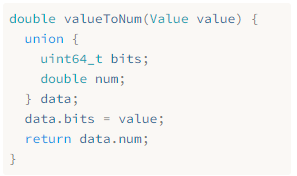

# 30.优化 Optimization

> The evening’s the best part of the day. You’ve done your day’s work. Now you can put your feet up and enjoy it.
>
> ​													——Kazuo Ishiguro, *The Remains of the Day*

夜晚是一天中最美好的时光。你已经完成了一天的工作，现在你可以双腿搁平，享受一下。（石黑一雄，《长日将尽》）

> If I still lived in New Orleans, I’d call this chapter a *lagniappe*, a little something extra given for free to a customer. You’ve got a whole book and a complete virtual machine already, but I want you to have some more fun hacking on clox. This time, we’re going for pure performance. We’ll apply two very different optimizations to our virtual machine. In the process, you’ll get a feel for measuring and improving the performance of a language implementation—or any program, really.

如果我还住在新奥尔良，我会把这一章称为*lagniappe*（小赠品），即免费送给顾客的一点额外的东西。你已经有了一整本书和一个完整的虚拟机，但我希望你能在clox上获得更多的乐趣。这一次，我们要追求的是纯粹的性能。我们将对虚拟机应用两种截然不同的优化。在这个过程中，你将了解如何测量和提高语言实现的性能——或者说任何程序的性能，真的。

> ## 30 . 1 Measuring Performance

## 30.1 测量性能

> **Optimization** means taking a working application and improving its performance. An optimized program does the same thing, it just takes less resources to do so. The resource we usually think of when optimizing is runtime speed, but it can also be important to reduce memory usage, startup time, persistent storage size, or network bandwidth. All physical resources have some cost—even if the cost is mostly in wasted human time—so optimization work often pays off.

**优化**是指拿到一个基本可用的应用程序并提高其性能。一个优化后的程序能做到同样的事情，只是需要更少的资源。我们在优化时通常考虑的资源是运行时速度，但减少内存使用、启动时间、持久化存储大小或网络带宽也很重要。所有的物理资源都有一定的成本——即使成本主要是浪费人力时间，所以优化工作通常都能得到回报。

> There was a time in the early days of computing that a skilled programmer could hold the entire hardware architecture and compiler pipeline in their head and understand a program’s performance just by thinking real hard. Those days are long gone, separated from the present by microcode, cache lines, branch prediction, deep compiler pipelines, and mammoth instruction sets. We like to pretend C is a “low-level” language, but the stack of technology between
>
> ```
> printf("Hello, world!");
> ```
>
> and a greeting appearing on screen is now perilously tall.

在计算机早期，曾经有一段时间，一个熟练的程序员可以把整个硬件架构和编译器管道记在脑子里，只需要认真思考就可以了解程序的性能。那些日子早已一去不复返了，现在已经被微码、缓存线、分支预测、深层编译器管道和庞大的指令集所分隔。我们喜欢假装C语言是一种“低级”语言，但在`printf("Hello, world!");`和屏幕上出现的问候语之间的技术栈现在已经很高了。

> Optimization today is an empirical science. Our program is a border collie sprinting through the hardware’s obstacle course. If we want her to reach the end faster, we can’t just sit and ruminate on canine physiology until enlightenment strikes. Instead, we need to *observe* her performance, see where she stumbles, and then find faster paths for her to take.

今天的优化是一门经验科学。我们的程序是一只在硬件障碍赛中冲刺的边牧。如果我们想让她更快地到达终点，我们不能只是坐在那里思考犬类的生理机能，等着灵光乍现。相反，我们需要*观察*她的表现，看看她在那里出错，然后为她找到更快的路径。

> Much like agility training is particular to one dog and one obstacle course, we can’t assume that our virtual machine optimizations will make *all* Lox programs run faster on *all* hardware. Different Lox programs stress different areas of the VM, and different architectures have their own strengths and weaknesses.

就像敏捷训练要真的一只狗和一项障碍赛，我们不能假设我们的虚拟机优化会使所有的Lox程序在所有硬件上运行得更快。不同的Lox程序侧重虚拟机的不同领域，不同的架构也有其自身的优势和劣势。

### 30 . 1 . 1 Benchmarks

> When we add new functionality, we validate correctness by writing tests—Lox programs that use a feature and validate the VM’s behavior. Tests pin down semantics and ensure we don’t break existing features when we add new ones. We have similar needs when it comes to performance:
>

当我们添加新功能时，我们通过编写测试来验证正确性——使用某个特性并验证虚拟机行为的Lox程序。测试可以约束语义，并确保在添加新功能时，不会破坏现有的特性。在性能方面，我们也有类似的需求：

> 1. How do we validate that an optimization *does* improve performance, and by how much?
> 2. How do we ensure that other unrelated changes don’t *regress* performance?
>

1. 我们如何验证一项优化确实提高了性能，以及提高了多少？
2. 我们如何确保其它不相关的修改不会使性能退步？

> The Lox programs we write to accomplish those goals are **benchmarks**. These are carefully crafted programs that stress some part of the language implementation. They measure not *what* the program does, but how *long* it takes to do it.
>

我们为实现这些目标而编写的Lox程序就是**基准**。这些都是精心设计的程序，侧重于语言实现的某些部分。它们测量的不是程序*做了什么*，而是做完这些需要*多久*[^1]。

> By measuring the performance of a benchmark before and after a change, you can see what your change does. When you land an optimization, all of the tests should behave exactly the same as they did before, but hopefully the benchmarks run faster.

通过测量修改前后的基准性能，你可以看到修改的效果。当你完成优化时，所有测试都应该与之前的行为完全一样，只是希望基准程序运行更快一点。

> Once you have an entire *suite* of benchmarks, you can measure not just *that* an optimization changes performance, but on which *kinds* of code. Often you’ll find that some benchmarks get faster while others get slower. Then you have to make hard decisions about what kinds of code your language implementation optimizes for.
>

一旦你有了一整套的基准测试，你不仅可以衡量某个优化是否改变了性能，而且可以衡量改变了哪类代码的性能。通常，你会发现一些基准测试变得更快，而另一些则变得更慢。然后你必须作出艰难的决策：你的语言实现要对哪种代码进行优化。

> The suite of benchmarks you choose to write is a key part of that decision. In the same way that your tests encode your choices around what correct behavior looks like, your benchmarks are the embodiment of your priorities when it comes to performance. They will guide which optimizations you implement, so choose your benchmarks carefully, and don’t forget to periodically reflect on whether they are helping you reach your larger goals.
>

你选择编写的基准套件是该决策的一部分。就像你的测试代码编码了关于正确代码行为的选择，你的基准测试是你在性能方面侧重点的体现。它们将指导你实现哪些优化，所以要仔细选择你的基准测试，并且不要忘记定期反思它们是否能帮助你实现更大的目标[^2]。

> Benchmarking is a subtle art. Like tests, you need to balance not overfitting to your implementation while ensuring that the benchmark does actually tickle the code paths that you care about. When you measure performance, you need to compensate for variance caused by CPU throttling, caching, and other weird hardware and operating system quirks. I won’t give you a whole sermon here, but treat benchmarking as its own skill that improves with practice.
>

基准测试是一门微妙的艺术。就像测试一样，你需要在不过度拟合语言实现的同时，确保基准测试确实适合你所关心的代码路径。在测量性能时，你需要补偿由CPU节流、缓存和其它奇怪的硬件和操作系统特性造成的差异。我不会在这里给你一个完整的说教，但请把基准测试当作可以通过实践来提高的一门技能。

> ### 30 . 1 . 2 Profiling

### 30.1.2 剖析

> OK, so you’ve got a few benchmarks now. You want to make them go faster. Now what? First of all, let’s assume you’ve done all the obvious, easy work. You are using the right algorithms and data structures—or, at least, you aren’t using ones that are aggressively wrong. I don’t consider using a hash table instead of a linear search through a huge unsorted array “optimization” so much as “good software engineering”.

好的，现在你已经有了一些基准测试。你想让它们走得更快，现在怎么办呢？首先，我们假设你已经完成了所有明显的、简单的工作。你使用了正确的算法和数据结构——或者，至少你没有使用那些严重错误的算法和数据结构。我认为使用哈希表代替巨大的无序数组进行线性搜索不是“优化”，而是“良好的软件工程实现”。

> Since the hardware is too complex to reason about our program’s performance from first principles, we have to go out into the field. That means *profiling*. A **profiler**, if you’ve never used one, is a tool that runs your program and tracks hardware resource use as the code executes. Simple ones show you how much time was spent in each function in your program. Sophisticated ones log data cache misses, instruction cache misses, branch mispredictions, memory allocations, and all sorts of other metrics.

由于硬件太过复杂，无法从基本原理推断出程序的性能，所以我们必须深入实地。这意味着*剖析*。**剖析器**（如果你从未使用过）是一种工具，可以运行你的程序并在代码执行过程中跟踪硬件资源的使用情况[^3]。简单的剖析器可以向你展示程序中每个函数花费了多少时间。复杂的剖析器则会记录数据缓存缺失、指令缓存缺失、分支预测错误、内存分配和其它各种指标。

> There are many profilers out there for various operating systems and languages. On whatever platform you program, it’s worth getting familiar with a decent profiler. You don’t need to be a master. I have learned things within minutes of throwing a program at a profiler that would have taken me *days* to discover on my own through trial and error. Profilers are wonderful, magical tools.

现在有很多针对不同操作系统和语言的剖析器。无论你在什么平台上编程，熟悉一个像样的剖析器都是值得的。你不需要称为大师。我在把程序扔给剖析器的几分钟内就学到了很多东西，而这些东西是我自己通过反复试验*好几天*才发现的。剖析器是一种绝妙、神奇的工具。

> ## 30 . 2 Faster Hash Table Probing

## 30.2 更快的哈希表探测

> Enough pontificating, let’s get some performance charts going up and to the right. The first optimization we’ll do, it turns out, is about the *tiniest* possible change we could make to our VM.

废话说得够多了，我们来让性能图表趋向右上方（提升性能）。我们要做的第一个优化，事实证明也是我们可以对虚拟机所做出的最微小的改变。

> When I first got the bytecode virtual machine that clox is descended from working, I did what any self-respecting VM hacker would do. I cobbled together a couple of benchmarks, fired up a profiler, and ran those scripts through my interpreter. In a dynamically typed language like Lox, a large fraction of user code is field accesses and method calls, so one of my benchmarks looked something like this:

当我第一次让clox派生的字节码虚拟机工作时，我做了任何有自尊心的虚拟机黑客都会做的事情。我拼凑了几个基准测试，启动了一个剖析器，并通过我的解释器运行了这些脚本。在Lox这样的动态类型语言中，用户代码的很大一部分是字段访问和方法调用，所以我的其中一个基准测试看起来是这样的[^4]：

```typescript
class Zoo {
  init() {
    this.aardvark = 1;
    this.baboon   = 1;
    this.cat      = 1;
    this.donkey   = 1;
    this.elephant = 1;
    this.fox      = 1;
  }
  ant()    { return this.aardvark; }
  banana() { return this.baboon; }
  tuna()   { return this.cat; }
  hay()    { return this.donkey; }
  grass()  { return this.elephant; }
  mouse()  { return this.fox; }
}

var zoo = Zoo();
var sum = 0;
var start = clock();
while (sum < 100000000) {
  sum = sum + zoo.ant()
            + zoo.banana()
            + zoo.tuna()
            + zoo.hay()
            + zoo.grass()
            + zoo.mouse();
}

print clock() - start;
print sum;
```

> If you’ve never seen a benchmark before, this might seem ludicrous. *What* is going on here? The program itself doesn’t intend to do anything useful. What it does do is call a bunch of methods and access a bunch of fields since those are the parts of the language we’re interested in. Fields and methods live in hash tables, so it takes care to populate at least a *few* interesting keys in those tables. That is all wrapped in a big loop to ensure our profiler has enough execution time to dig in and see where the cycles are going.

如果你以前从未见过基准测试，那这个看起来可能会很好笑。这是怎么回事？这个程序本身并不打算做任何有用的事情。它所做的就是调用一堆方法和访问一堆字段，因为这些是语言中我们感兴趣的部分。字段和方法都在哈希表中，因此需要小心地在这些表中至少填入几个有趣的键[^5]。这一切都包装在一个大循环中，以确保我们的剖析器有足够的执行时间来挖掘和查看循环的走向。

> Before I tell you what my profiler showed me, spend a minute taking a few guesses. Where in clox’s codebase do you think the VM spent most of its time? Is there any code we’ve written in previous chapters that you suspect is particularly slow?

在我告诉你剖析器显示了什么之前，先花点时间猜一下。你认为在clox的代码库中，虚拟机的大部分时间都花在了哪里？我们在前几章所写的代码中，有没有你怀疑特别慢的？

> Here’s what I found: Naturally, the function with the greatest inclusive time is `run()`. (**Inclusive time** means the total time spent in some function and all other functions it calls—the total time between when you enter the function and when it returns.) Since `run()` is the main bytecode execution loop, it drives everything.

下面是我的发现：自然，非独占时间最大的函数是`run()`。（**非独占时间（Inclusive time）**是指在某个函数及其调用的所有其它函数中所花费的总时间——即从你进入函数到函数返回之间的总时间。）因为`run()`是主要的字节码执行循环，它驱动着一切。

> Inside `run()`, there are small chunks of time sprinkled in various cases in the bytecode switch for common instructions like `OP_POP`, `OP_RETURN`, and `OP_ADD`. The big heavy instructions are `OP_GET_GLOBAL` with 17% of the execution time, `OP_GET_PROPERTY` at 12%, and `OP_INVOKE` which takes a whopping 42% of the total running time.

在`run()`内部，有小块的时间视不同情况分散在如`OP_POP`、`OP_RETURN`、`OP_ADD`等常见指令中。较大的重磅指令是占执行时间17%的`OP_GET_GLOBAL`，占12%的`OP_GET_PROPERTY`，还有占总运行时间的42%的`OP_INVOKE`。

> So we’ve got three hotspots to optimize? Actually, no. Because it turns out those three instructions spend almost all of their time inside calls to the same function: `tableGet()`. That function claims a whole 72% of the execution time (again, inclusive). Now, in a dynamically typed language, we expect to spend a fair bit of time looking stuff up in hash tables—it’s sort of the price of dynamism. But, still, *wow.*

所以我们有三个热点需要优化？事实上，并不是。因为事实证明，这三条指令几乎所有的时间都花在了调用同一个函数上：`tableGet()`。这个函数占用了整整72%的执行时间（同样的，非独占时间）。现在，在一个动态类型语言中，我们预想到会花费相当多的时间在哈希表中查找内容——这算是动态的代价，但是，仍旧让人惊叹。

> ### 30 . 2 . 1 Slow key wrapping

### 30.2.1 缓慢的键包装

> If you take a look at `tableGet()`, you’ll see it’s mostly a wrapper around a call to `findEntry()` where the actual hash table lookup happens. To refresh your memory, here it is in full:
>

如果查看一下`tableGet()`，你会发现它主要是对`findEntry()`调用的一个包装，而`findEntry()`是真正进行哈希表查找的地方。为了唤起你的记忆，下面是它的全部内容：

```c
static Entry* findEntry(Entry* entries, int capacity,
                        ObjString* key) {
  uint32_t index = key->hash % capacity;
  Entry* tombstone = NULL;

  for (;;) {
    Entry* entry = &entries[index];
    if (entry->key == NULL) {
      if (IS_NIL(entry->value)) {
        // Empty entry.
        return tombstone != NULL ? tombstone : entry;
      } else {
        // We found a tombstone.
        if (tombstone == NULL) tombstone = entry;
      }
    } else if (entry->key == key) {
      // We found the key.
      return entry;
    }

    index = (index + 1) % capacity;
  }
}
```

> When running that previous benchmark—on my machine, at least—the VM spends 70% of the total execution time on *one line* in this function. Any guesses as to which one? No? It’s this:
>

在运行之前的基准测试时——至少在我的机器上是这样——虚拟机将总执行时间的70%花费在这个函数的*一行*代码上。能猜到是哪一行吗？猜不到？是这一行：

```c
  uint32_t index = key->hash % capacity;
```

> That pointer dereference isn’t the problem. It’s the little `%`. It turns out the modulo operator is *really* slow. Much slower than other arithmetic operators. Can we do something better?

问题不在于指针解引用，而是那个小小的`%`。事实证明，取模操作符*真的*很慢。比其它算术运算符慢得多[^6]。我们能做得更好吗？

> In the general case, it’s really hard to re-implement a fundamental arithmetic operator in user code in a way that’s faster than what the CPU itself can do. After all, our C code ultimately compiles down to the CPU’s own arithmetic operations. If there were tricks we could use to go faster, the chip would already be using them.
>

在一般情况下，要想在用户代码中重新实现一个算术运算符，而且要比CPU本身的运算速度更快，这是非常难的。毕竟，我们的C代码最终会被编译为CPU自己的算术运算。如果有什么技巧可以加速运算，芯片早就在使用了。

> However, we can take advantage of the fact that we know more about our problem than the CPU does. We use modulo here to take a key string’s hash code and wrap it to fit within the bounds of the table’s entry array. That array starts out at eight elements and grows by a factor of two each time. We know—and the CPU and C compiler do not—that our table’s size is always a power of two.
>

然而，我们可以利用这一事实：我们比CPU更了解我们的问题。我们在这里使用取模将键字符串的哈希码包装到表的项数组的大小范围内。该数组开始时有8个元素，每次增加2倍。我们知道（CPU和C编译器都不知道）我们的表大小总是2的幂。

> Because we’re clever bit twiddlers, we know a faster way to calculate the remainder of a number modulo a power of two: **bit masking**. Let’s say we want to calculate 229 modulo 64. The answer is 37, which is not particularly apparent in decimal, but is clearer when you view those numbers in binary:
>

因为我们是聪明的位操作者，我们知道一个更快的方法来计算一个数以2的幂为模的余数：**位掩码**。假设我们要计算229对64取模。答案是37，这在十进制中不是特别明显，但当你用二进制查看这些数字时，就会更清楚：


> On the left side of the illustration, notice how the result (37) is simply the dividend (229) with the highest two bits shaved off? Those two highest bits are the bits at or to the left of the divisor’s single 1 bit.
>

在图的左侧，注意结果（37）是如何简单地将除数（229）的最高两位削除？这两个最高的位是被除数第一个1及其左侧的比特位。

> On the right side, we get the same result by taking 229 and bitwise AND-ing it with 63, which is one less than our original power of two divisor. Subtracting one from a power of two gives you a series of 1 bits. That is exactly the mask we need in order to strip out those two leftmost bits.

在右边，我们将299和63（原来的2的幂除数减一）进行按位与操作，也可以得到同样的结果。2的幂减去1会得到一系列的1比特。这正是我们需要的掩码，以便剥离掉最左侧的两个比特。

> In other words, you can calculate a number modulo any power of two by simply AND-ing it with that power of two minus one. I’m not enough of a mathematician to *prove* to you that this works, but if you think it through, it should make sense. We can replace that slow modulo operator with a very fast decrement and bitwise AND. We simply change the offending line of code to this:

换句话说，要计算某个数与任何2的幂的模数，你可以简单地将该数与2的幂减1进行位相与。我不是一个数学家，无法向你证明这一点，但如果你仔细想想，这应该是有道理的。我们可以用一个非常快的减法和按位与运算来替换那个缓慢的模运算。我们只是简单地将那行代码改为：

*<u>table.c，在findEntry()方法中替换1行：</u>*

```c
static Entry* findEntry(Entry* entries, int capacity,
                        ObjString* key) {  
  // 替换部分开始
  uint32_t index = key->hash & (capacity - 1);
  // 替换部分结束
  Entry* tombstone = NULL;
```

> CPUs love bitwise operators, so it’s hard to improve on that.

CPU喜欢位运算，因此很难在此基础上进行改进[^7]。

> Our linear probing search may need to wrap around the end of the array, so there is another modulo in `findEntry()` to update.

我们的线性探测搜索可能需要在数组的末尾绕回起点，所以在`findEntry()`中还有一个模运算需要更新。

*<u>table.c，在findEntry()方法中替换1行：</u>*

```c
    // We found the key.
      return entry;
    }
    // 替换部分开始
    index = (index + 1) & (capacity - 1);
    // 替换部分结束
  }
```

> This line didn’t show up in the profiler since most searches don’t wrap.

这一行没有出现在剖析器中，是因为大部分搜索都不需要绕回。

> The `findEntry()` function has a sister function, `tableFindString()` that does a hash table lookup for interning strings. We may as well apply the same optimizations there too. This function is called only when interning strings, which wasn’t heavily stressed by our benchmark. But a Lox program that created lots of strings might noticeably benefit from this change.

`findEntry()`函数有一个姊妹函数，`tableFindString()`，它为驻留的字符串做哈希表查询。我们不妨在这里也应用同样的优化。该函数只在对字符串进行驻留时才会被调用，我们的基准测试中没有特别侧重这一点。但是一个创建大量字符串的Lox程序可能会从这个调整中明显受益。

*<u>table.c，在tableFindString()方法中替换1行：</u>*

```c
  if (table->count == 0) return NULL;
  // 替换部分开始
  uint32_t index = hash & (table->capacity - 1);
  // 替换部分结束
  for (;;) {
    Entry* entry = &table->entries[index];
```

> And also when the linear probing wraps around.
>

当线性探索绕回起点时也是如此。

*<u>table.c，在tableFindString()方法中替换1行：</u>*

```c
    return entry->key;
    }
    // 替换部分开始
    index = (index + 1) & (table->capacity - 1);
    // 替换部分结束
  }
```

> Let’s see if our fixes were worth it. I tweaked that zoological benchmark to count how many batches of 10,000 calls it can run in ten seconds. More batches equals faster performance. On my machine using the unoptimized code, the benchmark gets through 3,192 batches. After this optimization, that jumps to 6,249.

来看看我们的修补是否值得。我调整了前面的动物学基准测试，计算它能在10秒内运行多少批的10000次调用[^8]。处理批次越多，性能越快。在我的机器上，使用未优化的代码，基准测试可以执行3192个批次。经过优化之后，这个数字跃升到了6249。


> That’s almost exactly twice as much work in the same amount of time. We made the VM twice as fast (usual caveat: on this benchmark). That is a massive win when it comes to optimization. Usually you feel good if you can claw a few percentage points here or there. Since methods, fields, and global variables are so prevalent in Lox programs, this tiny optimization improves performance across the board. Almost every Lox program benefits.

在同样的时间内，工作量几乎是原来的两倍。我们让虚拟机的速度提高了一倍（警告：在这个基准测试中）。对于优化来说，这是一个巨大的胜利。通常情况下，如果你能在这里或那里提升几个百分点，你都会感觉很好。因为方法、字段和全局变量在Lox程序中非常普遍，因此这个微小的优化可以全面提高性能。几乎每个Lox程序都会受益。

> Now, the point of this section is *not* that the modulo operator is profoundly evil and you should stamp it out of every program you ever write. Nor is it that micro-optimization is a vital engineering skill. It’s rare that a performance problem has such a narrow, effective solution. We got lucky.

现在，本节的重点不是说取模运算符非常邪恶，你要把它从你写的每个程序中剔除。也不是说微优化是一项重要的工程技能。很少有一个性能问题具有如此狭窄、有效的解决方案。我们很幸运。

> The point is that we didn’t *know* that the modulo operator was a performance drain until our profiler told us so. If we had wandered around our VM’s codebase blindly guessing at hotspots, we likely wouldn’t have noticed it. What I want you to take away from this is how important it is to have a profiler in your toolbox.

关键在于，直到剖析器告诉我们，我们才知道取模运算符是一个性能损耗。如果我们在虚拟机的代码库中盲目地猜测热点，我们可能不会注意到它。我想让你从中学到的是，在你的工具箱中拥有一个剖析器是多么重要。

> To reinforce that point, let’s go ahead and run the original benchmark in our now-optimized VM and see what the profiler shows us. On my machine, `tableGet()` is still a fairly large chunk of execution time. That’s to be expected for a dynamically typed language. But it has dropped from 72% of the total execution time down to 35%. That’s much more in line with what we’d like to see and shows that our optimization didn’t just make the program faster, but made it faster *in the way we expected*. Profilers are as useful for verifying solutions as they are for discovering problems.
>

为了强化这一点，我们继续在现在已优化的虚拟机中运行最初的基准测试，看看剖析器会显示什么。在我的机器上，`tableGet()`仍然占用了相当大的执行时间。对于动态类型的语言来说，这是可以预期的结果。但是它已经从72%下降到了35%。这更符合我们希望看到的情况，表明我们的优化不仅使程序更快，而且是以预期的方式使它更快。剖析器在验证解决方法时和发现问题时一样有用。

> ## 30 . 3 NaN Boxing

## 30.3 NaN装箱

> This next optimization has a very different feel. Thankfully, despite the odd name, it does not involve punching your grandmother. It’s different, but not, like, *that* different. With our previous optimization, the profiler told us where the problem was, and we merely had to use some ingenuity to come up with a solution.

接下来的这个优化有着非常不同的感觉。值得庆幸的是，虽然它的名字很奇怪，但它并不会推翻一切。确实不同，但不会那么不同。在我们之前的优化中，剖析器会告诉我们问题出在哪里，而我们只需要发挥一些聪明才智就可以想出解决方案。

> This optimization is more subtle, and its performance effects more scattered across the virtual machine. The profiler won’t help us come up with this. Instead, it was invented by someone thinking deeply about the lowest levels of machine architecture.

这个优化更加微妙，它对性能的影响在虚拟机在更加分散。剖析器无法帮我们找到它。相反，它是由一个对机器架构底层进行深入思考的人发明的[^9]。

> Like the heading says, this optimization is called **NaN boxing** or sometimes **NaN tagging**. Personally I like the latter name because “boxing” tends to imply some kind of heap-allocated representation, but the former seems to be the more widely used term. This technique changes how we represent values in the VM.

正如标题所说，这种优化称为**NaN装箱**，有时也被称为**NaN标记**。我个人更喜欢后者，因为“装箱”往往意味着某种堆分配的表示形式，但前者似乎是使用广泛的术语。这种技术改变了我们在虚拟机中表示值的方式。

> On a 64-bit machine, our Value type takes up 16 bytes. The struct has two fields, a type tag and a union for the payload. The largest fields in the union are an Obj pointer and a double, which are both 8 bytes. To keep the union field aligned to an 8-byte boundary, the compiler adds padding after the tag too:

在64位机器上，我们的Value类型占用了16个字节。该结构体中有两个字段，一个类型标签和一个存储有效载荷的联合体。联合体中最大的字段是一个Obj指针和一个double值，都是8字节。为了使联合体字段与8字节边界对齐，编译器也在标签后面添加了填充：


> That’s pretty big. If we could cut that down, then the VM could pack more values into the same amount of memory. Most computers have plenty of RAM these days, so the direct memory savings aren’t a huge deal. But a smaller representation means more Values fit in a cache line. That means fewer cache misses, which affects *speed*.

真可真够大的。如果我们能把它减少，那虚拟机就能在相同的内存中装入更多的值。现在大多数计算机都有足够的RAM，所以节省直接内存不是什么大问题。但是更小的表示方式意味着有更多的值可以放入缓存行中。这意味着更少的缓存失误，从而影响*速度*。

> If Values need to be aligned to their largest payload size, and a Lox number or Obj pointer needs a full 8 bytes, how can we get any smaller? In a dynamically typed language like Lox, each value needs to carry not just its payload, but enough additional information to determine the value’s type at runtime. If a Lox number is already using the full 8 bytes, where could we squirrel away a couple of extra bits to tell the runtime “this is a number”?

既然Value需要与最大的有效载荷对齐，而且Lox数值或Obj指针需要完整的8个字节，那我们如何才能变得更小呢？在Lox这样的动态类型语言中，每个值不仅需要携带其有效载荷，还需要携带足够多的附加信息，以便在运行时确定值的类型。如果一个Lox的数字已经用了整整8个字节，那我们可以在哪里偷取两个额外的比特来告诉运行时“这是一个数字”？

> This is one of the perennial problems for dynamic language hackers. It particularly bugs them because statically typed languages don’t generally have this problem. The type of each value is known at compile time, so no extra memory is needed at runtime to track it. When your C compiler compiles a 32-bit int, the resulting variable gets *exactly* 32 bits of storage.

这是动态语言黑客长期面临的问题之一。因为静态类型语言通常不存在这个问题，所以这让他们特别困扰。每个值的类型在编译时就已经知道了，所以在运行时不需要额外的内存来记录这些信息。当你的C语言编译器编译一个32位的int时，产生的变量会得到*正好*32位的存储空间。

> Dynamic language folks hate losing ground to the static camp, so they’ve come up with a number of very clever ways to pack type information and a payload into a small number of bits. NaN boxing is one of those. It’s a particularly good fit for languages like JavaScript and Lua, where all numbers are double-precision floating point. Lox is in that same boat.

动态语言的人讨厌输给静态阵营，所以他们想出了许多非常聪明的方法，将类型信息和有效载荷打包到少量的比特中。NaN装箱就是其中之一。它特别适合于像JavaScript和Lua这样的语言，在这些语言中，所有数字都是双精度浮点数。Lox也是如此。

> ### 30 . 3 . 1 What is (and is not) a number?

### 30.3.1 什么是（以及不是）数值？

> Before we start optimizing, we need to really understand how our friend the CPU represents floating-point numbers. Almost all machines today use the same scheme, encoded in the venerable scroll [IEEE 754](https://en.wikipedia.org/wiki/IEEE_754), known to mortals as the “IEEE Standard for Floating-Point Arithmetic”.

在开始优化之前，我们需要真正了解我们的朋友CPU是如何表示浮点数的。现在几乎所有的机器都使用相同的方案，编码在古老的卷轴[IEEE 754](https://en.wikipedia.org/wiki/IEEE_754)中，凡人们称之为“IEEE浮点运算标准”。

> In the eyes of your computer, a 64-bit, double-precision, IEEE floating-point number looks like this:

在你的计算机看来，一个64位、双精度的IEEE浮点数是这样的：


> - Starting from the right, the first 52 bits are the **fraction**, **mantissa**, or **significand** bits. They represent the significant digits of the number, as a binary integer.
> - Next to that are 11 **exponent** bits. These tell you how far the mantissa is shifted away from the decimal (well, binary) point.
> - The highest bit is the **sign bit**, which indicates whether the number is positive or negative.

* 从右边开始，前52位是**分数**、**尾数**或**有效位**。它们以二进制整数形式表示数值的有效数字。
* 接下来是11个**指数**位。它们会告诉你尾数中的小数点要移动多少位。
* 最高的位是**符号**位，表示这个数值是正数还是负数[^10]。

> I know that’s a little vague, but this chapter isn’t a deep dive on floating point representation. If you want to know how the exponent and mantissa play together, there are already better explanations out there than I could write.

我知道这有一点模糊，但这一章并不是对浮点数表示法的深入探讨。如果你想知道指数和尾数是如何互相作用的，外面已经有比我写得更好的解释了。

> The important part for our purposes is that the spec carves out a special case exponent. When all of the exponent bits are set, then instead of just representing a really big number, the value has a different meaning. These values are “Not a Number” (hence, **NaN**) values. They represent concepts like infinity or the result of division by zero.

对于我们的目的来说，重要的部分是该规范列出了一个特殊情况下的指数。当指数位全部置为1，这个值就不再表示一个非常大的数字了，而是有着不同的含义。这些值是“非数字”（Not a Number，即**NaN**）值。它们代表了像无穷或除0结果这样的概念。

> *Any* double whose exponent bits are all set is a NaN, regardless of the mantissa bits. That means there’s lots and lots of *different* NaN bit patterns. IEEE 754 divides those into two categories. Values where the highest mantissa bit is 0 are called **signalling NaNs**, and the others are **quiet NaNs**. Signalling NaNs are intended to be the result of erroneous computations, like division by zero. A chip may detect when one of these values is produced and abort a program completely. They may self-destruct if you try to read one.

任何指数位全部被置为1的double数都是NaN，无论尾数位是什么。这意味着有很多*不同*的NaN模式。IEEE 754将其分为两类。最高尾数位为0的值被称为**信号NaN**，其它的是**静默NaN**。信号NaN是错误计算的结果，如除以0。当这些值被生成时，芯片可以检测到并完全中止程序[^11]。如果你试图读取这些值，它们可能会自毁。

> Quiet NaNs are supposed to be safer to use. They don’t represent useful numeric values, but they should at least not set your hand on fire if you touch them.

静默NaN使用起来更安全。它们不代表有用的数值，但它们至少不会一碰就着。

> Every double with all of its exponent bits set and its highest mantissa bit set is a quiet NaN. That leaves 52 bits unaccounted for. We’ll avoid one of those so that we don’t step on Intel’s “QNaN Floating-Point Indefinite” value, leaving us 51 bits. Those remaining bits can be anything. We’re talking 2,251,799,813,685,248 unique quiet NaN bit patterns.

每一个所有指数位置1、最高尾数位置1的double都是一个静默NaN。这就留下了52个未解释的位。我们会避开其中一个，这样我们就不会踩到Intel的“QNaN浮点不确定”值，剩下51位。这些剩余的比特可以是任何东西。我们现在说的是2,251,799,813,685,248独一无二的静默NaN位模式。


> This means a 64-bit double has enough room to store all of the various different numeric floating-point values and *also* has room for another 51 bits of data that we can use however we want. That’s plenty of room to set aside a couple of bit patterns to represent Lox’s `nil`, `true`, and `false` values. But what about Obj pointers? Don’t pointers need a full 64 bits too?

这意味着一个64位的double有足够的框架存储所有不同的浮点数值，*还*有52位的数据空间供我们随意使用。这样就有足够的空间来预留几个位来表示Lox的`nil`、`true`和`false`值。但是Obj的指针呢？指针不是也需要64位吗？

> Fortunately, we have another trick up our other sleeve. Yes, technically pointers on a 64-bit architecture are 64 bits. But, no architecture I know of actually uses that entire address space. Instead, most widely used chips today only ever use the low 48 bits. The remaining 16 bits are either unspecified or always zero.

幸运的是，我们还有另一个妙招。是的，从技术上讲，64位架构上的指针是64位的。但是，我所知道的架构中没有一个真正使用了整个地址空间。相反，如今大多数广泛使用的芯片只使用低48位[^12]。剩余16位要么未指定，要么始终为零。

> If we’ve got 51 bits, we can stuff a 48-bit pointer in there with three bits to spare. Those three bits are just enough to store tiny type tags to distinguish between `nil`, Booleans, and Obj pointers.

如果我们有51比特位，可以把一个48位的指针塞进去，还有3比特位的空闲。这三个比特位刚好可以用来存储微小的类型标记来区分`nil`、布尔值和Obj指针。

> That’s NaN boxing. Within a single 64-bit double, you can store all of the different floating-point numeric values, a pointer, or any of a couple of other special sentinel values. Half the memory usage of our current Value struct, while retaining all of the fidelity.

这就是NaN装箱。在一个64位的double中，你可以存储所有不同的浮点数值、一个指针或其它一些特殊的标示值。这比我们当前Value结构体少了一半的内存占用量，同时保留了所有的精确性。

> What’s particularly nice about this representation is that there is no need to *convert* a numeric double value into a “boxed” form. Lox numbers *are* just normal, 64-bit doubles. We still need to *check* their type before we use them, since Lox is dynamically typed, but we don’t need to do any bit shifting or pointer indirection to go from “value” to “number”.

这种表示方法的特别之处在于，不需要将数值类型的double值*转换*为一个“装箱后的”形式。Lox中的数字只是普通的64位double。在使用之前，我们仍然需要*检查*它们的类型，因为Lox是动态类型的，但我们不需要做任何的数位偏移或指针引用来完成从“值”到“数”的转换。

> For the other value types, there is a conversion step, of course. But, fortunately, our VM hides all of the mechanism to go from values to raw types behind a handful of macros. Rewrite those to implement NaN boxing, and the rest of the VM should just work.

对于其它的值类型，当然有一个转换步骤。但幸运的是，我们的虚拟机将从值到原始类型的所有机制都隐藏在少数几个宏后面。重写这些宏来实现NaN装箱，虚拟机的其它部分就可以正常工作了。

> ### 30 . 3 . 2 Conditional support

### 30.3.2 有条件地支持

> I know the details of this new representation aren’t clear in your head yet. Don’t worry, they will crystallize as we work through the implementation. Before we get to that, we’re going to put some compile-time scaffolding in place.

我知道这个新表示形式的细节在你的脑子里还不清晰。不用担心，它们会在我们的实现过程中逐步具现化。在此之前，我们要放置一些编译时的脚手架。

> For our previous optimization, we rewrote the previous slow code and called it done. This one is a little different. NaN boxing relies on some very low-level details of how a chip represents floating-point numbers and pointers. It *probably* works on most CPUs you’re likely to encounter, but you can never be totally sure.

对于我们之前的优化，我们重写之前的慢代码就可以宣告完成了。这一次则有点不同。NaN装箱依赖于芯片如何表示浮点数和指针等一些非常底层的细节。它也许适用于你可能遇到的大多数CPU，但你永远无法完全确定。

> It would suck if our VM completely lost support for an architecture just because of its value representation. To avoid that, we’ll maintain support for *both* the old tagged union implementation of Value and the new NaN-boxed form. We select which representation we want at compile time using this flag:

如果我们的虚拟机仅仅因为某个架构的值表示形式而完全失去对它的支持，那就太糟糕了。为了避免这种情况，我们会保留对Value的旧的带标记联合体实现方式以及新的NaN装箱形式的支持。我们在编译时使用这个标志来选择我们想要的方法：

*<u>common.h，添加代码：</u>*

```c
#include <stdint.h>
// 新增部分开始
#define NAN_BOXING
// 新增部分结束
#define DEBUG_PRINT_CODE
```

> If that’s defined, the VM uses the new form. Otherwise, it reverts to the old style. The few pieces of code that care about the details of the value representation—mainly the handful of macros for wrapping and unwrapping Values—vary based on whether this flag is set. The rest of the VM can continue along its merry way.

如果定义了这个值，虚拟机就会使用新的形式。否则，它就会恢复旧的风格。少数关心值表示形式细节的几段代码——主要是用于包装和解包Value的少数几个宏——会根据这个标志是否被设置而有所不同。虚拟机的其它部分可以继续快乐的旅程。

> Most of the work happens in the “value” module where we add a section for the new type.

大部分工作都发生在“value”模块中，我们在其中为新类型添加一些代码。

*<u>value.h，添加代码：</u>*

```c
typedef struct ObjString ObjString;
// 新增部分开始
#ifdef NAN_BOXING

typedef uint64_t Value;

#else
// 新增部分结束
typedef enum {
```

> When NaN boxing is enabled, the actual type of a Value is a flat, unsigned 64-bit integer. We could use double instead, which would make the macros for dealing with Lox numbers a little simpler. But all of the other macros need to do bitwise operations and uint64_t is a much friendlier type for that. Outside of this module, the rest of the VM doesn’t really care one way or the other.

当启用NaN装箱时，Value的实际类型是一个扁平的、无符号的64位整数。我们可以用double代替，这会使处理Lox数字的宏更简单一些。但所有其它宏都需要进行位操作，而uint_64是一个更友好的类型。在这个模块之外，虚拟机的其它部分并不真正关心这一点。

> Before we start re-implementing those macros, we close the `#else` branch of the `#ifdef` at the end of the definitions for the old representation.

在我们开始重新实现这些宏之前，我们先关闭旧表示形式的定义末尾的`#ifdef`的`#else`分支。

*<u>value.h，添加代码：</u>*

```c
#define OBJ_VAL(object)   ((Value){VAL_OBJ, {.obj = (Obj*)object}})
// 新增部分开始
#endif
// 新增部分结束
typedef struct {
```

> Our remaining task is simply to fill in that first `#ifdef` section with new implementations of all the stuff already in the `#else` side. We’ll work through it one value type at a time, from easiest to hardest.

我们剩下的任务只是在第一个`#ifdef`部分中填入已经在`#else`部分存在的所有内容的新实现。我们会从最简单到最难，依次完成每个值类型的工作。

> ### 30 . 3 . 3 Numbers

### 30.3.3 数字

> We’ll start with numbers since they have the most direct representation under NaN boxing. To “convert” a C double to a NaN-boxed clox Value, we don’t need to touch a single bit—the representation is exactly the same. But we do need to convince our C compiler of that fact, which we made harder by defining Value to be uint64_t.

我们会从数字开始，因为它们在NaN装箱方式中有最直接的表示形式。要将C语言中的double“转换”为一个NaN装箱后的clox Value，我们不需要改动任何一个比特——其表示方式是完全相同的。但我们确实需要说服我们的C编译器相信这一事实，我们将Value定义为uint64_t使之变得更加困难。

> We need to get the compiler to take a set of bits that it thinks are a double and use those same bits as a uint64_t, or vice versa. This is called **type punning**. C and C++ programmers have been doing this since the days of bell bottoms and 8-tracks, but the language specifications have hesitated to say which of the many ways to do this is officially sanctioned.

我们需要让编译器接受一组它认为是double的比特，并作为uint64_t来使用，反之亦然。这就是所谓的**类型双关**。C和C++程序员早在喇叭裤和8音轨的时代就开始这样做了，但语言规范却一直犹豫不决，不知道哪种方法是官方认可的[^13]。

> I know one way to convert a `double` to `Value` and back that I believe is supported by both the C and C++ specs. Unfortunately, it doesn’t fit in a single expression, so the conversion macros have to call out to helper functions. Here’s the first macro:

我知道一种将`double`转换为`Value`并反向转换的方法，我相信C和C++规范都支持该方法。不幸的是，它不适合在一个表达式中使用，因此转换宏必须调用辅助函数。下面是第一个宏：

*<u>value.h，添加代码：</u>*

```c
typedef uint64_t Value;
// 新增部分开始
#define NUMBER_VAL(num) numToValue(num)
// 新增部分结束
#else
```

> That macro passes the double here:

这个宏会将double传递到这里：

*<u>value.h，添加代码：</u>*

```c
#define NUMBER_VAL(num) numToValue(num)
// 新增部分开始
static inline Value numToValue(double num) {
  Value value;
  memcpy(&value, &num, sizeof(double));
  return value;
}
// 新增部分结束
#else
```

> I know, weird, right? The way to treat a series of bytes as having a different type without changing their value at all is `memcpy()`? This looks horrendously slow: Create a local variable. Pass its address to the operating system through a syscall to copy a few bytes. Then return the result, which is the exact same bytes as the input. Thankfully, because this *is* the supported idiom for type punning, most compilers recognize the pattern and optimize away the `memcpy()` entirely.

我知道，很奇怪，对吗？在不改变值的情况下，将一系列字节视为具有不同类型的方式是`memcpy()`？这看起来慢的可怕：创建一个局部变量；通过系统调用 将其地址传递给操作系统，以复制几个字节；然后返回结果，这个结果与输入的字节完全相同。值得庆幸的是，由于这是类型双关的习惯用法，大部分编译器都能识别这种模式，并完全优化掉`memcpy()`。

> “Unwrapping” a Lox number is the mirror image.

“拆包”一个Lox数字就是镜像操作。

*<u>value.h，添加代码：</u>*

```c
typedef uint64_t Value;
// 新增部分开始
#define AS_NUMBER(value)    valueToNum(value)
// 新增部分结束
#define NUMBER_VAL(num) numToValue(num)
```

> That macro calls this function:

这个宏会调用下面的函数：

*<u>value.h，添加代码：</u>*

```c
#define NUMBER_VAL(num) numToValue(num)
// 新增部分开始
static inline double valueToNum(Value value) {
  double num;
  memcpy(&num, &value, sizeof(Value));
  return num;
}
// 新增部分结束
static inline Value numToValue(double num) {
```

> It works exactly the same except we swap the types. Again, the compiler will eliminate all of it. Even though those calls to `memcpy()` will disappear, we still need to show the compiler *which* `memcpy()` we’re calling so we also need an include.

它的工作原理完全一样，只是交换了类型。同样，编译器会消除所有这些。尽管对`memcpy()`的那些调用会消失，我们仍然需要向编译器显示我们正在调用*哪个*`memcpy()`，因此我们也需要引入一下[^14]。

*<u>value.h，添加代码：</u>*

```c
#define clox_value_h
// 新增部分开始
#include <string.h>
// 新增部分结束
#include "common.h"
```

> That was a lot of code to ultimately do nothing but silence the C type checker. Doing a runtime type *test* on a Lox number is a little more interesting. If all we have are exactly the bits for a double, how do we tell that it *is* a double? It’s time to get bit twiddling.

其中是大量的代码，最终除了让C语言类型检查器保持沉默之外，什么也没做。对一个Lox数字进行运行时类型*测试*就比较有趣了。如果我们拿到的所有比特位正好是一个double，如何判断它是一个double呢？是时候玩一些位操作技巧了。

*<u>value.h，添加代码：</u>*

```c
typedef uint64_t Value;
// 新增部分开始
#define IS_NUMBER(value)    (((value) & QNAN) != QNAN)
// 新增部分结束
#define AS_NUMBER(value)    valueToNum(value)
```

> We know that every Value that is *not* a number will use a special quiet NaN representation. And we presume we have correctly avoided any of the meaningful NaN representations that may actually be produced by doing arithmetic on numbers.

我们知道，每个*不是*数字的Value都会使用一个特殊的静默NaN表示形式。而且假定我们已经正确地避免了任何有意义的NaN表示形式（这些实际上可能是通过对数字进行算术运算产生的）。

> If the double has all of its NaN bits set, and the quiet NaN bit set, and one more for good measure, we can be pretty certain it is one of the bit patterns we ourselves have set aside for other types. To check that, we mask out all of the bits except for our set of quiet NaN bits. If *all* of those bits are set, it must be a NaN-boxed value of some other Lox type. Otherwise, it is actually a number.

如果某个double值的NaN比特位置为1，而且静默NaN比特位也置为1，还有一个比特位也被置为1，那我们就可以非常肯定它是我们为其它类型预留的比特模式之一[^15]。为了验证这一点，我们屏蔽掉除静默NaN置为1的比特之外的所有其它比特位，如果这些位都被置为1了，那它一定是某个其它Lox类型的已NaN装箱的值。否则，它就是一个数字。

> The set of quiet NaN bits are declared like this:

静默NaN的比特集合是这样声明的：

*<u>value.h，添加代码：</u>*

```c
#ifdef NAN_BOXING
// 新增部分开始
#define QNAN     ((uint64_t)0x7ffc000000000000)
// 新增部分结束
typedef uint64_t Value;
```

> It would be nice if C supported binary literals. But if you do the conversion, you’ll see that value is the same as this:

如果C支持二进制字面量就好了。但如果你做了转换，你会看到那个值是这样的：


> This is exactly all of the exponent bits, plus the quiet NaN bit, plus one extra to dodge that Intel value.

这正是所有的指数位，加上静默NaN比特位，再加上一个额外的用来规避英特尔值的比特位。

> ### 30 . 3 . 4 Nil, true, and false

### 30 . 3 . 4 Nil、true和false

> The next type to handle is `nil`. That’s pretty simple since there’s only one `nil` value and thus we need only a single bit pattern to represent it. There are two other singleton values, the two Booleans, `true` and `false`. This calls for three total unique bit patterns.

下一个要处理的类型是`nil`。这非常简单，因为只有一个`nil`值，因此我们只需要1 个比特位模式来表示它。还有另外两个单例值，即两个布尔值，`true`和`false`。这总共需要三种唯一的比特位模式。

> Two bits give us four different combinations, which is plenty. We claim the two lowest bits of our unused mantissa space as a “type tag” to determine which of these three singleton values we’re looking at. The three type tags are defined like so:

两个比特可以得到四种不同的组合，这已经足够了。我们要求将未使用的尾数中的两个最低位作为“类型标签”，以确定我们正面对的是这三个单例值中的哪一个。这三个类型标签定义如下：

*<u>value.h，添加代码：</u>*

```c
#define QNAN     ((uint64_t)0x7ffc000000000000)
// 新增部分开始
#define TAG_NIL   1 // 01.
#define TAG_FALSE 2 // 10.
#define TAG_TRUE  3 // 11.
// 新增部分结束
typedef uint64_t Value;
```

> Our representation of `nil` is thus all of the bits required to define our quiet NaN representation along with the `nil` type tag bits:

因此，我们的`nil`表示形式的所有比特位就是定义静默NaN表示形式所需的所有比特位，以及`nil`类型的标记位：


> In code, we check the bits like so:

在代码中，我们这样来检查：

*<u>value.h，添加代码：</u>*

```c
#define AS_NUMBER(value)    valueToNum(value)
// 新增部分开始
#define NIL_VAL         ((Value)(uint64_t)(QNAN | TAG_NIL))
// 新增部分结束
#define NUMBER_VAL(num) numToValue(num)
```

> We simply bitwise OR the quiet NaN bits and the type tag, and then do a little cast dance to teach the C compiler what we want those bits to mean.

我们只是将静默NaN比特位与类型标签进行按位或运算，然后做一点强制转换来告诉C编译器我们希望这些位表示什么意思。

> Since `nil` has only a single bit representation, we can use equality on uint64_t to see if a Value is `nil`.
>

由于`nil`只有一个比特表示形式，我们可以对uint64_t使用等号来判断某个Value是否是`nil`。

*<u>value.h，添加代码：</u>*

```c
typedef uint64_t Value;
// 新增部分开始
#define IS_NIL(value)       ((value) == NIL_VAL)
// 新增部分结束
#define IS_NUMBER(value)    (((value) & QNAN) != QNAN)
```

> You can guess how we define the `true` and `false` values.
>

你可以猜到我们如何定义`true`和`false`值。

*<u>value.h，添加代码：</u>*

```c
#define AS_NUMBER(value)    valueToNum(value)
// 新增部分开始
#define FALSE_VAL       ((Value)(uint64_t)(QNAN | TAG_FALSE))
#define TRUE_VAL        ((Value)(uint64_t)(QNAN | TAG_TRUE))
// 新增部分结束
#define NIL_VAL         ((Value)(uint64_t)(QNAN | TAG_NIL))
```

> The bits look like this:

比特位看起来是这样的：


> To convert a C bool into a Lox Boolean, we rely on these two singleton values and the good old conditional operator.
>

为了将C语言bool转换为Lox的Boolean，我们依靠这两个单例值和古老的条件运算符。

*<u>value.h，添加代码：</u>*

```c
#define AS_NUMBER(value)    valueToNum(value)
// 新增部分开始
#define BOOL_VAL(b)     ((b) ? TRUE_VAL : FALSE_VAL)
// 新增部分结束
#define FALSE_VAL       ((Value)(uint64_t)(QNAN | TAG_FALSE))
```

> There’s probably a cleverer bitwise way to do this, but my hunch is that the compiler can figure one out faster than I can. Going the other direction is simpler.
>

可能有更聪明的位运算方式来实现这一点，但我的直觉是，编译器可以比我更快地找到一个方法。反过来就简单多了。

*<u>value.h，添加代码：</u>*

```c
#define IS_NUMBER(value)    (((value) & QNAN) != QNAN)
// 新增部分开始
#define AS_BOOL(value)      ((value) == TRUE_VAL)
// 新增部分结束
#define AS_NUMBER(value)    valueToNum(value)
```

> Since we know there are exactly two Boolean bit representations in Lox—unlike in C where any non-zero value can be considered “true”—if it ain’t `true`, it must be `false`. This macro does assume you call it only on a Value that you know *is* a Lox Boolean. To check that, there’s one more macro.
>

因为我们知道在Lox中正好有两个Boolean的位表示形式——不像C语言中，任何非零值都可以被认为是“true”——如果它不是`true`，就一定是`false`。这个宏假设你只会在明知是Lox布尔值类型的Value上调用该方法。为了检查这一点，还有一个宏。

*<u>value.h，添加代码：</u>*

```c
typedef uint64_t Value;
// 新增部分开始
#define IS_BOOL(value)      (((value) | 1) == TRUE_VAL)
// 新增部分结束
#define IS_NIL(value)       ((value) == NIL_VAL)
```

> That looks a little strange. A more obvious macro would look like this:

这里看起来有点奇怪。一个更直观的宏看起来应该是这样的：

```c
#define IS_BOOL(v) ((v) == TRUE_VAL || (v) == FALSE_VAL)
```

> Unfortunately, that’s not safe. The expansion mentions `v` twice, which means if that expression has any side effects, they will be executed twice. We could have the macro call out to a separate function, but, ugh, what a chore.

不幸的是，这并不安全。展开式中两次使用了`v`，这意味着如果表达式有任何副作用，它们将被执行两次。我们可以让宏调用到一个单独的函数，但是，唉，真麻烦。

> Instead, we bitwise OR a 1 onto the value to merge the only two valid Boolean bit patterns. That leaves three potential states the value can be in:

相反，我们在值上按位或1，来合并仅有的两个有效的Boolean比特位模式。这样，值就剩下了三种可能的状态：

> 1. It was `FALSE_VAL` and has now been converted to `TRUE_VAL`.
> 2. It was `TRUE_VAL` and the `| 1` did nothing and it’s still `TRUE_VAL`.
> 3. It’s some other, non-Boolean value.
>

1. 之前是`FALSE_VAL`，现在转换为`TRUE_VAL`。
2. 之前是`TRUE_VAL`，`| 1`没有起任何作用，结果仍然是`TRUE_VAL`。
3. 它是其它的非布尔值。

> At that point, we can simply compare the result to `TRUE_VAL` to see if we’re in the first two states or the third.

在此基础上，我们可以简单地将结果与`TRUE_VAL`进行比较，看看我们是处于前两个状态还是第三个状态。

> ### 30 . 3 . 5 Objects

### 30.3.5 对象

> The last value type is the hardest. Unlike the singleton values, there are billions of different pointer values we need to box inside a NaN. This means we need both some kind of tag to indicate that these particular NaNs *are* Obj pointers, and room for the addresses themselves.

最后一种值类型是最难的。与单例值不同，我们需要在NaN中包含数十亿个不同的指针值。这意味着我们既需要某种标签来表明这些特定的NaN*是*Obj指针，也需要为这些地址本身留出空间。

> The tag bits we used for the singleton values are in the region where I decided to store the pointer itself, so we can’t easily use a different bit there to indicate that the value is an object reference. However, there is another bit we aren’t using. Since all our NaN values are not numbers—it’s right there in the name—the sign bit isn’t used for anything. We’ll go ahead and use that as the type tag for objects. If one of our quiet NaNs has its sign bit set, then it’s an Obj pointer. Otherwise, it must be one of the previous singleton values.

我们用于单例值的标签比特位处于我决定存储指针本身的区域，所以我们不能轻易地在那里使用不同的位来表明该值是一个对象引用[^16]。不过，还有一个位我们没有用到。因为所有的NaN值都不是数字——正如其名——符号位没有任何用途。我们会继续使用它来作为对象的类型标签。如果某个静默NaN的符号位被置为1，那么它就是一个Obj指针。否则，它一定是前面的单例值之一。

> If the sign bit is set, then the remaining low bits store the pointer to the Obj:

如果符号位被置1，那么剩余的低比特位会存储Obj指针：


> To convert a raw Obj pointer to a Value, we take the pointer and set all of the quiet NaN bits and the sign bit.

为了将一个原生Obj指针转换为Value，我们会接受指针并将所有的静默NaN比特位和符号位置1。

*<u>value.h，添加代码：</u>*

```c
#define NUMBER_VAL(num) numToValue(num)
// 新增部分开始
#define OBJ_VAL(obj) \
    (Value)(SIGN_BIT | QNAN | (uint64_t)(uintptr_t)(obj))
// 新增部分结束
static inline double valueToNum(Value value) {
```

> The pointer itself is a full 64 bits, and in principle, it could thus overlap with some of those quiet NaN and sign bits. But in practice, at least on the architectures I’ve tested, everything above the 48th bit in a pointer is always zero. There’s a lot of casting going on here, which I’ve found is necessary to satisfy some of the pickiest C compilers, but the end result is just jamming some bits together.

指针本身是一个完整的64位，原则上，它可能因此与某些静默NaN和符号位冲突。但实际上，至少在我测试过的架构中，指针中48位以上的所有内容都是零。这里进行了大量的类型转换。我们发现这对于满足一些最挑剔的C语言编译器来说是必要的，但最终的结果只是将这些比特位塞在一起[^17]。

> We define the sign bit like so:

我们这样定义符号位：

*<u>value.h，添加代码：</u>*

```c
#ifdef NAN_BOXING
// 新增部分开始
#define SIGN_BIT ((uint64_t)0x8000000000000000)
// 新增部分结束
#define QNAN     ((uint64_t)0x7ffc000000000000)
```

> To get the Obj pointer back out, we simply mask off all of those extra bits.
>

为了取出Obj指针，我们只需把所有这些额外的比特位屏蔽掉。

*<u>value.h，添加代码：</u>*

```c
#define AS_NUMBER(value)    valueToNum(value)
// 新增部分开始
#define AS_OBJ(value) \
    ((Obj*)(uintptr_t)((value) & ~(SIGN_BIT | QNAN)))
// 新增部分结束
#define BOOL_VAL(b)     ((b) ? TRUE_VAL : FALSE_VAL)
```

> The tilde (`~`), if you haven’t done enough bit manipulation to encounter it before, is bitwise NOT. It toggles all ones and zeroes in its operand. By masking the value with the bitwise negation of the quiet NaN and sign bits, we *clear* those bits and let the pointer bits remain.
>

如果你没有做过足够多的位运算就可能没有遇到过，波浪号（`~`）是位运算中的NOT（按位取非）。它会切换操作数中所有的1和0。使用静默NaN和符号位按位取非的值作为掩码，对值进行屏蔽，我们可以*清除*这些比特位，并将指针比特保留下来。

> One last macro:

最后一个宏：

*<u>value.h，添加代码：</u>*

```c
#define IS_NUMBER(value)    (((value) & QNAN) != QNAN)
// 新增部分开始
#define IS_OBJ(value) \
    (((value) & (QNAN | SIGN_BIT)) == (QNAN | SIGN_BIT))
// 新增部分结束
#define AS_BOOL(value)      ((value) == TRUE_VAL)
```

> A Value storing an Obj pointer has its sign bit set, but so does any negative number. To tell if a Value is an Obj pointer, we need to check that both the sign bit and all of the quiet NaN bits are set. This is similar to how we detect the type of the singleton values, except this time we use the sign bit as the tag.
>

存储Obj指针的Value的符号位被置1，但任意负数也是如此。为了判断Value是否为Obj指针，我们需要同时检查符号位和所有的静默NaN比特位。这与我们检测单例值类型的方法类似，这不过这次我们使用符号位作为标签。

> ### 30 . 3 . 6 Value functions

### 30.3.6 Value函数

> The rest of the VM usually goes through the macros when working with Values, so we are almost done. However, there are a couple of functions in the “value” module that peek inside the otherwise black box of Value and work with its encoding directly. We need to fix those too.

VM的其余部分在处理Value时通常都是通过宏，所以我们基本上已经完成了。但是，在“value”模块中，有几个函数会窥探Value黑匣子内部，并直接处理器编码。我们也需要修复这些问题。

> The first is `printValue()`. It has separate code for each value type. We no longer have an explicit type enum we can switch on, so instead we use a series of type tests to handle each kind of value.

第一个是`printValue()`。它针对每个值类型都有单独的代码。我们不再有一个明确的类型枚举进行switch，因此我们使用一系列的类型检查来处理每一种值。

*<u>value.c，在printValue()方法中添加代码：</u>*

```c
void printValue(Value value) {
// 新增部分开始
#ifdef NAN_BOXING
  if (IS_BOOL(value)) {
    printf(AS_BOOL(value) ? "true" : "false");
  } else if (IS_NIL(value)) {
    printf("nil");
  } else if (IS_NUMBER(value)) {
    printf("%g", AS_NUMBER(value));
  } else if (IS_OBJ(value)) {
    printObject(value);
  }
#else
// 新增部分结束
  switch (value.type) {
```

> This is technically a tiny bit slower than a switch, but compared to the overhead of actually writing to a stream, it’s negligible.

从技术上讲，这比switch语句稍微慢一点点，但是与实际写入流的开销相比，它可以忽略不计。

> We still support the original tagged union representation, so we keep the old code and enclose it in the `#else` conditional section.

我们仍然支持原先的带标签联合体表示形式，因此我们保留旧代码，并将其包含在`#else`条件部分。

*<u>value.c，在printValue()方法中添加代码：</u>*

```c
  }
// 新增部分开始
#endif
// 新增部分结束
}
```

> The other operation is testing two values for equality.

另一个操作是测试两个值是否相等。

*<u>value.c，在valuesEqual()方法中添加代码：</u>*

```c
bool valuesEqual(Value a, Value b) {
// 新增部分开始
#ifdef NAN_BOXING
  return a == b;
#else
// 新增部分结束
  if (a.type != b.type) return false;
```

> It doesn’t get much simpler than that! If the two bit representations are identical, the values are equal. That does the right thing for the singleton values since each has a unique bit representation and they are only equal to themselves. It also does the right thing for Obj pointers, since objects use identity for equality—two Obj references are equal only if they point to the exact same object.

没有比这更简单的了！如果两个比特表示形式是相同的，则值就是相等的。这对于单例值来说是正确的，因为每个单例值都有唯一的位表示形式，而且它们只等于自己。对于Obj指针，它也做了正确的事情，因为对象使用本体来判断相等——只有当两个Obj指向完全相同的对象时，它们才相等。

> It’s *mostly* correct for numbers too. Most floating-point numbers with different bit representations are distinct numeric values. Alas, IEEE 754 contains a pothole to trip us up. For reasons that aren’t entirely clear to me, the spec mandates that NaN values are *not* equal to *themselves*. This isn’t a problem for the special quiet NaNs that we are using for our own purposes. But it’s possible to produce a “real” arithmetic NaN in Lox, and if we want to correctly implement IEEE 754 numbers, then the resulting value is not supposed to be equal to itself. More concretely:

对于数字来说，也*基本*是正确的。大多数具有不同位表示形式的浮点数是不同的数值。然而，IEEE 754中有一个坑，会让我们陷入困境。由于我不太清楚的原因，该规范规定NaN值*不*等于*自身*。对于我们自己使用的特殊的静默NaN来说，这不是问题。但是在Lox中产生一个“真正的”算术型NaN是有可能的，如果我们想正确地实现IEEE 754数字，那么产生的结果值就不等于它自身。更具体地说：

```typescript
var nan = 0/0;
print nan == nan;
```

> IEEE 754 says this program is supposed to print “false”. It does the right thing with our old tagged union representation because the `VAL_NUMBER` case applies `==` to two values that the C compiler knows are doubles. Thus the compiler generates the right CPU instruction to perform an IEEE floating-point equality.

IEEE 754表明，这个程序应该打印“false”。对于我们原先的带标签联合体表示形式来说，它是正确的，因为`VAL_NUMBER`将`==`应用于两个C编译器知道是double的值。因此，编译器会生成正确的CPU指令来执行IEEE浮点运算。

> Our new representation breaks that by defining Value to be a uint64_t. If we want to be *fully* compliant with IEEE 754, we need to handle this case.

我们的新表示形式由于将Value定义为uint64_t而打破了这一点。如果我们想完全符合IEEE 754的要求，就需要处理这种情况。

*<u>value.c，在valuesEqual()方法中添加代码：</u>*

```c
#ifdef NAN_BOXING  
  // 新增部分开始
  if (IS_NUMBER(a) && IS_NUMBER(b)) {
    return AS_NUMBER(a) == AS_NUMBER(b);
  }
  // 新增部分结束
  return a == b;
```

> I know, it’s weird. And there is a performance cost to doing this type test every time we check two Lox values for equality. If we are willing to sacrifice a little compatibility—who *really* cares if NaN is not equal to itself?—we could leave this off. I’ll leave it up to you to decide how pedantic you want to be.

我知道，这很奇怪。而且每次我们检查两个Lox值是否相等时，都要进行这种类型测试，这是有性能代价的。如果我们愿意牺牲一点兼容性——谁会*真正*关心NaN是否等于其本身呢？——我们可以忽略它。我把这个问题留给你，看看你想要有多“迂腐”[^18]。

> Finally, we close the conditional compilation section around the old implementation.

最后，我们关闭旧实现中的条件编译部分。

*<u>value.c，在valuesEqual()方法中添加代码：</u>*

```c
  }
// 新增部分开始
#endif
// 新增部分结束
}
```

> And that’s it. This optimization is complete, as is our clox virtual machine. That was the last line of new code in the book.

就是这样。这个优化完成了，我们的clox虚拟机也完成了。这是本书中最后一行新代码。

> ### 30 . 3 . 7 Evaluating performance

### 30.3.7 评估性能

> The code is done, but we still need to figure out if we actually made anything better with these changes. Evaluating an optimization like this is very different from the previous one. There, we had a clear hotspot visible in the profiler. We fixed that part of the code and could instantly see the hotspot get faster.

代码完成了，但我们仍然需要弄清楚，我们是否真的通过这些修改获得了一些改进。评估这样的优化与之前的优化有很大不同。之前，我们可以在剖析器中看到一个明显的热点。我们修复了这部分代码，并立即看到热点部分变快了。

> The effects of changing the value representation are more diffused. The macros are expanded in place wherever they are used, so the performance changes are spread across the codebase in a way that’s hard for many profilers to track well, especially in an optimized build.

改变值表示形式的影响更加分散。在宏的任何地方都会进行对应的扩展，所以性能的变化会分散到整个代码库中，这对很多剖析器来说是很难跟踪的，尤其是在优化的构建中[^19]。

> We also can’t easily *reason* about the effects of our change. We’ve made values smaller, which reduces cache misses all across the VM. But the actual real-world performance effect of that change is highly dependent on the memory use of the Lox program being run. A tiny Lox microbenchmark may not have enough values scattered around in memory for the effect to be noticeable, and even things like the addresses handed out to us by the C memory allocator can impact the results.

我们也无法轻易推断出我们的改变所带来的影响。我们让Value变得更小，这就减少了虚拟机中的缓存丢失。但是，这一改变在真实世界中的实际性能影响在很大程序上取决于正在运行的Lox程序的内存使用情况。一个很小的Lox微基准测试可能没有足够的值分散在内存中，因此效果也许不明显，甚至类似C语言地址分配器为我们提供的地址这样的东西也会影响结果。

> If we did our job right, basically everything gets a little faster, especially on larger, more complex Lox programs. But it is possible that the extra bitwise operations we do when NaN-boxing values nullify the gains from the better memory use. Doing performance work like this is unnerving because you can’t easily *prove* that you’ve made the VM better. You can’t point to a single surgically targeted microbenchmark and say, “There, see?”

如果我们的工作做对了，基本上所有东西都会变快一点，尤其是在更大、更复杂的Lox程序上。但是，我们对NaN装箱值执行的位操作可能会抵消更高效的内存使用所带来的收益。做这样的性能工作是令人不安的，因为你无法轻易地证明你已经使虚拟机变得更好了。你不能指着一个特定的微基准测试说：“看到了吗？”

> Instead, what we really need is a *suite* of larger benchmarks. Ideally, they would be distilled from real-world applications—not that such a thing exists for a toy language like Lox. Then we can measure the aggregate performance changes across all of those. I did my best to cobble together a handful of larger Lox programs. On my machine, the new value representation seems to make everything roughly 10% faster across the board.

相反，我们真正需要的是一套更大的基准测试。理想情况下，这些基准测试应该是从真实世界的应用程序中提炼出来的——对于Lox这样的玩具语言来说，不存在这样的东西。然后我们可以测量所有这些测试的总体性能变化。我尽力拼凑了几个较大的Lox程序。在我的机器是，新的值表示形式似乎使所有的代码都全面提高了大约10%。

> That’s not a huge improvement, especially compared to the profound effect of making hash table lookups faster. I added this optimization in large part because it’s a good example of a certain *kind* of performance work you may experience, and honestly, because I think it’s technically really cool. It might not be the first thing I would reach for if I were seriously trying to make clox faster. There is probably other, lower-hanging fruit.

这并不是一个巨大的改进，尤其是与哈希查找加速的深远影响相比。我添加这个优化，很大程度上是因为它是关于你可能遇到的*某种*性能工作的一个很好的例子，而且说实话，我认为它在技术上真的很酷。如果我真的想让clox变得更快的话，这应该不是我首先要做的事情。可能还有其它更容易实现的目标。

> But, if you find yourself working on a program where all of the easy wins have been taken, then at some point you may want to think about tuning your value representation. I hope this chapter has shined a light on some of the options you have in that area.

但是，如果你发现自己正在处理的程序中，所有容易赢得的东西都已经被拿走了，那么在某些时候，你可能要考虑调整一下值表示形式。我希望这一章能对你在这方面的一些选择有所启发。

> ## 30 . 4 Where to Next

## 30.4 前路何方

> We’ll stop here with the Lox language and our two interpreters. We could tinker on it forever, adding new language features and clever speed improvements. But, for this book, I think we’ve reached a natural place to call our work complete. I won’t rehash everything we’ve learned in the past many pages. You were there with me and you remember. Instead, I’d like to take a minute to talk about where you might go from here. What is the next step in your programming language journey?

关于Lox语言和我们的两个解释器，就到此为止了。我们可以一直对它进行修补，添加新的语言功能和巧妙的速度改进。但是，对于本书来说，我认为我们已经达到了一个可以宣告工作完成的状态。我不会重述我们在过去的许多章节中所学到的一切。你和我一起从那里过来，你都记得。相反，我想花点时间谈谈你今后的发展方向。你的编程语言之旅的下一步是什么？

> Most of you probably won’t spend a significant part of your career working in compilers or interpreters. It’s a pretty small slice of the computer science academia pie, and an even smaller segment of software engineering in industry. That’s OK. Even if you never work on a compiler again in your life, you will certainly *use* one, and I hope this book has equipped you with a better understanding of how the programming languages you use are designed and implemented.

你们中的大多数人可能不会把职业生涯的大部分时间花在编译器或解释器上。这在计算机科学学术界中的一个相当小的部分，在工业软件工程中则是一个更小的部分。这也没关系。即使你一生中不再从事编译器工作，你也一定会使用它，而我希望这本书能让你更好地理解你所使用的编程语言是如何设计与实现的。

> You have also learned a handful of important, fundamental data structures and gotten some practice doing low-level profiling and optimization work. That kind of expertise is helpful no matter what domain you program in.

你还学习了一些重要的、基本的数据结构，并进行了一些底层剖析和优化工作的实践。无论你在哪个领域编程，这种专业知识都是有帮助的。

> I also hope I gave you a new way of looking at and solving problems. Even if you never work on a language again, you may be surprised to discover how many programming problems can be seen as language-*like*. Maybe that report generator you need to write can be modeled as a series of stack-based “instructions” that the generator “executes”. That user interface you need to render looks an awful lot like traversing an AST.

我也希望我为你们提供了一种看待问题和解决问题的新方法。即使你不再从事语言工作，你也可能会惊讶地发现，有多少编程问题可以被视为*类似于*语言的问题[^20]。也许你需要编写的报告生成器可以被建模为一系列由生成器“执行”的、基于堆栈的“指令”。你需要渲染的用户界面看起来非常像遍历AST。

> If you do want to go further down the programming language rabbit hole, here are some suggestions for which branches in the tunnel to explore:

如果你确实想在编程语言领域中走得更远，这里有一些关于哪些方面可以探索的建议：

- > Our simple, single-pass bytecode compiler pushed us towards mostly runtime optimization. In a mature language implementation, compile-time optimization is generally more important, and the field of compiler optimizations is incredibly rich. Grab a classic compilers book, and rebuild the front end of clox or jlox to be a sophisticated compilation pipeline with some interesting intermediate representations and optimization passes.
  >
  > Dynamic typing will place some restrictions on how far you can go, but there is still a lot you can do. Or maybe you want to take a big leap and add static types and a type checker to Lox. That will certainly give your front end a lot more to chew on.

  我们这个简单的、单遍字节码编译器将我们推向了运行时优化。在一个成熟的语言实现中，编译时优化通常更重要，而且编译器优化的领域也非常丰富。找一本经典的编译器书籍[^21]，将clox或jlox的前端重构为一个复杂的编译管道，其中要包含一些有趣的中间表示形式和优化遍历。

  动态类型会对你能走多远加以限制，但你仍然可以做很多事情。或者你想要来个大跃进，给Lox添加静态类型和类型检查器。这肯定会让你的前端有更多的东西可以细细咀嚼。

- > In this book, I aim to be correct, but not particularly rigorous. My goal is mostly to give you an *intuition* and a feel for doing language work. If you like more precision, then the whole world of programming language academia is waiting for you. Languages and compilers have been studied formally since before we even had computers, so there is no shortage of books and papers on parser theory, type systems, semantics, and formal logic. Going down this path will also teach you how to read CS papers, which is a valuable skill in its own right.

  在本书中，我的目标是正确，但不是特别严谨。我的目标主要是给你一个*直观感受*和做语言工作的感觉。如果你想要更精确的感觉，那么整个编程语言学术界都在等着你。在我们拥有计算机之前，语言和编译器就已经被正式研究过了，因此在解析器理论、类型系统、语义学和形式逻辑方面并不缺乏书籍和论文。沿着这条路走下去也会教你如何阅读CS论文，这本身就是一项有价值的技能。

- > Or, if you just really enjoy hacking on and making languages, you can take Lox and turn it into your own plaything. Change the syntax to something that delights your eye. Add missing features or remove ones you don’t like. Jam new optimizations in there.
  >
  > Eventually you may get to a point where you have something you think others could use as well. That gets you into the very distinct world of programming language *popularity*. Expect to spend a ton of time writing documentation, example programs, tools, and useful libraries. The field is crowded with languages vying for users. To thrive in that space you’ll have to put on your marketing hat and *sell*. Not everyone enjoys that kind of public-facing work, but if you do, it can be incredibly gratifying to see people use your language to express themselves.

  或者，如果你真的喜欢钻研和制造语言，你可以把Lox变成你自己的玩物。把语法改成能让你满意的东西。增加缺失的功能或删除你不喜欢的功能。在其中添加新的优化[^22]。

  最终，你会达到某个境地，有了一些你认为其他人也可以使用的东西。这会带你进入非常独特的编程语言*流行度*的世界。预计你将花费大量的时间来编写文档、示例程序、工具和有用的库。这个领域充斥着很多争夺用户的语言。要想在这个领域取得成功，你将必须带上营销的帽子，进行销售。不是每个人都喜欢这种面对公众的工作，但如果你喜欢，能够看到人们使用你的语言来表达自己，你会感到无比欣慰。

> Or maybe this book has satisfied your craving and you’ll stop here. Whichever way you go, or don’t go, there is one lesson I hope to lodge in your heart. Like I was, you may have initially been intimidated by programming languages. But in these chapters, you’ve seen that even really challenging material can be tackled by us mortals if we get our hands dirty and take it a step at a time. If you can handle compilers and interpreters, you can do anything you put your mind to.

或者，也许这本书已经满足了你的需求，你会在这里停下来。无论你走哪条路，或者不走哪条路，我都希望能把这个教训留在你心里。像我一样，你可能一开始就被编程语言吓到了。但在这些章节中，你已经看到，即使是真正具有挑战性的事情，只要亲自动手，一步一步来，我们这些凡人也可以解决。如果你能处理好编译器和解释器，你就可以做到任何你想做的事情。


[^1]: 大多数基准程序测量的是运行时间。但是，当然，你最终会发现自己需要编写基准测试来测量内存分配、垃圾回收器花费的时间、启动时间等等。
[^2]: 在JavaScript虚拟机的早期扩散中，第一个广泛使用的基准测试套件是WebKit的SunSpider。在浏览器大战期间，营销人员利用SunSpider的结果来宣称他们的浏览器是最快的。这极大地激励了虚拟机专家们根据这些基准进行优化。<BR>不幸的是，SunSpider程序往往与真实世界的JavaScript不匹配。它们大多是微基准测试——快速结束的小玩具程序。这些基准测试对复杂的即时编译器不利，因为它们一开始速度比较慢，但一旦JIT有足够的时间来优化并重新编译热点代码，就会变得快很多。这将虚拟机专家们置于一个不幸的境地：要么让SubSpider的数字变得更好，要么实际优化真实用户运行的程序类型。<BR>谷歌的V8团队分享了他们的Octane基准测试套件，这在当时更接近于真实世界的代码。多年以后，随着JavaScript使用模式的不断发展，甚至Octane也失去了作用。期待你的基准测试随着你的语言生态系统的发展而发展。<BR>记住，最终目标是使*用户程序*更快，而基准测试只是实现这个目标的一个代替物。
[^3]: 这里的“你的程序”是指运行其它Lox程序的Lox虚拟机本身。我们要优化的是clox，而不是用户的Lox脚本。当然，选择哪一个Lox程序加载到虚拟机中会极大地影响clox的哪些部分会受到压力，这就是基准测试如此重要的原因。<BR>剖析器不会告诉我们正在运行的脚本中每个Lox函数花费了多少时间。我们必须编写自己的“Lox剖析器”才能做到这一点，这有点超出了本书的范围。
[^4]: 这个基准测试的另一个注意点是要*使用*所执行的代码的结果。通过计算滚动求和与打印结果，我们确保虚拟机*必须*执行所有的Lox代码。这是一个重要的习惯。与我们这个简单的Lox虚拟机不同，很多编译器都做了积极的死码消除，并且聪明到会丢弃那些结果未被使用的计算逻辑。<BR>许多编程语言黑客都会对虚拟机在某些基准测试上的惊人表现印象深刻，最后才意识到这是因为编译器将整个基准测试程序优化到不存在了。
[^5]: 如果你真的想要对哈希表的性能进行基准测试，那你应该使用许多不同大小的表。我们在这里给每个表添加的6个键甚至都没有超过哈希表中8个元素的最小阈值。但我不想向你抛出一个庞大的基准测试脚本。如果你喜欢，可以随意添加更多的小动物和食物。
[^6]: 流水线使得我们很难讨论单个CPU指令的性能，但可以给你一个直观感受，在x86上，除法和模运算比加法和减法运算慢30-50*倍*。
[^7]: 另一个潜在的改进是通过直接存储位掩码而不是存储容量值来消除减法。在我的测试中，这并没有什么区别。如果CPU在其它方面遇到瓶颈，指令流水线的存在使得一些操作基本上是无用的。
[^8]: 我们最初的基准测试是固定工作量，然后测量时间。修改后的脚本计算它在10秒内可以执行多少批次的调用，是固定时间并测量工作量。对于性能的比较，我喜欢后一种方法，因为报告的数字代表了速度。你可以直接比较优化前后的数字。当测量执行时间时，你必须进行一些计算，才能得到一个良好的相对性能测量。
[^9]: 我不确定是谁首先提出了这个技巧。我能找到的最早的资料是David Gudeman在1993年发表的论文 《在动态类型语言中表示类型信息（Representing Type Information in Dynamically Typed Languages）》。其他人都在引用这篇文章。但是Gudeman自己说这篇论文并不是什么新颖的工作，而是 "收集了大量的民间传说"。<BR>也许发明者已经消失在时间的迷雾中，也许它已经被重新发明了很多次。任何人对IEEE 754进行了足够长时间的思考，都可能会开始考虑在那些未使用的NaN中加入一些有用的信息。
[^10]: 因为符号位一直存在，即使数字是零，这意味着“正零”和“负零”有不同的位表示形式，事实上，IEEE 754确实区分了它们。
[^11]: 我不知道是否有CPU真正做到了捕获信号NaN并中止，规范中只是说它们*可以*。
[^12]: 48比特位足以对262,114GB的内存进行寻找。现代操作系统也为每个进程提供了自己的地址空间，所以这应该足够了。
[^13]: 规范的作者不喜欢类型双关，因为它使得优化变得更加困难。一个关键的优化技术是对指令进行重新排序，以填充CPU的执行管道。显然，编译器只有在重排序不会产生用户可见的影响时才可以这样做。<BR>指针使得这一点更加困难。如果两个指针指向同一个值，那么通过一个指针进行的写操作和通过另一个指针进行的读操作就不能被重新排序。但是，如果是两个*不同*类型的指针呢？如果这些指针可以指向同一个对象，那么基本上*任意*两个指针都可以成为同一个值的别名。这极大地限制了编译器可以自由地重新排列的代码量。<BR>为了避免这种情况，编译器希望采用**严格别名**——不兼容类型的指针不能指向相同的值。类型双关，从本质上来说，打破了这种假设。
[^14]: 如果你发现自己的编译器没有对`memcpy()`进行优化，可以试试这个：
[^15]: 非常肯定，但不是严格保证。据我所知，没有什么可以阻止CPU产生一个NaN值，作为某些操作的结果，而且这些操作的位表示形式会与我们声明的位表示形式相冲突。但在我跨多个架构的测试中，还没有看到这种情况发生。
[^16]: 实际上，即使该值是一个Obj指针，我们也*可以*使用最低位来存储类型标签。这是因为Obj指针总是被对齐到8字节边界，因为Obj包含一个64位的字段。这反过来意味着Obj指针的最低三位始终是0。我们可以在其中存储任何我们想要的东西，只是在解引用指针之前要将这些屏蔽掉。<BR>这是另一种被称为**指针标记**的值表示形式优化方案。
[^17]: 在涉及到本书中的代码时，我都试图遵循法律条文，所以这一段是值得怀疑的。在优化的时候，你会遇到一个问题，那就是你不仅要突破*规范所规定*的边界，还有突破真正的编译器和芯片所允许的边界。<BR>超出规范之外是有风险的，但在这个无法无天的领域也会有回报。这样做是否值得，取决于你自己。
[^18]: 事实上，jlox把NaN相等性搞错了。当你使用`==`来比较基本类型double时，Java做的是正确的，但如果你把这些值包装在Double或Object中，并使用`equals()`来比较它们时，就是错的，而这正是jlox中使用相等性的方式。
[^19]: 在做剖析工作时，你基本总是想剖析程序的优化后的“发布”构建版本，因为这反映了最终用户体验的性能情况。编译器的优化（如内联）会极大地影响代码中哪些部分是性能热点。手工优化一个调试构建版本，可能会让你去“修复”那些优化编译器本来就会为你解决的问题。<BR>请确保你不会意外地对调试构建版本进行基准测试和优化。我似乎每年都至少要犯一次这样的错误。
[^20]: 这也适用于其它领域。我认为我在编程中所学到的任何一个主题——甚至在编程之外——最终都发现在其它领域中是有用的。我最喜欢软件工程的一个方面正是它对那些兴趣广泛的人的助益。
[^21]: 在这方面，我喜欢Cooper和Torczon的《*编译器工程，Engineering a Compiler*》。Appel的《*现代编译器实现，Modern Compiler Implementation*》一书也广受好评。
[^22]: 本书的文本版权归我所有，但jlox和clox的代码和实现采用了非常宽松的[MIT许可](https://en.wikipedia.org/wiki/MIT_License)。我非常欢迎你使用[这些解释器](https://github.com/munificent/craftinginterpreters)中的任何一个，对它们做任何你想做的事。去吧。<BR>如果你对语言做了重大改动，最好也能改一下名字，主要是为了避免人们对“Lox”这个名字的含义感到困惑。

---

## 习题

> Assigning homework on the last day of school seems cruel but if you really want something to do during your summer vacation:

在学校的最后一天布置家庭作业似乎很残酷，但如果你真的想在暑假做点什么的话：

1. > Fire up your profiler, run a couple of benchmarks, and look for other hotspots in the VM. Do you see anything in the runtime that you can improve?

   启动你的剖析器，运行几个基准测试，并查找虚拟机中的其它热点。你在运行时中看到什么可以改进的地方吗？

2. > Many strings in real-world user programs are small, often only a character or two. This is less of a concern in clox because we intern strings, but most VMs don’t. For those that don’t, heap allocating a tiny character array for each of those little strings and then representing the value as a pointer to that array is wasteful. Often, the pointer is larger than the string’s characters. A classic trick is to have a separate value representation for small strings that stores the characters inline in the value.
   >
   > Starting from clox’s original tagged union representation, implement that optimization. Write a couple of relevant benchmarks and see if it helps.

   在现实世界的用户程序中，许多字符串都很小，通常只有一两个字符。这种clox中不太需要考虑，因为我们会驻留字符串，但大树下虚拟机不会这样做。对于那些不这样做的虚拟机来说，为每个小字符串在堆上分配一个很小的字符数组，然后用一个指向该数组的指针来表示该值是很浪费的。通常情况下，这个指针要比字符串的字符大。一个经典的技巧是为小字符串设置一个单独的值表示形式，该形式会将字符内联存储在值中。

   从clox最初的带标签联合体表示形式开始，实现这一优化。写几个相关的基准测试，看看是否有帮助。

3. > Reflect back on your experience with this book. What parts of it worked well for you? What didn’t? Was it easier for you to learn bottom-up or top-down? Did the illustrations help or distract? Did the analogies clarify or confuse?
   >
   > The more you understand your personal learning style, the more effectively you can upload knowledge into your head. You can specifically target material that teaches you the way you learn best.

   回顾一下你在这本书中的经历。哪些部分对你来说很有用？哪些没有？对你来说，自下而上的学习更容易，还是自上而下的学习更简单？插图有帮助还是分散了注意力？类比是澄清了还是混淆了？

   你越了解你的个人学习风格，你就能越有效地将知识输入你的大脑中。你可以有针对性地选择用你最擅长的方式进行教学的材料。
